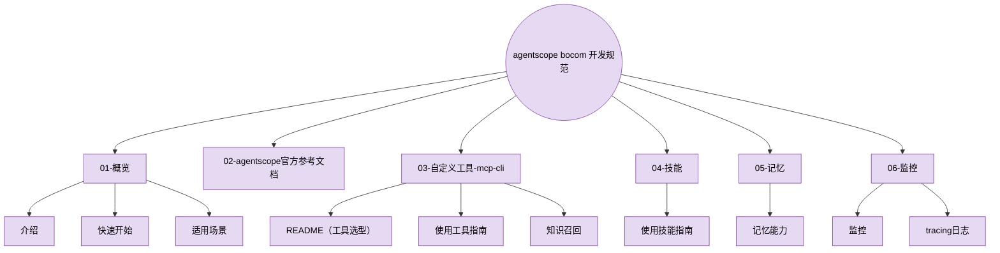

# agentscope bocom 开发规范 · 文档导航

> 本文档体系以**开发规范**为核心，面向基于 AgentScope 2.0 二次开发的 agentscope bocom 平台（行内智能体平台），覆盖从快速上手、能力接入到上线排查的完整闭环。

## 文档结构

## 文档导航

### 01-概览（从这里开始）

| 文档 | 解决的问题 |
| ---- | ---------- |
| [介绍](开发规范/01-概览/介绍.md) | 项目背景、与官方 AgentScope 的关系、企业特有对接与改造总览 |
| [适用场景](开发规范/01-概览/适用场景.md) | L3 智能体框架适用业务判定标准：何时用本框架、何时用行内 L2 |
| [快速开始](开发规范/01-概览/快速开始.md) | 走通最小闭环：创建智能体、配置 ELLM 模型凭证、配置工具/技能、排查问题 |

### 02-agentscope官方参考文档（框架参考，按需查阅）

AgentScope 官方概念与 API 参考，目录自包含（入门 / 核心概念 / 智能体 / 模型 / 上下文管理 / 工具 / 工作区与沙箱 / 部署 / 附录），入口见 [README](开发规范/02-agentscope官方参考文档/README.md)。

### 03-自定义工具-mcp-cli · 工具对接包

> 主包自带框架原生工具机制（内置工具、`Toolkit` / `ToolRegistry`、MCP 接入，开箱即用）；独立发布的工具包 `bocomadp-tools` 提供行内系统对接工具，用法见本目录文档。

| 文档 | 解决的问题 |
| ---- | ---------- |
| [README（工具选型）](开发规范/03-自定义工具-mcp-cli/README.md) | 工具 / MCP / 技能 / 知识召回该走哪条路径 |
| [使用工具指南](开发规范/03-自定义工具-mcp-cli/使用工具指南.md) | 内置工具、自定义工具两种加载方式、MCP 接入 |
| [知识召回](开发规范/03-自定义工具-mcp-cli/知识召回.md) | 行内接口 cross_search 跨知识搜索、参数配置、开源 RAG 备选 |

### 04-技能 · 技能对接包

> 主包自带框架原生技能机制；独立发布的技能包 `skill_hub_sdk` 提供行内技能 hub 对接。

| 文档 | 解决的问题 |
| ---- | ---------- |
| [使用技能指南](开发规范/04-技能/使用技能指南.md) | 技能安装 / 删除的两种方式（前端接口、代码直调）与排障速查 |

### 05-记忆 · 记忆对接包

> 主包自带框架记忆中间件机制；独立发布的记忆包 `bocomadp.memory` 提供行内记忆服务对接。

| 文档 | 解决的问题 |
| ---- | ---------- |
| [记忆能力](开发规范/05-记忆/记忆能力.md) | 零代码开启智能体会话记忆：中间件装配、管理 API、参数配置 |

### 06-监控

| 文档 | 解决的问题 |
| ---- | ---------- |
| [监控](开发规范/06-监控/监控.md) | OTel 三信号（span/指标/日志）、业务指标采集、token 预算护栏、排查路径速查 |
| [tracing日志](开发规范/06-监控/tracing日志.md) | 全链路追踪接入、日志 trace_id 关联、调试输出 |

## 推荐学习路径
**quickstart**：[介绍](开发规范/01-概览/介绍.md) → [快速开始](开发规范/01-概览/快速开始.md) 走通「创建智能体 → 配 ELLM 模型 → 配工具技能 → 对话」。

**入门**：[官方参考文档](开发规范/02-agentscope官方参考文档/README.md) 按需精读 → [使用工具指南](开发规范/03-自定义工具-mcp-cli/使用工具指南.md) 接入工具/MCP → [使用技能指南](开发规范/04-技能/使用技能指南.md) 配置技能。

**进阶能力**：[知识召回](开发规范/03-自定义工具-mcp-cli/知识召回.md)（RAG）→ [记忆](开发规范/05-记忆/记忆能力.md)。

**上线运维**：[监控](开发规范/06-监控/监控.md) 与 [tracing日志](开发规范/06-监控/tracing日志.md) 建立可观测性；沙箱与工作区机制见 [07-工作区与沙箱](开发规范/02-agentscope官方参考文档/07-工作区与沙箱/概述.md)。
