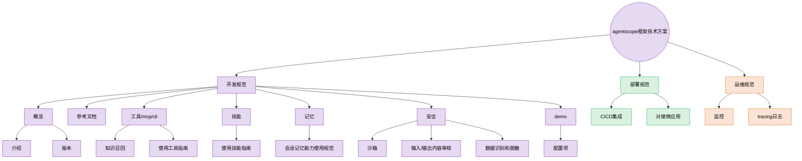

# agentscope 框架技术方案 · 开发者文档

> 本文档体系以**开发规范**为核心，目的是教会开发者如何基于 AgentScope 2.0 方便地开发智能体应用；同时覆盖部署规范与运维规范，形成从开发到上线的完整闭环。

## 技术方案架构

## 文档导航

### 开发规范（核心，从这里开始）

| 目录 | 文档 | 解决的问题 |
| ---- | ---- | ---------- |
| 01-概览 | [介绍](开发规范/01-概览/介绍.md) | AgentScope 是什么、如何安装并跑起第一个智能体 |
| 01-概览 | [版本](开发规范/01-概览/版本.md) | 2.0 与 1.0 的差异、新项目选型建议 |
| 02-参考文档 | [README（API 地图）](开发规范/02-参考文档/README.md) | 五大核心模块（消息/智能体/模型/上下文/中间件）如何协作 |
| 02-参考文档 | [快速开始](开发规范/02-参考文档/01-入门.md) | 代码方式创建智能体、会话、对话（含 deerflow 流式） |
| 02-参考文档 | [消息与事件](开发规范/02-参考文档/02-核心概念.md) | `Msg` 结构、六种内容块、事件流与消息重建 |
| 02-参考文档 | [智能体](开发规范/02-参考文档/03-智能体.md) | Agent 配置、运行、结构化输出、状态持久化、人机协作、中断 |
| 02-参考文档 | [模型层](开发规范/02-参考文档/04-模型.md) | 行内 ELLM 模型配置与调用、key 生命周期、模型候选管理、多模型路由 |
| 02-参考文档 | [上下文管理](开发规范/02-参考文档/05-上下文管理.md) | 自动压缩、上下文卸载、运行时状态注入、文件上传与产物下载 |
| 02-参考文档 | [中间件](开发规范/02-参考文档/02-核心概念.md) | 7 个钩子、内置中间件、自定义横切逻辑 |
| 03-工具-mcp-cli | [README（工具选型）](开发规范/03-工具-mcp-cli/README.md) | 工具 / MCP 两种扩展能力的选型 |
| 03-工具-mcp-cli | [使用工具指南](开发规范/03-工具-mcp-cli/使用工具指南.md) | 内置工具、自定义工具两种加载方式、MCP 接入 |
| 03-工具-mcp-cli | [知识召回](开发规范/03-工具-mcp-cli/知识召回.md) | 行内接口 cross_search 跨知识搜索、参数配置、开源 RAG 备选 |
| 04-技能 | [使用技能指南](开发规范/04-技能/使用技能指南.md) | SKILL.md 编写规范、两阶段加载、技能注册与复用 |
| 05-记忆 | [会话记忆能力使用规范](开发规范/05-记忆/会话记忆能力使用规范.md) | 零代码开启智能体会话记忆:参数配置、管理 API、路由注册 |
| 06-安全 | [README（安全总览）](开发规范/06-安全/README.md) | 沙箱 / 内容审核 / 数据脱敏三道防线 |
| 06-安全 | [沙箱](开发规范/06-安全/沙箱.md) | 七种工作区后端、权限模式、MCP 网关 |
| 06-安全 | [输入输出内容审核](开发规范/06-安全/输入输出内容审核.md) | 权限决策矩阵、人工确认流程、内容块约束、输出校验 |
| 06-安全 | [数据识别和脱敏](开发规范/06-安全/数据识别和脱敏.md) | 凭证管理、密钥脱敏、敏感路径与跨用户共享控制 |
| 07-demo | [配置项](开发规范/07-demo/配置项.md) | 全量可运行示例 + 所有配置项速查表 |

### 部署规范

| 文档 | 解决的问题 |
| ---- | ---------- |
| [CICD集成](部署规范/CICD集成.md) | 用 `create_app` 把智能体嵌入生产服务：存储/消息总线/工作区三件套、单机到分布式演进 |
| [对接微应用](部署规范/对接微应用.md) | IM 渠道（飞书/钉钉/Discord）、REST API + SSE、TypeScript SDK、协议适配 |

### 运维规范

| 文档 | 解决的问题 |
| ---- | ---------- |
| [监控](运维规范/监控.md) | 渠道状态、文档索引状态机、工作区生命周期、token 用量观测 |
| [tracing日志](运维规范/tracing日志.md) | OpenTelemetry 全链路追踪、事件流观测、调试输出 |

## 推荐学习路径

**quickstart**：[介绍](开发规范/01-概览/介绍.md) → 复制第一个智能体示例 → `launch_console` 终端对话。

**入门**：[API 地图](开发规范/02-参考文档/README.md) → 按需精读参考文档 → [使用工具指南](开发规范/03-工具-mcp-cli/使用工具指南.md) 接入工具/MCP → [沙箱](开发规范/06-安全/沙箱.md) 选择执行后端。

**进阶能力**：[知识召回](开发规范/03-工具-mcp-cli/知识召回.md)（RAG）→ [记忆](开发规范/05-记忆/会话记忆能力使用规范.md) → [技能](开发规范/04-技能/使用技能指南.md) → [中间件](开发规范/02-参考文档/02-核心概念.md) 自定义横切逻辑。

**上线交付**：[CICD集成](部署规范/CICD集成.md) → [对接微应用](部署规范/对接微应用.md) → [监控](运维规范/监控.md) 与 [tracing日志](运维规范/tracing日志.md)。
