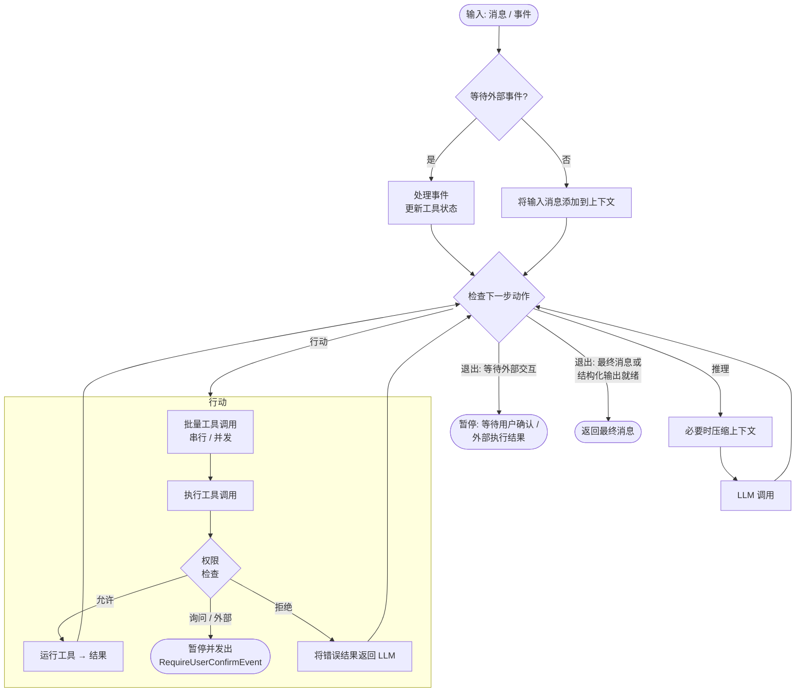

# 概述

> AgentScope 的核心抽象：无状态的推理-行动循环引擎

`Agent` 是 AgentScope 的核心抽象：一个**无状态**的推理-行动循环引擎，将模型、工具、权限系统、人机交互、上下文管理、中间件、状态管理和事件系统整合到一个统一接口中。

其主要职责包括：

* 接收输入消息或事件，调用工具完成任务
* 生成符合用户给定 schema 的结构化输出
* 管理上下文，包括上下文压缩与卸载
* 通过运行时状态注入感知环境变化（时间、任务、上下文用量）
* 在生命周期的关键节点运行中间件，执行自定义逻辑
* 自动编排工具调用的并发与顺序执行
* 处理用户中断，并从暂停状态继续运行

## 核心接口

`Agent` 类的主要接口如下：

| 方法                                                         | 描述                                   |
| ---------------------------------------------------------- | ------------------------------------ |
| `reply(inputs, structured_schema)`                         | 运行推理-行动循环并返回最终 `Msg`，可选择要求结构化输出      |
| `reply_stream(inputs, structured_schema, yield_final_msg)` | 同 `reply`，但以流式方式逐一产出 `AgentEvent` 对象 |
| `observe(msgs)`                                            | 将消息添加到上下文，不触发推理                      |
| `compress_context(context_config, instructions)`           | 在 token 数量超过阈值时压缩上下文，可注入指令引导摘要行为     |

## 主循环

智能体在每次 `reply` 调用时运行推理-行动循环。每一轮由一个统一的决策点检查当前状态，并选择下一步动作（推理、行动或退出）。下图展示了主要控制流程：

## 延伸阅读

<CardGroup cols={2}>
  <Card title="配置智能体" icon="gear" href="/versions/2.0.8dev/zh/building-blocks/agent/configure-agent">
    如何配置模型、格式化器、工具与各类配置对象。
  </Card>

  <Card title="运行智能体" icon="play" href="/versions/2.0.8dev/zh/building-blocks/agent/run-agent">
    如何调用回复、流式输出、要求结构化输出与持久化状态。
  </Card>

  <Card title="感知环境" icon="clock" href="/versions/2.0.8dev/zh/building-blocks/context/environment-awareness">
    智能体如何持续感知时间、任务与上下文用量。
  </Card>

  <Card title="中断智能体" icon="hand" href="/versions/2.0.8dev/zh/building-blocks/agent/interrupt-agent">
    如何干净地停止一个运行中或暂停中的智能体。
  </Card>

  <Card title="人机交互" icon="user-check" href="/versions/2.0.8dev/zh/building-blocks/agent/human-in-the-loop">
    如何暂停以等待用户确认或外部工具执行。
  </Card>
</CardGroup>