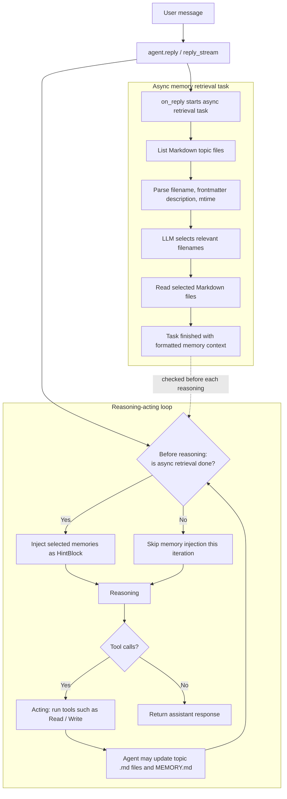

# 长期记忆

> 基于智能体中间件实现的，跨会话长期记忆

**长期记忆** 是智能体跨会话保留信息的能力，包括用户偏好、历史决策，以及在会话中总结、凝练的知识或规则。

AgentScope 通过 [智能体中间件](../02-核心概念/中间件.md) 的形式实现不同长期记忆能力。每个长期记忆实现都是一个 `MiddlewareBase` 的子类，以非侵入式的方式完成记忆的注入、检索和写回。

AgentScope 目前支持以下长期记忆，更多实现正在开发中：

| 名称             | 代码接口                      | 描述                                                                            |
| -------------- | ------------------------- | ----------------------------------------------------------------------------- |
| Agentic Memory | `AgenticMemoryMiddleware` | 基于 Markdown 文件的长期记忆，由智能体自主创建、维护和使用。                                           |
| ReMe           | `ReMeMiddleware`          | 由 [ReMe](https://github.com/agentscope-ai/ReMe) 驱动的进程内、文件型长期记忆，自动从对话中提取并写回记忆。 |
| Mem0           | `Mem0Middleware`          | 由 [mem0](https://github.com/mem0ai/mem0) 驱动的、开箱即用的长期记忆后端。                     |
| 开发中 ...        |                           |                                                                               |

## Agentic Memory

Agentic Memory 是 AgentScope 原生的长期记忆实现，通过 Markdown 文件的读写和检索实现长期记忆功能。
运行中智能体自主创建各种 Markdown 格式的记忆文件，并通过一个固定的 `MEMORY.md` 文件维护所有记忆文件的索引，并自动注入到系统提示中，是一种“渐进暴露”的实现方式。

<Tip>
  Agentic Memory 通过 `backend` 参数支持切换不同的运行环境（例如本地、Docker、E2B、云端等），可以在不同的沙箱环境中运行，默认使用 `LocalBackend`。
</Tip>

运行时，智能体通过内置的 `Read`、`Write` 和 `Edit` 工具创建、访问和修改长期记忆，典型的文件结构如下：

```text theme={null}
<workdir>/Memory/
├── MEMORY.md
├── <agent_created_topic>.md
├── <agent_created_feedback>.md
└── ...
```

其中每个 Markdown 文件都遵循 frontmatter 规范，包含 `name`、`description` 和 `type` 字段，便于后续检索和注入：

```markdown theme={null}
---
name: {{memory name}}
description: {{one-line description — used to decide relevance in future conversations, so be specific}}
type: {{user, feedback, project, reference}}
---

{{memory content — for feedback/project types, structure as: rule/fact, then **Why:** and **How to apply:** lines}}
```

`MEMORY.md` 则保持简短，只作为索引并自动注入到系统提示中，示例如下：

```markdown theme={null}
- [User profile](user_profile.md) — User location and answer-style preference.
- [Feedback on answer style](feedback_answer_style.md) — User prefers concise Chinese answers.
```

Agentic Memory 有两种检索链路：一种是智能体根据提示词和 `MEMORY.md` 索引自主检索相关文件；另一种是在调用智能体 `reply`/`reply_stream` 时，启动一个异步任务使用 LLM 来选择相关的 Markdown 文件，并在后续推理前检查该异步任务是否结束，再以 `HintBlock` 的形式插入检索结果。

需要注意检索过程是异步的：注入发生在推理-行动循环中推理**开始前**的检查点，具体时机取决于检索过程耗时；如果本次回复没有进入后续推理轮次（例如模型没有产生工具调用），则该次回复可能不会注入检索到的长期记忆内容。具体工作流程如下：



通过如下代码在不同的环境中使用 Agentic Memory：

<CodeGroup>
  ```python title="本地环境" theme={null}
  from agentscope.agent import Agent
  from agentscope.middleware import AgenticMemoryMiddleware
  from agentscope.permission import AdditionalWorkingDirectory, PermissionMode
  from agentscope.tool import Read, Toolkit, Write, Edit


  workdir = "/tmp/agentscope_ltm_demo"
  memory = AgenticMemoryMiddleware(workdir=workdir)

  agent = Agent(
      name="assistant",
      system_prompt="You are a helpful assistant.",
      model=my_chat_model,
      toolkit=Toolkit(tools=[Read(), Write(), Edit()]),
      middlewares=[memory],
  )

  # [可选] 允许示例中的 Write 工具写入 workdir。生产环境请根据安全策略配置权限。
  agent.state.permission_context.mode = PermissionMode.ACCEPT_EDITS
  agent.state.permission_context.working_directories[workdir] = (
      AdditionalWorkingDirectory(path=workdir, source="long-term-memory-demo")
  )

  await agent.reply("请记住：我住在杭州，并且偏好简洁的中文回答。")

  # 重新创建一个智能体，只要复用同一个 workdir，就能使用同一份 Markdown 记忆。
  new_agent = Agent(
      name="assistant",
      system_prompt="You are a helpful assistant.",
      model=my_chat_model,
      toolkit=Toolkit(tools=[Read(), Write()]),
      middlewares=[AgenticMemoryMiddleware(workdir=workdir)],
  )

  await new_agent.reply("你还记得我的所在地和回答风格偏好吗？")
  ```

  ```python title="Docker 环境" theme={null}
  from agentscope.agent import Agent
  from agentscope.middleware import AgenticMemoryMiddleware
  from agentscope.tool import Read, Toolkit, Write
  from agentscope.workspace import DockerWorkspace


  workspace = DockerWorkspace()
  await workspace.initialize()

  # 获取 Docker 沙箱的 backend
  backend = workspace.get_backend()
  memory = AgenticMemoryMiddleware(
      workdir=workspace.workdir,
      # 切换到沙箱环境中
      backend=backend,
  )

  agent = Agent(
      name="assistant",
      system_prompt="You are a helpful assistant.",
      model=my_chat_model,
      toolkit=Toolkit(
          # Docker workspace 默认工具中自带 Read / Write / Edit 工具
          tools=await workspace.list_tools(),
          # 也可以自己传入 Read / Write / Edit 工具
          # tools=[Read(backend=backend), Write(backend=backend), Edit(backend=backend)],
      ),
      middlewares=[memory],
  )

  try:
      await agent.reply("请记住：我正在 Docker 沙箱中测试长期记忆。")
  finally:
      await workspace.close()
  ```

  ```python title="E2B 环境" theme={null}
  from agentscope.agent import Agent
  from agentscope.middleware import AgenticMemoryMiddleware
  from agentscope.tool import Read, Toolkit, Write
  from agentscope.workspace import E2BWorkspace


  workspace = E2BWorkspace()
  await workspace.initialize()

  # 获取 E2B 沙箱的 backend
  backend = workspace.get_backend()
  memory = AgenticMemoryMiddleware(
      workdir= workspace.workdir,
      # 切换到沙箱环境中
      backend=backend,
  )

  agent = Agent(
      name="assistant",
      system_prompt="You are a helpful assistant.",
      model=my_chat_model,
      toolkit=Toolkit(
          # E2B workspace 默认工具中自带 Read / Write / Edit 工具
          tools=await workspace.list_tools(),
          # 也可以自己传入 Read / Write / Edit 工具
          # tools=[Read(backend=backend), Write(backend=backend), Edit(backend=backend)],
      ),
      middlewares=[memory],
  )

  try:
      await agent.reply("请记住：我正在 E2B 沙箱中测试长期记忆。")
  finally:
      await workspace.close()
  ```
</CodeGroup>

## ReMe

[ReMe](https://github.com/agentscope-ai/ReMe) 是 AgentScope 团队维护的文件型记忆工具箱。`ReMeMiddleware` 将 ReMe 嵌入当前进程，不需要单独启动服务；它监听智能体的对话，在每次回复后通过 ReMe 的 `auto_memory` 任务自动提取并写回记忆。智能体不负责保存记忆，ReMe 也不会提供手动新增记忆的工具。

<Tip>
  ReMe 的工作区由 `workspace_dir` 指定，里面保存记忆卡片和检索索引。只要不同会话复用同一个工作区，就可以实现跨会话召回。
</Tip>

### 安装

`ReMeMiddleware` 的依赖位于 AgentScope 的可选依赖中：

```bash theme={null}
pip install "agentscope[reme]"
```

### 快速开始

可以把 AgentScope 的聊天模型和 embedding 模型注入 ReMe。聊天模型用于 `auto_memory` 的记忆抽取；传入 embedding 模型后，AgentScope 的最小化内置配置会自动启用向量检索。下面的 `my_chat_model`、`my_embedding_model` 替换为你使用的模型实例：

```python theme={null}
import asyncio

from agentscope.agent import Agent
from agentscope.middleware import ReMeMiddleware
from agentscope.state import AgentState
from agentscope.tool import Toolkit


async def main():
    memory = ReMeMiddleware(
        workspace_dir=".reme",
        parameters=ReMeMiddleware.Parameters(
            chat_model=my_chat_model,
            embedding_model=my_embedding_model,
            mode="both",
            top_k=5,
        ),
    )

    agent = Agent(
        name="assistant",
        system_prompt="You are a helpful assistant.",
        model=my_chat_model,
        # both / agent_control 模式需要显式把 memory_search 加入 toolkit。
        toolkit=Toolkit(tools=await memory.list_tools()),
        middlewares=[memory],
        # 为可恢复的会话指定稳定的 ID；不指定时 AgentState 会自动生成。
        state=AgentState(session_id="alice-main"),
    )

    try:
        await agent.reply("请记住：我住在杭州，并且偏好简洁的中文回答。")
    finally:
        # AgentScope 不会自动管理中间件生命周期。
        await memory.close()


asyncio.run(main())
```

`ReMeMiddleware` 始终构建一份由 AgentScope 维护的最小化 ReMe 配置。它包含对话写回、将 daily 记忆整理为 digest 的定时与手动 dream 任务，以及覆盖 daily 和 digest 的检索，但不会加载与中间件无关的 ReMe 独立任务。不注入聊天模型时，LLM 组件读取 ReMe 的 `LLM_*` 环境变量；不传入 `embedding_model` 时保持 BM25 关键词检索，传入后则根据模型的实际向量维度创建并启用向量存储。

### 控制模式

`ReMeMiddleware.Parameters.mode` 默认为 `"both"`，只决定检索方式；对话写回在三种模式下都会自动执行。

| 模式               | 行为                                                                                                                     |
| ---------------- | ---------------------------------------------------------------------------------------------------------------------- |
| `static_control` | 中间件在 `reply` 开始时后台检索，并在后续推理步骤前把结果以 `AssistantMsg(name="memory")` 的提示注入上下文；智能体对检索过程无感知。检索与回复并发执行，因此单次模型调用就结束的回复可能来不及注入。 |
| `agent_control`  | 不自动检索，只通过 `list_tools()` 暴露 `memory_search(query, limit)` 工具，并在系统提示中追加使用提示；智能体自行决定何时搜索。对话仍会在回复后自动写回。                   |
| `both`           | 同时启用自动检索和 `memory_search` 工具。                                                                                          |

在 `static_control` 模式下，`await memory.list_tools()` 返回空列表；在 `agent_control` 和 `both` 模式下，必须像上面的示例一样将返回的工具传入 `Toolkit`。`memory_search` 只有查询功能，没有 `add_memory`；记忆写入始终由中间件自动完成。

### 会话作用域与生命周期

* 写回按 `agent.state.session_id` 隔离。可以通过 `AgentState(session_id="...")` 为可恢复会话指定稳定 ID；该 ID 不需要配置在中间件上。
* 检索覆盖整个 `workspace_dir`，而不是只覆盖当前 `session_id`。因此，使用同一工作区的新智能体可以召回旧会话写入的记忆。
* 一个 `ReMeMiddleware` 可以安全地在多个智能体和会话之间共享；中间件会在每次 hook 调用时读取对应智能体的 `session_id`。应用退出时应显式调用 `await memory.close()`。

`auto_memory` 写回完成后，记忆卡片还需要经过 ReMe 的索引任务才会可检索。刚写回后立即搜索时，结果可能暂时不可见；示例 [`examples/long_term_memory/reme`](https://github.com/agentscope-ai/agentscope/tree/main/examples/long_term_memory/reme) 为了演示确定性结果，会在写回后显式触发一次索引。

### 关键参数

| 位置                    | 参数                | 默认值       | 说明                                                             |
| --------------------- | ----------------- | --------- | -------------------------------------------------------------- |
| `ReMeMiddleware(...)` | `workspace_dir`   | `".reme"` | ReMe 记忆卡片和索引所在的工作区目录。                                          |
| `Parameters`          | `chat_model`      | `None`    | 注入 ReMe 的 LLM，用于 `auto_memory`；为空时最小化配置使用 ReMe 的 `LLM_*` 环境变量。 |
| `Parameters`          | `embedding_model` | `None`    | 注入 ReMe 的 embedding 模型；传入时创建并启用维度匹配的向量存储，为空时保持 BM25 检索。        |
| `Parameters`          | `mode`            | `"both"`  | `static_control`、`agent_control` 或 `both`。                     |
| `Parameters`          | `top_k`           | `5`       | 每次自动检索最多返回的记忆数，也是 `memory_search` 的默认 `limit`。                 |

## Mem0

`Mem0Middleware` 是由 [mem0](https://github.com/mem0ai/mem0) 驱动的、开箱即用的长期记忆后端，同时支持 `mem0.AsyncMemory`（开源版）与 `mem0.AsyncMemoryClient`（托管 Platform 版）。在使用 `mem0.AsyncMemory`（开源版）时，可以让 mem0 自身的记忆抽取与 embedding 都走你现有的 AgentScope 模型 —— 因此 mem0 无需单独的 provider key。

### 安装

`Mem0Middleware` 的依赖位于 AgentScope 的可选依赖中：

```bash theme={null}
pip install "agentscope[mem0]"
```

### 快速开始

最快捷的方式是直接传入你的 AgentScope chat 与 embedding 模型；中间件会在内部构建一个开源版 mem0 存储，并把记忆抽取与 embedding 都接到这两个模型上。

```python theme={null}
import asyncio

from agentscope.agent import Agent
from agentscope.middleware import Mem0Middleware
from agentscope.tool import Toolkit


async def main():
    mw = Mem0Middleware(
        user_id="alice",
        chat_model=my_chat_model,
        embedding_model=my_embedding_model,
        mode="both",
    )

    agent = Agent(
        name="assistant",
        system_prompt="You are a helpful assistant.",
        model=my_chat_model,
        toolkit=Toolkit(tools=await mw.list_tools()),
        middlewares=[mw],
    )

    # 本次会话写入的记忆，会在后续相同 ``user_id`` 的会话中重新出现。
    await agent(...)


asyncio.run(main())
```

<Note>
  `Mem0Middleware` 通过 `list_tools()` 提供 `search_memory` / `add_memory` 工具，而智能体 **不会** 自动调用它。要让这些工具对智能体可用，需要开发者手动传入 toolkit —— `Toolkit(tools=await mw.list_tools())`。在 `static_control` 模式下 `list_tools()` 返回空列表。
</Note>

### 控制模式

`mode` 参数决定智能体与 mem0 的交互方式，默认为 `"both"`，与 AgentScope 1.x 的 `ReActAgent.long_term_memory_mode` 一致。

| 模式               | 行为                                                                                                  |
| ---------------- | --------------------------------------------------------------------------------------------------- |
| `static_control` | 中间件在每次 reply 前检索 mem0，把检索到的记忆以 `AssistantMsg(name="memory")` 注入上下文，并在 reply 后把新的对话写回。智能体对 mem0 无感知。 |
| `agent_control`  | 中间件暴露 `search_memory` / `add_memory` 工具，并在系统提示中追加一段简短的使用提示。由智能体自行决定何时读写记忆；没有自动检索或写回。                |
| `both`           | 两种模式同时生效 —— 既自动检索，又提供按需调用的工具。                                                                       |

### 构造方式

`Mem0Middleware` 支持三种接入 mem0 后端的方式：

<Tabs>
  <Tab title="AgentScope 模型">
    传入 AgentScope 模型，让中间件在内部构建开源版 `AsyncMemory`（mem0 默认的 Qdrant 存储）。embedding 模型的 `dimensions` 必须与向量存储匹配（默认 Qdrant 期望 `1536`）。

    ```python theme={null}
    Mem0Middleware(
        user_id="alice",
        chat_model=my_chat_model,
        embedding_model=my_embedding_model,
    )
    ```
  </Tab>

  <Tab title="模型 + 自定义 config">
    以你自己的 `mem0.configs.base.MemoryConfig` 为基础，自定义向量存储、history DB 或 reranker，同时仍让 LLM 与 embedder 走 AgentScope。只有 `.llm` / `.embedder` 槽位会被覆盖，其余字段全部保留。

    ```python theme={null}
    Mem0Middleware(
        user_id="alice",
        chat_model=my_chat_model,
        embedding_model=my_embedding_model,
        mem0_config=my_mem0_config,
    )
    ```
  </Tab>

  <Tab title="预构建 client">
    当你需要完全掌控时（例如使用托管 Platform，或在多个智能体间共享同一存储），可传入预构建的 mem0 client。一旦提供 `client`，它具有绝对优先级，`chat_model` / `embedding_model` / `mem0_config` 都会被忽略。

    ```python theme={null}
    from mem0 import AsyncMemoryClient

    Mem0Middleware(
        user_id="alice",
        client=AsyncMemoryClient(api_key="m0-..."),
    )
    ```
  </Tab>
</Tabs>

<Warning>
  `Mem0Middleware` 要求使用**异步** mem0 client（`mem0.AsyncMemory` 或 `mem0.AsyncMemoryClient`）。同步的 `Memory` / `MemoryClient` 不受支持。
</Warning>

### 关键参数

| 参数                      | 类型                                              | 默认值      | 说明                                                                     |
| ----------------------- | ----------------------------------------------- | -------- | ---------------------------------------------------------------------- |
| `user_id`               | `str`                                           | *（必填）*   | 用户记忆的 mem0 命名空间。                                                       |
| `mode`                  | `"static_control" \| "agent_control" \| "both"` | `"both"` | 智能体与 mem0 的交互方式（见上文）。                                                  |
| `agent_id`              | `str \| None`                                   | `None`   | 可选的更细粒度命名空间。                                                           |
| `top_k`                 | `int`                                           | `5`      | 每次 static-control 检索返回的最大记忆数；同时作为 `search_memory` 工具的默认值。              |
| `threshold`             | `float \| None`                                 | `None`   | 最小相似度分数；`None` 表示交由 mem0 决定。                                           |
| `scope_search_by_agent` | `bool`                                          | `True`   | 为 `True` 时检索同时按 `user_id` 与 `agent_id` 过滤；为 `False` 时同一用户的记忆在多个智能体间共享。 |
| `await_write`           | `bool`                                          | `True`   | 为 `True` 时回合结束后的写入会内联等待；为 `False` 时为异步触发（更快，但异常只在日志中体现）。               |

### 供智能体调用的工具

在 `agent_control` 与 `both` 模式下，中间件提供两个模型可按需调用的工具：

* **`search_memory(keywords, limit=5)`** —— 用一组简短、精准的关键词检索记忆。每个关键词作为独立查询发起，结果合并并去重。
* **`add_memory(thinking, content)`** —— 记录持久信息。只有 `content`（一组独立完整的句子）会被写入 mem0；`thinking` 留在对话记录中以便审计。

两个工具都会自动放行（auto-allow），并直接从中间件实例读取 `user_id` / `agent_id`，因此除了把它们加入 toolkit 之外无需额外接线。