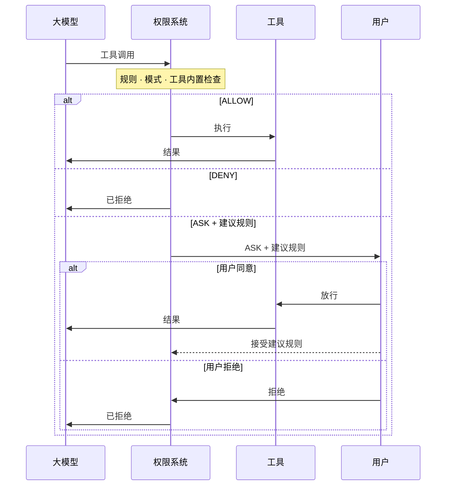

# 概述

> 规则、模式与工具内置检查如何共同决定每一次工具调用

权限系统拦截智能体发起的每一次工具调用，并给出三种决策之一：**允许**执行、**拒绝**执行，或**询问用户**确认。

决策由三个组件共同驱动，每个组件都有独立的页面介绍：

| 组件                                                                              | 作用                                        | 来源                                                   |
| ------------------------------------------------------------------------------- | ----------------------------------------- | ---------------------------------------------------- |
| [权限规则](权限规则.md) | 针对特定工具与调用的显式允许/拒绝/询问模式，以最高优先级评估           | 在 `PermissionContext` 中预先配置，或在询问时由用户接受建议规则动态加入       |
| [权限模式](权限模式.md) | 全局策略，决定哪些决策点生效，以及无人裁决时的兜底行为               | 配置阶段设定，运行时可切换                                        |
| [工具内置检查](工具内置检查.md)    | 工具自身在运行时基于真实输入做的动态分析：只读判定、危险路径保护、工作目录自动放行 | 由各工具的 `check_read_only()` / `check_permissions()` 实现 |

下面的时序图展示了一次工具调用在系统中的流转。ASK 决策会连同自动生成的**建议规则**一起呈现给用户；接受建议后规则会被持久化，之后相同的调用不再询问：



## 决策矩阵

每次调用都自上而下依次经过相同的决策点，第一个给出裁决的决策点即为最终结果。下表按模式展示各决策点的产出："跳过"表示该模式完全不咨询这一步；当某一步保持沉默（规则未命中，或工具返回 `PASSTHROUGH`）时，评估继续向下，直到兜底：

| 决策点                      | `DEFAULT`             | `ACCEPT_EDITS`                | `EXPLORE` | `BYPASS`                 | `DONT_ASK`                       |
| ------------------------ | --------------------- | ----------------------------- | --------- | ------------------------ | -------------------------------- |
| ① 命中拒绝规则                 | DENY                  | DENY                          | DENY      | DENY                     | DENY                             |
| ② 命中询问规则                 | ASK                   | ASK                           | ASK       | ASK                      | DENY                             |
| ③ 只读快速通道                 | ALLOW                 | ALLOW                         | ALLOW     | ALLOW                    | ALLOW                            |
| ④ 工具 `check_permissions` | ALLOW / DENY / 安全 ASK | 同 `DEFAULT`，另加工作目录内编辑 → ALLOW | 跳过        | ALLOW / DENY（安全 ASK 被跳过） | 同 `ACCEPT_EDITS`，但任何 ASK 转为 DENY |
| ⑤ 命中允许规则                 | ALLOW                 | ALLOW                         | 跳过        | ALLOW                    | ALLOW                            |
| ⑥ 兜底                     | ASK                   | ASK                           | DENY      | ALLOW                    | DENY                             |

各行的含义：

* **① / ② / ⑤ 规则**：用户配置的匹配模式，拒绝与询问规则先评估，允许规则靠后。拒绝规则与询问规则在**所有**模式下始终生效（`DONT_ASK` 下询问规则转为 DENY，因为没有用户可以回答）。
* **③ 只读快速通道**：如果本次调用在事实上是只读的（`check_read_only(tool_input)`），在所有模式下都会自动放行。该判定针对每次调用，而非静态的工具标记：`git status` 通过，写文件的 Bash 命令不通过，被标记为命令注入风险的命令永远不视为只读。
* **④ 工具 `check_permissions`**：工具检查本次调用，返回 ALLOW、DENY、ASK 或 PASSTHROUGH。**安全 ASK**（`bypass_immune=True`）无法被第 ⑤ 步的允许规则静默，普通 ASK 可以。针对编辑操作的工作目录自动放行也在这一步发生。
* **⑥ 兜底**：以上都未裁决时按模式收尾，这也是各模式性格的来源：询问（`DEFAULT` / `ACCEPT_EDITS`）、拒绝（`EXPLORE` / `DONT_ASK`）、放行（`BYPASS`）。

各模式的完整决策流程图参见[权限模式](权限模式.md)；安全 ASK 在各模式下的精确处理参见[安全检查契约](工具内置检查.md#安全检查契约)。

## 常见场景

下面的示例展示了如何为常见部署场景配置 `AgentState.permission_context`。每个示例把一种模式与一组规则结合，匹配特定的使用场景。

<CodeGroup>
  ```python 只读探索 theme={null}
  # EXPLORE 模式：智能体可以自由使用只读工具（Read、Grep、Glob）
  # 和只读 bash 命令（`ls`、`git status`、`cat` 等）。
  # 任何修改（Write、Edit、非只读 bash 命令）都会被自动拒绝。
  agent = Agent(
      name="explorer",
      system_prompt="...",
      model=model,
      state=AgentState(
          permission_context=PermissionContext(mode=PermissionMode.EXPLORE)
      ),
  )
  ```

  ```python 无人值守自动化 theme={null}
  from agentscope.permission import PermissionRule, PermissionBehavior

  agent = Agent(
      name="ci_agent",
      system_prompt="...",
      model=model,
      state=AgentState(
          permission_context=PermissionContext(
              mode=PermissionMode.DONT_ASK,
              allow_rules={
                  "Bash": [
                      PermissionRule(tool_name="Bash", rule_content="npm run:*",
                                     behavior=PermissionBehavior.ALLOW, source="project"),
                      PermissionRule(tool_name="Bash", rule_content="git commit:*",
                                     behavior=PermissionBehavior.ALLOW, source="project"),
                  ],
              },
          )
      ),
  )
  # 只有显式放行的命令会执行；其余调用（包括 `rm -rf /` 或写入
  # ~/.bashrc 之类的安全 ASK）都被转为 DENY。无人值守的场景
  # 推荐用 DONT_ASK 而不是 BYPASS：它保留了工具的安全网，同时
  # 也从不打扰用户。
  ```

  ```python BYPASS 配显式护栏 theme={null}
  # BYPASS 按设计跳过工具的安全 ASK，拒绝规则因此成为唯一护栏。
  # 使用 BYPASS 时，务必为想保护的路径与命令配上拒绝规则。
  agent = Agent(
      name="my_agent",
      system_prompt="...",
      model=model,
      state=AgentState(
          permission_context=PermissionContext(
              mode=PermissionMode.BYPASS,
              deny_rules={
                  "Bash": [
                      PermissionRule(tool_name="Bash", rule_content="rm:*",
                                     behavior=PermissionBehavior.DENY, source="userSettings"),
                      PermissionRule(tool_name="Bash", rule_content="git push:*",
                                     behavior=PermissionBehavior.DENY, source="userSettings"),
                  ],
                  "Write": [
                      PermissionRule(tool_name="Write", rule_content="**/.bashrc",
                                     behavior=PermissionBehavior.DENY, source="userSettings"),
                      PermissionRule(tool_name="Write", rule_content="**/.ssh/**",
                                     behavior=PermissionBehavior.DENY, source="userSettings"),
                  ],
              },
          )
      ),
  )
  # 除拒绝列表中的命令与路径外其余均放行。
  # 如果不配这些拒绝规则，BYPASS 会让智能体自由删除任意文件、
  # 推送到任意远端、覆盖 ~/.bashrc，这是设计行为。
  ```
</CodeGroup>

## 延伸阅读

<CardGroup cols={2}>
  <Card title="权限模式" icon="sliders" href="/versions/2.0.8dev/zh/building-blocks/permission-system/permission-mode">
    选择全局策略，查看各模式的完整决策流程。
  </Card>

  <Card title="权限规则" icon="list-check" href="/versions/2.0.8dev/zh/building-blocks/permission-system/permission-rule">
    编写允许/拒绝/询问规则，运行时接受建议规则。
  </Card>

  <Card title="工具内置检查" icon="magnifying-glass" href="/versions/2.0.8dev/zh/building-blocks/permission-system/tool-check">
    只读判定、危险路径保护与自定义安全检查。
  </Card>

  <Card title="工具" icon="wrench" href="/versions/2.0.8dev/zh/building-blocks/tool/overview">
    权限系统所管辖工具的注册与管理。
  </Card>
</CardGroup>