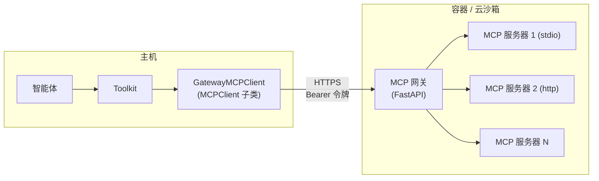

# MCP 网关

> 沙箱类工作区如何把内部的 MCP 服务暴露给主机

沙箱类工作区（Bubblewrap、Docker、E2B、Daytona、K8s、OpenSandbox）无法直接注册主机侧的 MCP 客户端：MCP 服务器运行在容器或沙箱内部，stdio 会话无法跨越这条边界。AgentScope 通过 **MCP 网关**解决这个问题：一个运行在工作区*内部*的轻量 FastAPI 进程，持有上游 MCP 会话，并通过一个带鉴权的 HTTP 端点统一暴露给主机。

网关暴露一组精简的 REST 接口（`GET /health`、`GET/POST/DELETE /mcps`、`GET /mcps/{name}/tools`、`POST /mcps/{name}/tools/{tool}`），由每次 `initialize()` 时生成的工作区专属 Bearer 令牌保护。主机侧由两个适配器保持标准接口不变：

| 适配器                | 基类          | 职责                                                                            |
| ------------------ | ----------- | ----------------------------------------------------------------------------- |
| `GatewayMCPClient` | `MCPClient` | `connect` / `close` / `list_tools` 转换为对网关的 HTTP 请求，工具包的其余部分无法将其与本地 MCP 客户端区分开 |
| `GatewayMCPTool`   | `ToolBase`  | `__call__` 向 `/mcps/{name}/tools/{tool}` 发起 POST，并重建返回的 `ToolChunk`           |

这层抽象让智能体侧代码在所有工作区后端上保持一致：无论上游会话位于主机（`LocalWorkspace`）还是隔离环境（所有沙箱类工作区），工作区的 `list_mcps()` 返回的都是 `MCPClient` 实例。

<Note>
  网关**不会**发布在主机可达的网络端口上。每次主机到网关的调用都在沙箱*内部*执行：`GatewayMCPClient` 通过后端的 `exec_shell` 以 `curl` 命令发起请求，网关始终只监听沙箱自身的回环地址。由于沙箱没有对外监听的服务，这一设计避免了对外开放网关端口带来的攻击面。
</Note>

`BubblewrapWorkspace` 是例外：它与主机共享网络命名空间，沙箱的回环地址即主机回环地址，主机上的其他进程有可能访问到该端口。因此它额外启用了两道防护：

| 防护措施      | 作用                                                       |
| --------- | -------------------------------------------------------- |
| Bearer 令牌 | 网关要求携带该工作区专属的令牌，即使其他进程发现了端口，也无法驱动其中的 MCP 服务              |
| 实例随机数     | `/health` 探测不携带令牌，且响应中必须包含本次启动网关时生成的随机数，避免端口竞争把令牌泄露给无关进程 |