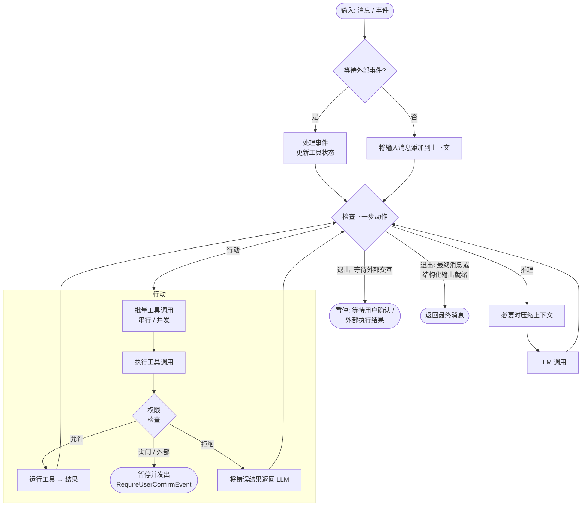

# 03-智能体


<!-- 来源：概述.md -->


## 概述

> BocomAgentScope 的核心抽象：无状态的推理-行动循环引擎

`Agent` 是 BocomAgentScope 的核心抽象：一个**无状态**的推理-行动循环引擎，将模型、工具、权限系统、人机交互、上下文管理、中间件、状态管理和事件系统整合到一个统一接口中。

其主要职责包括：

* 接收输入消息或事件，调用工具完成任务
* 生成符合用户给定 schema 的结构化输出
* 管理上下文，包括上下文压缩与卸载
* 通过运行时状态注入感知环境变化（时间、任务、上下文用量）
* 在生命周期的关键节点运行中间件，执行自定义逻辑
* 自动编排工具调用的并发与顺序执行
* 处理用户中断，并从暂停状态继续运行

### 核心接口

`Agent` 类的主要接口如下：

| 方法                                                         | 描述                                   |
| ---------------------------------------------------------- | ------------------------------------ |
| `reply(inputs, structured_schema)`                         | 运行推理-行动循环并返回最终 `Msg`，可选择要求结构化输出      |
| `reply_stream(inputs, structured_schema, yield_final_msg)` | 同 `reply`，但以流式方式逐一产出 `AgentEvent` 对象 |
| `observe(msgs)`                                            | 将消息添加到上下文，不触发推理                      |
| `compress_context(context_config, instructions)`           | 在 token 数量超过阈值时压缩上下文，可注入指令引导摘要行为     |

### 主循环

智能体在每次 `reply` 调用时运行推理-行动循环。每一轮由一个统一的决策点检查当前状态，并选择下一步动作（推理、行动或退出）。下图展示了主要控制流程：



### 延伸阅读

<CardGroup cols={2}>
  <Card title="配置智能体" icon="gear" href="/versions/2.0.8dev/zh/building-blocks/agent/configure-agent">
    如何配置模型、格式化器、工具与各类配置对象。
  </Card>

  <Card title="运行智能体" icon="play" href="/versions/2.0.8dev/zh/building-blocks/agent/run-agent">
    如何调用回复、流式输出、要求结构化输出与持久化状态。
  </Card>

  <Card title="感知环境" icon="clock" href="/versions/2.0.8dev/zh/building-blocks/context/environment-awareness">
    智能体如何持续感知时间、任务与上下文用量。
  </Card>

  <Card title="中断智能体" icon="hand" href="/versions/2.0.8dev/zh/building-blocks/agent/interrupt-agent">
    如何干净地停止一个运行中或暂停中的智能体。
  </Card>

  <Card title="人机交互" icon="user-check" href="/versions/2.0.8dev/zh/building-blocks/agent/human-in-the-loop">
    如何暂停以等待用户确认或外部工具执行。
  </Card>
</CardGroup>


<!-- 来源：中断智能体.md -->


## 中断智能体

> 干净地停止运行中或暂停中的智能体，并从一致状态恢复

`Agent` 类基于 `asyncio.CancelledError` 实现中断机制，支持在模型推理或工具执行的任意阶段停止执行。中断之后，智能体的上下文会保持一致状态，会话可以立即通过新的输入消息继续。

中断智能体有两种方式，取决于智能体是否正在运行：

* **智能体正在运行**：通过对承载 `reply` / `reply_stream` 的协程调用 `task.cancel()` 来中断。这会在智能体内部触发 `asyncio.CancelledError`，从而干净地展开当前的推理-行动步骤。
* **智能体处于暂停状态**：通过 `reply_stream` 传入一个 `UserInterruptEvent`。如果智能体当前正在等待用户确认或外部工具执行，它会清理待处理状态并结束本次回复。对于每一个待处理的工具调用，智能体会合成一个标记为"被用户中断"的 `ToolResultBlock`，并依次产出对应的 `ToolResultStartEvent`、`ToolResultTextDeltaEvent`、`ToolResultEndEvent` 以及最后的 `ReplyEndEvent`，使智能体重新处于可以接受用户输入的状态。如果智能体并未处于暂停状态，则该事件是空操作，`reply` / `reply_stream` 会立即返回。

<CodeGroup>
  ```python 中断运行中的智能体 theme={null}
  import asyncio
  from bocomagentscope.agent import Agent
  from bocomagentscope.message import UserMsg

  async def chat(agent: Agent) -> None:
      async for event in agent.reply_stream(
          UserMsg(name="user", content="..."),
      ):
          ...

  async def main() -> None:
      agent = Agent(...)
      task = asyncio.create_task(chat(agent))

      # 在任意时刻取消任务即可中断智能体
      await asyncio.sleep(1)
      task.cancel()

  asyncio.run(main())
  ```

  ```python 中断已暂停的智能体 theme={null}
  from bocomagentscope.agent import Agent
  from bocomagentscope.event import UserInterruptEvent

  async def main() -> None:
      agent = Agent(...)

      # 假设智能体此前已因 RequireUserConfirmEvent
      # 或 RequireExternalExecutionEvent 而暂停。
      # 传入 UserInterruptEvent 以清理待处理状态并结束当前回复。
      async for event in agent.reply_stream(
          UserInterruptEvent(reply_id=agent.state.reply_id),
      ):
          print(event)
  ```
</CodeGroup>

<Note>
  使用 `agent.state.reply_id` 引用当前处于暂停状态的回复。有关智能体如何进入暂停状态，请参见[人机交互](人机交互.md)。
</Note>


<!-- 来源：人机交互.md -->


## 人机交互

> 暂停以等待用户确认或外部执行，再通过结果事件恢复

当智能体遇到以下两种情况时，会暂停执行并发出特殊事件：需要**用户确认**的工具调用（权限系统返回 ASK），或标记为**外部执行**的工具（结果必须来自智能体外部）。两种情况下，都通过向 `reply` / `reply_stream` 传回结果事件来恢复智能体。

暂停期间，`reply` 会返回一条 `finished_reason` 为 `None` 的等待提示消息：回复处于停靠状态而非结束，在外部结果到达之前，剩余的工具调用不会执行。

### 用户确认

当权限系统判断某个工具调用需要用户批准时，智能体会发出 `RequireUserConfirmEvent` 并暂停。

<Steps>
  <Step title="接收 RequireUserConfirmEvent">
    使用 `reply_stream` 检测暂停。事件结构如下：

    <ParamField path="reply_id" type="str" required>
      当前回复的 ID，用于恢复智能体。
    </ParamField>

    <ParamField path="tool_calls" type="list[ToolCallBlock]" required>
      等待用户确认的工具调用列表。每个 `ToolCallBlock` 包含：

      <Expandable>
        <ParamField path="id" type="str">此工具调用的唯一标识符。</ParamField>
        <ParamField path="name" type="str">工具名称（如 `"Bash"`、`"Write"`）。</ParamField>
        <ParamField path="input" type="str">JSON 编码的输入参数。</ParamField>
        <ParamField path="suggested_rules" type="list[PermissionRule]">自动生成的权限规则，用户可接受以允许类似的未来调用。</ParamField>
      </Expandable>
    </ParamField>

    ```python theme={null}
    from bocomagentscope.event import RequireUserConfirmEvent

    async for event in agent.reply_stream(msg):
        if isinstance(event, RequireUserConfirmEvent):
            for tc in event.tool_calls:
                print(f"工具: {tc.name}, 输入: {tc.input}")
                print(f"建议规则: {tc.suggested_rules}")
    ```
  </Step>

  <Step title="构建确认结果">
    为每个待处理的工具调用创建 `ConfirmResult`，指明是否允许执行。也可以修改工具调用输入或接受建议的权限规则：

    ```python theme={null}
    from bocomagentscope.event import ConfirmResult, UserConfirmResultEvent

    confirm_results = []
    for tc in event.tool_calls:
        confirm_results.append(ConfirmResult(
            confirmed=True,           # 或 False 表示拒绝
            tool_call=tc,             # 传回（可选择修改）
            rules=tc.suggested_rules, # 接受规则以便未来自动允许
        ))
    ```
  </Step>

  <Step title="恢复智能体">
    将 `UserConfirmResultEvent` 传回 `reply` 或 `reply_stream`：

    ```python theme={null}
    confirm_event = UserConfirmResultEvent(
        reply_id=event.reply_id,
        confirm_results=confirm_results,
    )
    result = await agent.reply(confirm_event)
    ```

    * **已确认**的工具调用立即执行，智能体继续推理
    * **已拒绝**的工具调用会产生大语言模型可见的错误结果，模型可能会换一种方式重试
    * **已接受的规则**会持久化到权限引擎中，匹配的未来调用将自动允许，无需再次提示
  </Step>
</Steps>

### 外部工具执行

当智能体调用 `is_external_tool = True` 的工具时，会发出 `RequireExternalExecutionEvent` 并暂停。工具的逻辑在智能体外部运行，通常由人工操作或外部系统执行。

<Steps>
  <Step title="接收 RequireExternalExecutionEvent">
    事件结构如下：

    <ParamField path="reply_id" type="str" required>
      当前回复的 ID，用于恢复智能体。
    </ParamField>

    <ParamField path="tool_calls" type="list[ToolCallBlock]" required>
      需要外部执行的工具调用列表。每个 `ToolCallBlock` 包含：

      <Expandable>
        <ParamField path="id" type="str">此工具调用的唯一标识符。</ParamField>
        <ParamField path="name" type="str">外部工具名称。</ParamField>
        <ParamField path="input" type="str">JSON 编码的输入参数。</ParamField>
      </Expandable>
    </ParamField>

    ```python theme={null}
    from bocomagentscope.event import RequireExternalExecutionEvent

    async for event in agent.reply_stream(msg):
        if isinstance(event, RequireExternalExecutionEvent):
            for tc in event.tool_calls:
                print(f"外部执行: {tc.name}({tc.input})")
    ```
  </Step>

  <Step title="外部执行并构建结果">
    在智能体外部执行操作，并将结果封装为 `ToolResultBlock` 对象：

    ```python theme={null}
    from bocomagentscope.message import ToolResultBlock, TextBlock, ToolResultState
    from bocomagentscope.event import ExternalExecutionResultEvent

    execution_results = []
    for tc in event.tool_calls:
        # 执行实际操作（API 调用、人工操作等）
        output = await run_external_operation(tc.name, tc.input)

        execution_results.append(ToolResultBlock(
            id=tc.id,
            name=tc.name,
            output=[TextBlock(text=output)],
            state=ToolResultState.SUCCESS,
        ))
    ```
  </Step>

  <Step title="恢复智能体">
    传回 `ExternalExecutionResultEvent` 以恢复智能体：

    ```python theme={null}
    external_event = ExternalExecutionResultEvent(
        reply_id=event.reply_id,
        execution_results=execution_results,
    )
    result = await agent.reply(external_event)
    ```

    结果会被注入智能体上下文，推理从中断处继续。
  </Step>
</Steps>

<Note>
  如果多个工具调用都需要外部交互，而只传回了部分确认或执行结果，智能体不会为尚未确认或执行的工具调用重新发出请求事件。
</Note>

<Tip>
  同一批并发的工具调用之间会对确认请求去重：若某次调用已被同批次中更早一次确认所建议的规则覆盖，就不会再次向用户发出确认请求。安全类确认请求不参与这种去重。
</Tip>

<Tip>
  构建交互式界面时使用 `reply_stream`：它可以实时检测暂停事件并立即提示用户。以编程方式处理事件的自动化流程则使用 `reply`。
</Tip>


<!-- 来源：运行智能体.md -->


## 运行智能体

> 运行智能体，处理它的回复、上下文与状态

`Agent` 类将智能体的行为抽象为一组接口，分别适用于不同的目标：

| 行为              | 接口                     | 适用场景                      |
| --------------- | ---------------------- | ------------------------- |
| [回复](#回复)       | `reply`、`reply_stream` | 驱动推理-行动循环，一次性返回结果或实时产出事件流 |
| [结构化输出](#结构化输出) | `structured_schema` 参数 | 要求回复产出符合 JSON schema 的字段  |
| [观察消息](#观察消息)   | `observe`              | 将消息注入上下文而不触发回复            |
| [压缩上下文](#压缩上下文) | `compress_context`     | 把长对话控制在模型的上下文窗口之内         |
| [持久化状态](#持久化状态) | `agent.state` 搭配存储后端   | 在一个进程中暂停会话，在另一个进程中恢复      |

### 回复

`reply` 和 `reply_stream` 都接受相同的 `inputs` 参数，驱动相同的推理-行动循环，区别只在结果的交付方式。`inputs` 参数支持：

| 输入                                                      | 效果                                                                                 |
| ------------------------------------------------------- | ---------------------------------------------------------------------------------- |
| 单个 `Msg` 或 `Msg` 列表                                     | 开始一次新的回复                                                                           |
| `UserConfirmResultEvent`、`ExternalExecutionResultEvent` | 从暂停状态恢复（参见[人机交互](人机交互.md)）   |
| `UserInterruptEvent`                                    | 终止一次暂停中的回复（参见[中断智能体](中断智能体.md)） |
| `None`                                                  | 不输入新内容，从当前状态继续                                                                     |

#### 基础回复

一次调用返回一条最终 `Msg`：运行智能体最简单的方式，适合不关心中间事件的自动化场景。

`reply` 在内部消费所有事件，并在智能体完成后返回最终 `Msg`。如果回复因等待外部交互而暂停，它会返回一条 `finished_reason` 为 `None` 的等待提示消息，表示回复尚未结束。

```python theme={null}
import asyncio
from bocomagentscope.message import UserMsg

async def main():
    msg = UserMsg(name="user", content="当前目录有哪些文件？")
    result = await agent.reply(msg)
    print(result.get_text_content())

asyncio.run(main())
```

除文本内容外，返回的 `Msg` 还携带本次回复的完整结果。每次调用后值得检查的字段如下：

| 字段                  | 类型                            | 描述                                                                               |
| ------------------- | ----------------------------- | -------------------------------------------------------------------------------- |
| `content`           | `list[ContentBlock]`          | 各轮迭代产出的全部内容块（文本、思考、工具调用与工具结果）                                                    |
| `finished_reason`   | `ReplyFinishedReason \| None` | 回复的结束方式：`completed`、`interrupted`、`exceed_max_iters` 或 `error`；`None` 表示暂停中、尚未结束 |
| `structured_output` | `dict \| None`                | 传入 `structured_schema` 时经过校验的结果（参见[结构化输出](#结构化输出)）                               |
| `usage`             | `Usage \| None`               | 本次回复所有模型调用累计的输入/输出 token 数                                                       |
| `error`             | `ErrorInfo \| None`           | 结构化错误信息，仅当 `finished_reason` 为 `error` 时填充                                       |
| `finished_at`       | `str \| None`                 | 回复结束时间（ISO 8601 时间戳）                                                             |

完整的 `Msg` 结构与内容块类型参见[消息与事件](../02-核心概念/消息与事件.md)。

#### 流式回复

智能体实时产出文本增量、工具调用进度和生命周期事件，这是构建交互式界面的基础。

`reply_stream` 逐一产出 `AgentEvent` 对象：

```python theme={null}
async def main():
    msg = UserMsg(name="user", content="总结一下 README 的内容。")
    async for event in agent.reply_stream(msg):
        if hasattr(event, "delta"):
            print(event.delta, end="", flush=True)

asyncio.run(main())
```

传入 `yield_final_msg=True` 可以让流的最后一项额外产出最终 `Msg`。当你在事件之外还需要组装好的回复消息（例如它的 `structured_output` 属性）时很有用：

```python theme={null}
from bocomagentscope.message import Msg

async for chunk in agent.reply_stream(msg, yield_final_msg=True):
    if isinstance(chunk, Msg):
        print("最终消息:", chunk.get_text_content())
```

### 结构化输出

可以要求一次回复产出符合 JSON schema 的字段，典型场景是生成报告，或输出用于驱动工作流的控制字段。

通过 `structured_schema` 传入一个 Pydantic 模型类。智能体会装配一个内置的 `GenerateStructuredOutput` 工具，其输入 schema 就是你的 schema：智能体先自由推理和调用其他工具，最后通过该工具提交结果。校验错误会反馈给模型重试，通过校验的结果以普通 dict 的形式落在最终消息的 `structured_output` 属性上（消息文本只是占位内容）。

<CodeGroup>
  ```python 基础回复 theme={null}
  from pydantic import BaseModel, Field
  from bocomagentscope.message import UserMsg

  class WeatherReport(BaseModel):
      city: str = Field(description="城市名")
      temperature: float = Field(description="摄氏温度")

  result = await agent.reply(
      UserMsg(name="user", content="杭州今天天气怎么样？"),
      structured_schema=WeatherReport,
  )
  print(result.structured_output)  # {"city": "杭州", "temperature": ...}
  ```

  ```python 流式回复 theme={null}
  from bocomagentscope.message import Msg, UserMsg

  async for chunk in agent.reply_stream(
      UserMsg(name="user", content="杭州今天天气怎么样？"),
      structured_schema=WeatherReport,
      yield_final_msg=True,
  ):
      if isinstance(chunk, Msg):
          print(chunk.structured_output)
  ```
</CodeGroup>

结构化输出的要求以单次回复为作用域，并且能跨越人机交互暂停、状态持久化和进程重启，因为 schema 会以普通 dict 的形式存入智能体状态。恢复一次暂停的回复时，不要再次传入 `structured_schema`；回复会沿用暂停时保存的 schema 继续。

<Note>
  * 校验方式随回复的运行方式自适应。进程内运行时，由模型类本身校验输出：默认值（含 `default_factory`）会被填充、多余字段被丢弃、自定义校验器会执行。从序列化状态恢复后，只剩下 JSON schema：schema 中声明的默认值会被填充、多余字段被保留、自定义校验器被跳过。
  * 达到 `max_iters` 仍无输出时，智能体会在 `structured_output_grace_iters`（默认 5）次额外迭代内强制调用 `GenerateStructuredOutput`。若仍失败，回复以 `finished_reason=EXCEED_MAX_ITERS` 结束且 `structured_output` 为 `None`，使用前请先判空。
</Note>

### 观察消息

可以把消息注入智能体上下文而不触发回复。在多智能体场景中，让一个智能体看到另一个智能体的输出时非常有用。

```python theme={null}
await agent.observe(other_agent_msg)
```

### 压缩上下文

通过对较早的消息做摘要，长对话得以保持在模型的上下文窗口之内，既可自动触发，也可按需手动触发。

当 token 数量超过 `context_config.trigger_ratio × model.context_length` 时，智能体会自动压缩上下文；若配置了 `offloader`，被摘要的消息还会被卸载到磁盘。

`compress_context` 接受两个可选参数：`context_config` 为本次调用覆盖默认阈值；`instructions` 传入一个 `HintBlock`，注入压缩上下文来引导摘要行为（例如指定必须保留的信息）：

```python theme={null}
from bocomagentscope.agent import ContextConfig
from bocomagentscope.message import HintBlock

# 使用智能体的默认配置
await agent.compress_context()

# 或为本次调用传入自定义配置
await agent.compress_context(
    ContextConfig(trigger_ratio=0.6, reserve_ratio=0.2)
)

# 或注入指令来引导摘要行为
await agent.compress_context(
    instructions=HintBlock(
        hint="保留至今提到的所有文件路径与 API 签名。",
    ),
)
```

超过 `tool_result_limit` token 的工具结果会被自动截断；若配置了 `offloader`，截断的部分会被卸载，智能体会收到一个可按需读取的路径引用。完整的压缩流程与卸载机制参见[上下文管理](../05-上下文管理/概述.md)。

<Note>
  如果系统提示词本身就超过了压缩阈值，`compress_context` 会抛出 `RuntimeError`。请保持系统提示词简洁，或增大模型的上下文长度。
</Note>

### 持久化状态

完整的智能体状态可以序列化为 JSON，因此一次回复可以在一个进程中暂停、在另一个进程中恢复。这是构建多会话服务的基础。

`AgentState` 保存了从断点精确恢复所需的全部信息：对话上下文、压缩摘要、权限规则、工具状态和当前回复位置。`RedisStorage` 是内置的存储后端，以 `(user_id, agent_id, session_id)` 为键层级组织状态：

| 方法                                                           | 描述                                                 |
| ------------------------------------------------------------ | -------------------------------------------------- |
| `get_session(user_id, agent_id, session_id)`                 | 加载 `SessionRecord`，其 `.state` 字段即为保存的 `AgentState` |
| `update_session_state(user_id, agent_id, session_id, state)` | 在回复结束后将更新后的 `AgentState` 持久化回 Redis                |

```python theme={null}
import asyncio
from bocomagentscope.agent import Agent
from bocomagentscope.state import AgentState
from bocomagentscope.model import DashScopeChatModel
from bocomagentscope.credential import DashScopeCredential
from bocomagentscope.message import UserMsg
from bocomagentscope.app.storage import RedisStorage

USER_ID = "user_123"
AGENT_ID = "agent_456"
SESSION_ID = "session_789"

async def main():
    async with RedisStorage(host="localhost", port=6379) as storage:
        # 从存储中加载状态，若不存在则使用全新状态
        record = await storage.get_session(
            user_id=USER_ID,
            agent_id=AGENT_ID,
            session_id=SESSION_ID,
        )
        state = record.state if record else AgentState()

        # 使用恢复的状态创建智能体
        agent = Agent(
            name="my_agent",
            system_prompt="你是一个有帮助的助手。",
            model=DashScopeChatModel(
                credential=DashScopeCredential(api_key="YOUR_API_KEY"),
                model="qwen-max",
            ),
            state=state,
        )

        # 执行一轮回复
        result = await agent.reply(
            UserMsg(name="user", content="继续之前的任务。"),
        )
        print(result.get_text_content())

        # 将更新后的状态持久化回 Redis
        await storage.update_session_state(
            user_id=USER_ID,
            agent_id=AGENT_ID,
            session_id=SESSION_ID,
            state=agent.state,
        )

asyncio.run(main())
```

<Note>
  若 session 尚不存在，`update_session_state` 会抛出 `KeyError`。首次创建时请使用 `upsert_session` 建立 session 记录，后续轮次再切换为 `update_session_state`。
</Note>


<!-- 来源：配置智能体.md -->


## 配置智能体

> 用模型、工具与配置对象组装一个智能体

智能体在初始化时完成全部装配：把模型、工具包和配置对象传入 `Agent(...)`，即可开始回复。以下示例涵盖最常见的几种配置场景。

<CodeGroup>
  ```python 最简配置 theme={null}
  from bocomagentscope.agent import Agent
  from bocomagentscope.model import DashScopeChatModel
  from bocomagentscope.credential import DashScopeCredential

  agent = Agent(
      name="my_agent",
      system_prompt="你是一个有帮助的助手。",
      model=DashScopeChatModel(
          credential=DashScopeCredential(api_key="YOUR_API_KEY"),
          model="qwen-max",
      ),
  )
  ```

  ```python 配置工具/MCP/技能 theme={null}
  import os
  from bocomagentscope.agent import Agent
  from bocomagentscope.tool import Toolkit, Bash, Edit, Grep, Read, Write
  from bocomagentscope.mcp import MCPClient, HttpMCPConfig
  from bocomagentscope.model import DashScopeChatModel
  from bocomagentscope.credential import DashScopeCredential

  agent = Agent(
      name="my_agent",
      system_prompt="你是一个有帮助的助手。",
      model=DashScopeChatModel(
          credential=DashScopeCredential(api_key="YOUR_API_KEY"),
          model="qwen-max",
      ),
      toolkit=Toolkit(
          tools=[Bash(), Edit(), Grep(), Read(), Write()],
          mcps=[
              MCPClient(
                  name="amap",
                  is_stateful=False,
                  mcp_config=HttpMCPConfig(
                      url=f"https://mcp.amap.com/mcp?key={os.environ['AMAP_API_KEY']}",
                  ),
              ),
          ],
          skills_or_loaders=["./skills"],
      ),
  )
  ```

  ```python 自定义上下文配置 theme={null}
  from bocomagentscope.agent import Agent
  from bocomagentscope.agent import ContextConfig
  from bocomagentscope.model import DashScopeChatModel
  from bocomagentscope.credential import DashScopeCredential

  agent = Agent(
      name="my_agent",
      system_prompt="你是一个有帮助的助手。",
      model=DashScopeChatModel(
          credential=DashScopeCredential(api_key="YOUR_API_KEY"),
          model="qwen-max",
      ),
      context_config=ContextConfig(
          trigger_ratio=0.7,       # 使用 70% 上下文时触发压缩
          reserve_ratio=0.2,       # 压缩后保留最近 20% 的内容
          tool_result_limit=1000,  # 工具结果超过 1000 token 时截断
          max_image_num=5,         # 只保留最近 5 张图片
      ),
  )
  ```

  ```python 自定义 ReAct 配置 theme={null}
  from bocomagentscope.agent import Agent
  from bocomagentscope.agent import ReActConfig
  from bocomagentscope.model import DashScopeChatModel
  from bocomagentscope.credential import DashScopeCredential

  agent = Agent(
      name="my_agent",
      system_prompt="你是一个有帮助的助手。",
      model=DashScopeChatModel(
          credential=DashScopeCredential(api_key="YOUR_API_KEY"),
          model="qwen-max",
      ),
      react_config=ReActConfig(
          max_iters=30,                     # 最多 30 轮推理-行动迭代
          structured_output_grace_iters=3,  # 为完成结构化输出追加的迭代次数
          stop_on_reject=True,              # 工具调用被拒绝时停止回复
      ),
  )
  ```
</CodeGroup>

### 参数说明

所有配置都通过 `Agent(...)` 构造函数传入。下表列出全部参数，可调节项被归入各配置对象：

| 参数                 | 类型                             | 默认值    | 描述                                                                                                 |
| ------------------ | ------------------------------ | ------ | -------------------------------------------------------------------------------------------------- |
| `name`             | `str`                          | 必填     | 智能体标识符，用于消息和日志                                                                                     |
| `system_prompt`    | `str`                          | 必填     | 智能体的基础系统提示词                                                                                        |
| `model`            | `ChatModelBase`                | 必填     | 用于推理的大语言模型                                                                                         |
| `toolkit`          | `Toolkit \| None`              | `None` | 管理工具、MCP 客户端、技能和工具组                                                                                |
| `state`            | `AgentState \| None`           | 自动创建   | 保存上下文、权限上下文和会话状态                                                                                   |
| `offloader`        | `Offloader \| None`            | `None` | 卸载压缩后的上下文与工具结果，需实现 `Offloader` 协议                                                                  |
| `middlewares`      | `list[MiddlewareBase] \| None` | `None` | 应用于回复、推理、行动、模型调用和系统提示词等钩子                                                                          |
| `model_config`     | `ModelConfig`                  | 默认值    | 重试次数和备用模型                                                                                          |
| `context_config`   | `ContextConfig`                | 默认值    | 上下文压缩阈值、图片数量和工具结果长度限制                                                                              |
| `injection_config` | `InjectionConfig`              | 默认值    | 运行时状态注入：时间、任务与上下文用量（参见[感知环境](../05-上下文管理/环境感知.md)） |
| `react_config`     | `ReActConfig`                  | 默认值    | 最大迭代次数、结构化输出宽限迭代次数和拒绝处理方式                                                                          |

### 切换模型

切换模型 API 只需改动 `model` 参数：所有模型类都遵循相同的 `Model(credential=..., model=...)` 模式，智能体的其余部分保持不变。

<CodeGroup>
  ```python DashScope theme={null}
  from bocomagentscope.model import DashScopeChatModel
  from bocomagentscope.credential import DashScopeCredential

  model = DashScopeChatModel(
      credential=DashScopeCredential(api_key="YOUR_API_KEY"),
      model="qwen-max",
  )
  ```

  ```python OpenAI theme={null}
  from bocomagentscope.model import OpenAIChatModel
  from bocomagentscope.credential import OpenAICredential

  model = OpenAIChatModel(
      credential=OpenAICredential(api_key="YOUR_API_KEY"),
      model="gpt-4o",
  )
  ```

  ```python Anthropic theme={null}
  from bocomagentscope.model import AnthropicChatModel
  from bocomagentscope.credential import AnthropicCredential

  model = AnthropicChatModel(
      credential=AnthropicCredential(api_key="YOUR_API_KEY"),
      model="claude-sonnet-4-5",
  )
  ```

  ```python Gemini theme={null}
  from bocomagentscope.model import GeminiChatModel
  from bocomagentscope.credential import GeminiCredential

  model = GeminiChatModel(
      credential=GeminiCredential(api_key="YOUR_API_KEY"),
      model="gemini-2.5-pro",
  )
  ```

  ```python Ollama theme={null}
  from bocomagentscope.model import OllamaChatModel
  from bocomagentscope.credential import OllamaCredential

  model = OllamaChatModel(
      credential=OllamaCredential(host="http://localhost:11434"),
      model="qwen3:8b",
  )
  ```
</CodeGroup>

### 支持多实体对话

智能体并不局限于一人一智能体的对话。在智能体团队、群聊或带 NPC 的游戏中，来自**多个具名实体**的消息共享同一份上下文，智能体必须知道每句话出自谁口。

在 BocomAgentScope 中，每个发言者由其 `Msg` 的 `name` 字段标识。多实体对话就是一组带有不同名字的消息列表，直接喂给智能体即可：

```python theme={null}
from bocomagentscope.message import UserMsg

msgs = [
    UserMsg(name="Alice", content="我投海边一票。"),
    UserMsg(name="Bob", content="我更想去爬山。"),
    UserMsg(name="user", content="小周，总结一下大家的偏好。"),
]
result = await agent.reply(msgs)
```

这些身份信息能否保留，取决于**格式化器**（Formatter），它负责在每次模型调用前把 `Msg` 对象转换为对应模型 API 的格式。默认的对话格式化器将消息映射到 API 原生的 `user`/`assistant` 角色上，适合一人一智能体的对话，但会丢掉名字，使发言者无法区分。

针对多实体对话，BocomAgentScope 为每种 API 都提供了对应的 `MultiAgentFormatter`。它把历史消息合并为一份带名字的对话记录（`Alice: ...`、`Bob: ...`），放进一条用户消息中，让大语言模型看到每个发言者的身份。切换方式是将其传入模型：

```python theme={null}
from bocomagentscope.model import DashScopeChatModel
from bocomagentscope.credential import DashScopeCredential
from bocomagentscope.formatter import DashScopeMultiAgentFormatter

model = DashScopeChatModel(
    credential=DashScopeCredential(api_key="YOUR_API_KEY"),
    model="qwen-max",
    formatter=DashScopeMultiAgentFormatter(),
)
```

<Tip>
  在多实体对话中，请在系统提示词里写明智能体自己的名字，让大语言模型知道自己扮演的是哪个角色。
</Tip>

BocomAgentScope 为每种 API 都提供了配对的两种格式化器：

| 模型 API    | 对话格式化器（默认）               | 多智能体格式化器                       |
| --------- | ------------------------ | ------------------------------ |
| DashScope | `DashScopeChatFormatter` | `DashScopeMultiAgentFormatter` |
| OpenAI    | `OpenAIChatFormatter`    | `OpenAIMultiAgentFormatter`    |
| Anthropic | `AnthropicChatFormatter` | `AnthropicMultiAgentFormatter` |
| Gemini    | `GeminiChatFormatter`    | `GeminiMultiAgentFormatter`    |
| Ollama    | `OllamaChatFormatter`    | `OllamaMultiAgentFormatter`    |
| DeepSeek  | `DeepSeekChatFormatter`  | `DeepSeekMultiAgentFormatter`  |
| Moonshot  | `MoonshotChatFormatter`  | `MoonshotMultiAgentFormatter`  |
| XAI       | `XAIChatFormatter`       | `XAIMultiAgentFormatter`       |

### 延伸阅读

<CardGroup cols={2}>
  <Card title="工具" icon="wrench" href="/versions/2.0.8dev/zh/building-blocks/tool/overview">
    如何构建工具，接入 MCP 服务器与技能。
  </Card>

  <Card title="中间件" icon="layer-group" href="/versions/2.0.8dev/zh/building-blocks/middleware">
    如何在回复、推理、行动和模型调用等钩子处插入自定义逻辑。
  </Card>

  <Card title="工作区" icon="box" href="/versions/2.0.8dev/zh/building-blocks/workspace/overview">
    如何在不同沙箱中运行。
  </Card>

  <Card title="权限系统" icon="lock" href="/versions/2.0.8dev/zh/building-blocks/permission-system/overview">
    如何控制工具调用的允许、询问与拒绝。
  </Card>
</CardGroup>
