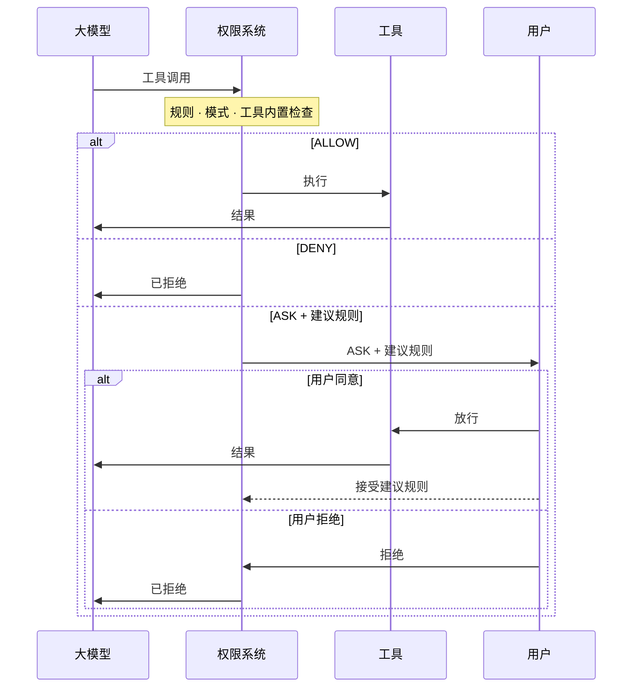

# 06-工具


<!-- 来源：权限系统\概述.md -->


## 概述

> 规则、模式与工具内置检查如何共同决定每一次工具调用

权限系统拦截智能体发起的每一次工具调用，并给出三种决策之一：**允许**执行、**拒绝**执行，或**询问用户**确认。

决策由三个组件共同驱动，每个组件都有独立的页面介绍：

| 组件                                                                              | 作用                                        | 来源                                                   |
| ------------------------------------------------------------------------------- | ----------------------------------------- | ---------------------------------------------------- |
| [权限规则](权限规则.md) | 针对特定工具与调用的显式允许/拒绝/询问模式，以最高优先级评估           | 在 `PermissionContext` 中预先配置，或在询问时由用户接受建议规则动态加入       |
| [权限模式](权限模式.md) | 全局策略，决定哪些决策点生效，以及无人裁决时的兜底行为               | 配置阶段设定，运行时可切换                                        |
| [工具内置检查](工具内置检查.md)    | 工具自身在运行时基于真实输入做的动态分析：只读判定、危险路径保护、工作目录自动放行 | 由各工具的 `check_read_only()` / `check_permissions()` 实现 |

下面的时序图展示了一次工具调用在系统中的流转。ASK 决策会连同自动生成的**建议规则**一起呈现给用户；接受建议后规则会被持久化，之后相同的调用不再询问：



### 决策矩阵

每次调用都自上而下依次经过相同的决策点，第一个给出裁决的决策点即为最终结果。下表按模式展示各决策点的产出："跳过"表示该模式完全不咨询这一步；当某一步保持沉默（规则未命中，或工具返回 `PASSTHROUGH`）时，评估继续向下，直到兜底：

| 决策点                      | `DEFAULT`             | `ACCEPT_EDITS`                | `EXPLORE` | `BYPASS`                 | `DONT_ASK`                       |
| ------------------------ | --------------------- | ----------------------------- | --------- | ------------------------ | -------------------------------- |
| ① 命中拒绝规则                 | DENY                  | DENY                          | DENY      | DENY                     | DENY                             |
| ② 命中询问规则                 | ASK                   | ASK                           | ASK       | ASK                      | DENY                             |
| ③ 只读快速通道                 | ALLOW                 | ALLOW                         | ALLOW     | ALLOW                    | ALLOW                            |
| ④ 工具 `check_permissions` | ALLOW / DENY / 安全 ASK | 同 `DEFAULT`，另加工作目录内编辑 → ALLOW | 跳过        | ALLOW / DENY（安全 ASK 被跳过） | 同 `ACCEPT_EDITS`，但任何 ASK 转为 DENY |
| ⑤ 命中允许规则                 | ALLOW                 | ALLOW                         | 跳过        | ALLOW                    | ALLOW                            |
| ⑥ 兜底                     | ASK                   | ASK                           | DENY      | ALLOW                    | DENY                             |

各行的含义：

* **① / ② / ⑤ 规则**：用户配置的匹配模式，拒绝与询问规则先评估，允许规则靠后。拒绝规则与询问规则在**所有**模式下始终生效（`DONT_ASK` 下询问规则转为 DENY，因为没有用户可以回答）。
* **③ 只读快速通道**：如果本次调用在事实上是只读的（`check_read_only(tool_input)`），在所有模式下都会自动放行。该判定针对每次调用，而非静态的工具标记：`git status` 通过，写文件的 Bash 命令不通过，被标记为命令注入风险的命令永远不视为只读。
* **④ 工具 `check_permissions`**：工具检查本次调用，返回 ALLOW、DENY、ASK 或 PASSTHROUGH。**安全 ASK**（`bypass_immune=True`）无法被第 ⑤ 步的允许规则静默，普通 ASK 可以。针对编辑操作的工作目录自动放行也在这一步发生。
* **⑥ 兜底**：以上都未裁决时按模式收尾，这也是各模式性格的来源：询问（`DEFAULT` / `ACCEPT_EDITS`）、拒绝（`EXPLORE` / `DONT_ASK`）、放行（`BYPASS`）。

各模式的完整决策流程图参见[权限模式](权限模式.md)；安全 ASK 在各模式下的精确处理参见[安全检查契约](工具内置检查.md#安全检查契约)。

### 常见场景

下面的示例展示了如何为常见部署场景配置 `AgentState.permission_context`。每个示例把一种模式与一组规则结合，匹配特定的使用场景。

<CodeGroup>
  ```python 只读探索 theme={null}
  # EXPLORE 模式：智能体可以自由使用只读工具（Read、Grep、Glob）
  # 和只读 bash 命令（`ls`、`git status`、`cat` 等）。
  # 任何修改（Write、Edit、非只读 bash 命令）都会被自动拒绝。
  agent = Agent(
      name="explorer",
      system_prompt="...",
      model=model,
      state=AgentState(
          permission_context=PermissionContext(mode=PermissionMode.EXPLORE)
      ),
  )
  ```

  ```python 无人值守自动化 theme={null}
  from bocomagentscope.permission import PermissionRule, PermissionBehavior

  agent = Agent(
      name="ci_agent",
      system_prompt="...",
      model=model,
      state=AgentState(
          permission_context=PermissionContext(
              mode=PermissionMode.DONT_ASK,
              allow_rules={
                  "Bash": [
                      PermissionRule(tool_name="Bash", rule_content="npm run:*",
                                     behavior=PermissionBehavior.ALLOW, source="project"),
                      PermissionRule(tool_name="Bash", rule_content="git commit:*",
                                     behavior=PermissionBehavior.ALLOW, source="project"),
                  ],
              },
          )
      ),
  )
  # 只有显式放行的命令会执行；其余调用（包括 `rm -rf /` 或写入
  # ~/.bashrc 之类的安全 ASK）都被转为 DENY。无人值守的场景
  # 推荐用 DONT_ASK 而不是 BYPASS：它保留了工具的安全网，同时
  # 也从不打扰用户。
  ```

  ```python BYPASS 配显式护栏 theme={null}
  # BYPASS 按设计跳过工具的安全 ASK，拒绝规则因此成为唯一护栏。
  # 使用 BYPASS 时，务必为想保护的路径与命令配上拒绝规则。
  agent = Agent(
      name="my_agent",
      system_prompt="...",
      model=model,
      state=AgentState(
          permission_context=PermissionContext(
              mode=PermissionMode.BYPASS,
              deny_rules={
                  "Bash": [
                      PermissionRule(tool_name="Bash", rule_content="rm:*",
                                     behavior=PermissionBehavior.DENY, source="userSettings"),
                      PermissionRule(tool_name="Bash", rule_content="git push:*",
                                     behavior=PermissionBehavior.DENY, source="userSettings"),
                  ],
                  "Write": [
                      PermissionRule(tool_name="Write", rule_content="**/.bashrc",
                                     behavior=PermissionBehavior.DENY, source="userSettings"),
                      PermissionRule(tool_name="Write", rule_content="**/.ssh/**",
                                     behavior=PermissionBehavior.DENY, source="userSettings"),
                  ],
              },
          )
      ),
  )
  # 除拒绝列表中的命令与路径外其余均放行。
  # 如果不配这些拒绝规则，BYPASS 会让智能体自由删除任意文件、
  # 推送到任意远端、覆盖 ~/.bashrc，这是设计行为。
  ```
</CodeGroup>

### 延伸阅读

<CardGroup cols={2}>
  <Card title="权限模式" icon="sliders" href="/versions/2.0.8dev/zh/building-blocks/permission-system/permission-mode">
    选择全局策略，查看各模式的完整决策流程。
  </Card>

  <Card title="权限规则" icon="list-check" href="/versions/2.0.8dev/zh/building-blocks/permission-system/permission-rule">
    编写允许/拒绝/询问规则，运行时接受建议规则。
  </Card>

  <Card title="工具内置检查" icon="magnifying-glass" href="/versions/2.0.8dev/zh/building-blocks/permission-system/tool-check">
    只读判定、危险路径保护与自定义安全检查。
  </Card>

  <Card title="工具" icon="wrench" href="/versions/2.0.8dev/zh/building-blocks/tool/overview">
    权限系统所管辖工具的注册与管理。
  </Card>
</CardGroup>


<!-- 来源：概述.md -->


## 概述

> 通过 Toolkit 为智能体装配工具、MCP 服务与技能

工具是智能体与外部世界交互的途径：执行 shell 命令、读写文件、调用 API。每个工具通过 JSON Schema 暴露给大模型，智能体通过统一的接口完成调用。

BocomAgentScope 包含以下三个工具相关的概念：

| 概念                  | 职责                                                                                                           |
| ------------------- | ------------------------------------------------------------------------------------------------------------ |
| **工具**              | 继承自 `ToolBase` 的子类，包括 BocomAgentScope 内置工具，以及将 Python 函数和 MCP 工具封装成 `ToolBase` 子类的 `FunctionTool` / `MCPTool` 包装器 |
| **Toolkit**         | 工具管理模块，负责注册工具、MCP 客户端与技能，向大模型暴露它们的 JSON Schema，并把每次工具调用分发给对应的工具对象                                            |
| **工具组（Tool Group）** | 一组工具 / MCP / 技能的集合，可以作为整体被激活或停用；智能体在运行时通过内置元工具控制工具组                                                          |

最简单的 `Toolkit` 只需传入一组工具实例：

```python theme={null}
from bocomagentscope.tool import Toolkit, Bash, Read, Write, Edit

toolkit = Toolkit(
    tools=[Bash(), Read(), Write(), Edit()],
)
```

只传 `tools` 时，这些工具都进入特殊的 `"basic"` 组，该组始终激活。追加 `mcps`、`skills_or_loaders` 或额外的 `tool_groups` 即可拓展智能体的能力。

### 延伸阅读

每种能力来源都有独立的页面介绍：

<CardGroup cols={2}>
  <Card title="Python 函数工具" icon="code" href="/versions/2.0.8dev/zh/building-blocks/tool/python-tool">
    内置工具、自定义工具、函数包装与工具中间件。
  </Card>

  <Card title="MCP" icon="plug" href="/versions/2.0.8dev/zh/building-blocks/tool/mcp">
    接入 MCP 服务并使用其工具。
  </Card>

  <Card title="Skill" icon="book-open" href="/versions/2.0.8dev/zh/building-blocks/tool/skill">
    用 Markdown 指令集拓展智能体能力。
  </Card>

  <Card title="元工具" icon="toggle-on" href="/versions/2.0.8dev/zh/building-blocks/tool/manage-tools">
    让智能体在运行时自主激活或停用工具组。
  </Card>
</CardGroup>

相关章节：

<CardGroup cols={2}>
  <Card title="智能体" icon="robot" href="/versions/2.0.8dev/zh/building-blocks/agent/overview">
    智能体如何在 ReAct 循环中编排工具调用。
  </Card>

  <Card title="权限系统" icon="shield" href="/versions/2.0.8dev/zh/building-blocks/permission-system/overview">
    精细控制哪个工具可以执行、何时执行。
  </Card>
</CardGroup>


<!-- 来源：MCP.md -->


## MCP

> 接入 MCP 服务并使用其工具

BocomAgentScope 集成 [Model Context Protocol (MCP)](https://modelcontextprotocol.io/)，让智能体可以接入任意兼容 MCP 的工具服务。框架自动处理协议协商、工具发现与结果转换。

支持两种连接方式：

| 连接方式               | 传输协议         | 生命周期                             |
| ------------------ | ------------ | -------------------------------- |
| **有状态（Stateful）**  | STDIO 或 HTTP | 持久会话，需显式 `connect()` / `close()` |
| **无状态（Stateless）** | 仅 HTTP       | 每次调用临时建会话，无需生命周期管理               |

为了避免冲突，MCP 工具的命名空间为 `mcp__{server_name}__{tool_name}`；被标注 `readOnlyHint` 的 MCP 工具会被权限系统识别为只读（在 EXPLORE 与 ACCEPT\_EDITS 模式下自动放行；DEFAULT 模式下若没有 allow 规则命中，仍然会 ASK）。

### 注册 MCP 客户端

通过 `Toolkit(mcps=[...])` 接口可以注册多个 MCP 客户端，其中有状态的 MCP 客户端必须在构造 toolkit 之前完成连接。

<CodeGroup>
  ```python title="Stateful (STDIO)" theme={null}
  from bocomagentscope.mcp import MCPClient, StdioMCPConfig
  from bocomagentscope.tool import Toolkit

  client = MCPClient(
      name="filesystem",
      is_stateful=True,
      mcp_config=StdioMCPConfig(
          command="mcp-server-filesystem",
          args=["--root", "/my/project"],
      ),
  )

  await client.connect()

  toolkit = Toolkit(mcps=[client])
  ```

  ```python title="Stateful (HTTP)" theme={null}
  from bocomagentscope.mcp import MCPClient, HttpMCPConfig
  from bocomagentscope.tool import Toolkit

  client = MCPClient(
      name="weather",
      is_stateful=True,
      mcp_config=HttpMCPConfig(
          url="https://api.weather.com/mcp",
          headers={"Authorization": "Bearer xxx"},
      ),
  )

  await client.connect()

  toolkit = Toolkit(mcps=[client])
  ```

  ```python title="Stateless (HTTP)" theme={null}
  from bocomagentscope.mcp import MCPClient, HttpMCPConfig
  from bocomagentscope.tool import Toolkit

  client = MCPClient(
      name="search",
      is_stateful=False,
      mcp_config=HttpMCPConfig(url="https://api.search.com/mcp"),
  )

  toolkit = Toolkit(mcps=[client])
  ```
</CodeGroup>

### 筛选暴露的工具

如果希望只暴露 MCP 服务的部分工具，可以在客户端上配置 `enable_tools` 或 `disable_tools` 参数：

```python theme={null}
client = MCPClient(
    name="search",
    is_stateful=False,
    mcp_config=HttpMCPConfig(url="https://api.search.com/mcp"),
    enable_tools=["web_search", "image_search"],
)
```

### 在 Toolkit 之外使用 MCP 工具

需要在 `Toolkit` 之外直接调用 MCP 工具时，调用 `await client.list_tools()` 拿到 `MCPTool` 实例列表后，即可像普通 `ToolBase` 一样使用。


<!-- 来源：Python函数工具.md -->


## Python 函数工具

> 基于类或普通函数构建工具，并控制它们的执行方式

Python 工具是任意继承 `ToolBase` 基类的对象。BocomAgentScope 提供了一组内置工具覆盖常见操作，并对外暴露同一接口供开发者自定义：

| 主题                          | 内容                                 |
| --------------------------- | ---------------------------------- |
| [ToolBase 接口](#toolbase-接口) | 每个工具需要实现的属性与方法                     |
| [内置工具](#使用内置工具)             | 开箱即用的工具：`Bash`、文件工具、计划工具           |
| [切换工具后端](#切换工具后端)           | 让内置工具运行在 Docker、E2B 等执行环境中         |
| [自定义工具](#自定义工具)             | 继承 `ToolBase`，声明 schema 并实现权限逻辑    |
| [将函数包装为工具](#将函数包装为工具)       | 用 `FunctionTool` 把普通 Python 函数变成工具 |
| [外部执行工具](#定义外部执行工具)         | 把执行委派给人工或外部系统                      |
| [工具中间件](#工具中间件)             | 在单个工具实例上挂载洋葱式钩子                    |

### ToolBase 接口

`ToolBase` 是所有工具的抽象基类。下表列出其属性与方法。

工具的属性：

| 属性                    | 类型            | 说明                                          |
| --------------------- | ------------- | ------------------------------------------- |
| `name`                | `str`         | 暴露给智能体的工具名称                                 |
| `description`         | `str`         | 面向智能体的功能描述                                  |
| `input_schema`        | `dict`        | 定义参数的 JSON Schema                           |
| `is_concurrency_safe` | `bool`        | 是否可并发调用                                     |
| `is_read_only`        | `bool`        | 是否只读、不产生副作用                                 |
| `is_external_tool`    | `bool`        | 为 `True` 时执行委派给外部执行（见[定义外部执行工具](#定义外部执行工具)） |
| `is_state_injected`   | `bool`        | 为 `True` 时通过 `_agent_state` 参数注入智能体状态数据     |
| `is_mcp`              | `bool`        | 是否来自 MCP 服务                                 |
| `mcp_name`            | `str \| None` | `is_mcp` 为 `True` 时所属 MCP 服务名               |

`ToolBase` 提供的核心方法：

| 方法                                       | 必需  | 说明                                                                                                                               |
| ---------------------------------------- | --- | -------------------------------------------------------------------------------------------------------------------------------- |
| `check_permissions(tool_input, context)` | 是   | 执行前的运行时权限检查；返回 `PermissionDecision`                                                                                              |
| `check_read_only(tool_input)`            | 可选  | 单次调用的只读判定；返回 `bool`。默认返回 `self.is_read_only`。当只读性取决于输入时覆写（例如 `Bash`：`ls` 是只读，`rm` 不是）。权限引擎在决定 EXPLORE / ACCEPT\_EDITS 是否自动放行时调用。 |
| `match_rule(rule_content, tool_input)`   | 可选  | 权限系统中的自定义规则匹配；返回 `bool`                                                                                                          |
| `generate_suggestions(tool_input)`       | 可选  | 基于本次工具调用生成建议规则；返回 `list[PermissionRule]`                                                                                         |
| `call(**kwargs)`                         | 是\* | 工具的执行逻辑，也是子类的 override 点。返回 `ToolChunk` 或 `AsyncGenerator[ToolChunk, None]`。外部执行工具（`is_external_tool = True`）不需要实现。              |
| `__call__(**kwargs)`                     | —   | 框架调度入口。依次运行中间件链（若有），再委托给 `call()`。不要 override。                                                                                   |

### 使用内置工具

BocomAgentScope 预置了一组覆盖常见智能体操作的工具，实例化后传入 `Toolkit(tools=[...])` 即可：

| 工具           | 说明                          | 只读 |
| ------------ | --------------------------- | -- |
| `Bash`       | 执行 shell 命令                 | 否  |
| `PowerShell` | 在 Windows 上执行 PowerShell 命令 | 否  |
| `Read`       | 按行号读取文件内容                   | 是  |
| `Write`      | 创建或覆写文件                     | 否  |
| `Edit`       | 在文件中做精确字符串替换                | 否  |
| `Glob`       | 按 glob 模式查找文件               | 是  |
| `Grep`       | 基于 ripgrep 搜索文件内容           | 是  |
| `TaskCreate` | 创建结构化任务以跟踪进度                | 否  |
| `TaskGet`    | 按 ID 获取任务详情                 | 是  |
| `TaskList`   | 列出全部任务及其状态                  | 是  |
| `TaskUpdate` | 更新任务状态或元数据                  | 否  |

<Note>
  元工具 `reset_tools` 和 `Skill` 查看工具只有在存在额外的工具组或技能时才会自动注册，开发者无需手动实例化。详见[元工具](元工具.md)与 [Skill](Skill.md)。
</Note>

#### Bash

`Bash` 工具执行 shell 命令并返回 stdout / stderr。它实现了所有可选接口方法，提供精细的权限控制。

`check_permissions()` 对命令字符串做分层安全分析：

1. **注入风险检测**：标记 `$(...)`、反引号、进程替换等无法静态分析的动态结构 → ASK
2. **只读命令检测**：自动放行安全命令（`git status`、`ls`、`cat`、`grep`、`docker ps` 等），包括所有子命令均只读的复合命令 → ALLOW
3. **危险命令模式**：识别破坏性操作（如 `chmod 777`、`mkfs`） → ASK
4. **Sed 约束检查**：阻止针对危险文件的就地 `sed -i` → ASK
5. **危险路径保护**：检查命令是否操作敏感配置文件（`.bashrc`、`.ssh/`、`.env`） → ASK
6. **危险删除检测**：捕获指向关键系统路径（`/`、`~`、`/usr`）的 `rm` / `rmdir` → ASK
7. **ACCEPT\_EDITS 模式**：自动放行文件系统命令（`mkdir`、`touch`、`rm`、`rmdir`、`mv`、`cp`、`sed`），**且仅当所有目标路径都在某个配置的工作目录内时**。任一目标路径越出工作集（例如 `cp /etc/hosts /tmp/x`）会落到 PASSTHROUGH 而不自动放行。

`check_read_only()` 在上述第 2 步只读检测器识别出的任何命令上返回 `True`，其余返回 `False`。权限引擎用它在 EXPLORE / ACCEPT\_EDITS 决定自动放行，避免重复跑完整的安全分析。

`match_rule()` 使用基于前缀的通配匹配：

| 模式             | 匹配                             | 不匹配           |
| -------------- | ------------------------------ | ------------- |
| `npm run:*`    | `npm run build`、`npm run test` | `npm install` |
| `git commit:*` | `git commit -m "fix"`          | `git push`    |
| `rm:*`         | `rm file.txt`、`rm -rf /tmp/x`  | `ls`          |

`generate_suggestions()` 抽取命令前缀（前两个 token）并给出前缀规则。例如 `git commit -m "fix bug"` 生成建议 `git commit:*`。

构造函数支持向危险路径列表追加自定义条目：

```python theme={null}
from bocomagentscope.tool import Bash

bash = Bash(
    additional_dangerous_files=[".secrets"],
    additional_dangerous_directories=[".credentials"],
)
```

#### PowerShell

`PowerShell` 是 `Bash` 在 Windows 上的对应工具。当宿主机为 Windows 时，`LocalWorkspace.list_tools()` 会返回 `PowerShell` 而非 `Bash`，因此同一份智能体代码可以在两种平台上运行：

```python theme={null}
from bocomagentscope.tool import PowerShell

pwsh = PowerShell(cwd="C:\\Users\\me\\project")
```

它的执行方式与 `Bash` 存在以下差异：

| 方面    | 行为                                                                      |
| ----- | ----------------------------------------------------------------------- |
| 可执行程序 | 优先使用 `pwsh`（PowerShell 6+），不可用时回退到 `powershell.exe`；探测只执行一次并缓存结果        |
| 会话状态  | 每条命令都以 `-NoProfile -NonInteractive` 运行，不加载用户配置文件，变量、当前目录等会话状态也不会在命令之间保留 |
| 编码    | 命令以 UTF-16LE base64 的 `-EncodedCommand` 形式传入，引号与非 ASCII 字符不会被破坏         |
| 超时    | `timeout` 参数以毫秒计，默认 120000，上限 600000                                    |
| 输出    | stdout 与 stderr 合并返回，超过 30000 字符后截断                                     |

<Warning>
  `check_permissions()` 对**任何** PowerShell 命令都返回 ASK。`Bash` 中用于自动放行只读命令的静态命令分析尚未在 PowerShell 上实现，因此没有命令会被判定为安全。该 ASK 是普通的确认请求，允许规则与 `BYPASS` 模式仍可覆盖；同时 `generate_suggestions()` 不会给出任何规则建议，以保持权限边界的保守性。
</Warning>

#### 文件工具

文件工具强制执行「先读后写」规则：`Write` 与 `Edit` 要求目标文件先经由 `Read` 读取过。这避免了盲目覆写，并保证智能体总是基于最新内容进行操作。

| 工具      | 操作          | 关键行为                                                 |
| ------- | ----------- | ---------------------------------------------------- |
| `Read`  | 读取文件内容      | 文本返回带行号的内容；图片和 PDF 可按模型能力返回 `DataBlock`              |
| `Write` | 创建或覆写文件     | 文件已存在但未被读取过则失败                                       |
| `Edit`  | 替换文件中的精确字符串 | `old_string` 找不到或不唯一时失败（除非 `replace_all=True`）；要求先读取 |

`check_permissions()`：`Write` 与 `Edit` 共用同一权限逻辑：

1. **危险路径保护**：操作敏感文件（`.bashrc`、`.env`、`.ssh/`）返回带 `bypass_immune=True` 的 ASK，allow 规则无法静默授权。`BYPASS` 模式下该 ASK 仍然被跳过（BYPASS 明确选择放弃 safety 提示），`DONT_ASK` 下被转为 DENY。完整契约见[安全检查契约](权限系统/工具内置检查.md#安全检查契约)。
2. **ACCEPT\_EDITS 模式**：自动放行配置工作目录内的文件操作
3. **PASSTHROUGH**：交给权限引擎做规则匹配

`Read` 是只读工具，始终返回 PASSTHROUGH（EXPLORE 与 ACCEPT\_EDITS 模式下的自动放行由引擎通过 `check_read_only` 处理）。

`Read` 会按文件类型选择返回形式：

* 文本文件使用 `offset` / `limit` 分页，返回带行号的 `TextBlock`；
* 模型支持的图片类型以 Base64 `DataBlock` 返回；
* PDF 在模型支持 `application/pdf` 时以 `DataBlock` 返回，否则在本地提取文本。超过 10 页时必须传入 `pages="1-5"` 之类的范围，单次最多读取 20 页。

可将模型卡片中的输入类型直接交给 `Read`，使工具只返回下游模型能处理的多模态内容：

```python theme={null}
read = Read(model_input_types=model_card.input_types)
result = await read(file_path="/workspace/report.pdf", pages="1-5")
```

`match_rule()`：三个工具都使用 `fnmatch` 对 `file_path` 参数做 glob 匹配：

| 模式            | 匹配                  |
| ------------- | ------------------- |
| `src/**`      | `src/` 下任意文件        |
| `src/**/*.py` | `src/` 下的 Python 文件 |
| `config.json` | 精确匹配该文件             |

`generate_suggestions()` 提议覆盖父目录的 glob。例如编辑 `/project/src/main.py` 会生成建议 `src/**`。

#### 计划工具

计划工具让智能体能够显式地维护一份结构化的任务清单，智能体可以通过工具调用来创建、查询和更新任务。计划相关的数据会被存储在智能体实例的 `agent.state.tasks_context` 中，所有计划相关的工具通过操作这个共享的状态来实现任务的管理。同时，所有计划相关的工具在权限检查中被默认放行。

完整的任务生命周期、存储模型，以及如何以编程方式预置或自定义任务，请参见[计划模式](../02-核心概念/计划模式.md)。

### 切换工具后端

BocomAgentScope 中的 `Bash`、`PowerShell`、`Grep`、`Glob`、`Read`、`Write`、`Edit` 工具支持后端切换，即将运行逻辑委派到不同的执行环境中，例如本地文件系统、Docker 容器、E2B 沙箱等。

通过指定 `backend` 参数即可切换后端，而 `backend` 实例可以通过 `Workspace` 实例获取，默认为本地环境。关于 `Workspace` 的更多信息，请参见[工作空间](../07-工作区与沙箱/概述.md)章节。

<CodeGroup>
  ```python title="切换到 Docker 后端" theme={null}
  from bocomagentscope.workspace import DockerWorkspace

  # 获取 Docker 沙箱的 backend
  workspace = DockerWorkspace(...)
  await workspace.initialize()

  backend = workspace.get_backend()

  # 配置工具
  bash = Bash(backend=backend)

  # 运行逻辑
  ...

  await workspace.close()
  ```

  ```python title="切换到 E2B 后端" theme={null}
  from bocomagentscope.workspace import E2BWorkspace

  # 获取 E2B 沙箱的 backend
  workspace = E2BWorkspace(...)
  await workspace.initialize()

  backend = workspace.get_backend()

  # 配置工具
  bash = Bash(backend=backend)

  # 运行逻辑
  ...

  await workspace.close()
  ```
</CodeGroup>

### 自定义工具

通过继承 `ToolBase` 基类并实现对应的抽象接口即可创建自定义工具，同时通过设定相关的属性可以控制工具的权限审查和执行逻辑。

```python theme={null}
from bocomagentscope.tool import ToolBase, ToolChunk
from bocomagentscope.permission import (
    PermissionContext, PermissionDecision, PermissionBehavior,
)
from bocomagentscope.message import TextBlock

class WebSearch(ToolBase):
    name = "WebSearch"
    description = "Search the web for information on a given query."
    input_schema = {
        "type": "object",
        "properties": {
            "query": {
                "type": "string",
                "description": "The search query.",
            },
        },
        "required": ["query"],
    }
    is_concurrency_safe = True
    is_read_only = True

    async def check_permissions(
        self, tool_input: dict, context: PermissionContext,
    ) -> PermissionDecision:
        return PermissionDecision(
            behavior=PermissionBehavior.ALLOW,
            message="Web search is read-only.",
        )

    async def call(self, query: str) -> ToolChunk:
        results = await do_search(query)
        return ToolChunk(content=[TextBlock(text=results)])
```

<Note>
  自定义工具时，有两个权限审查相关的逻辑需要注意：

  * **`check_read_only(tool_input)`**：当某次调用是否只读取决于输入时，需要覆写该函数（例如 `Bash`：`ls` 是只读，`rm` 不是）。该函数默认返回 `is_read_only` 静态属性。权限引擎在判定 EXPLORE / ACCEPT\_EDITS 是否自动放行时调用。
  * **`PermissionDecision(..., bypass_immune=True)`**：在返回的 ASK 上设置，把它标记为 allow 规则无法静默的 safety check（例如 `DeployTool` 标记 `prod-*` 目标）。各模式下的具体处理见 [安全检查契约](权限系统/工具内置检查.md#安全检查契约)。
</Note>

### 将函数包装为工具

当需要把一个 Python 函数暴露给智能体时，一个轻量化的方法是用 `FunctionTool` 适配器包装。它会自动从 `func.__name__` 取工具名、从 docstring 提取工具描述、从类型注解推导 input schema。

```python theme={null}
from bocomagentscope.tool import FunctionTool, Toolkit

def get_weather(city: str, unit: str = "celsius") -> str:
    """Get the current weather for a city.

    Args:
        city: The city name to look up.
        unit: Temperature unit, either "celsius" or "fahrenheit".
    """
    return f"The weather in {city} is 22°{unit[0].upper()}"

toolkit = Toolkit(tools=[FunctionTool(get_weather)])
```

当自动推导的默认值不合适时，`FunctionTool` 支持显式覆盖：

| 参数                    | 类型                                | 说明                                          |
| --------------------- | --------------------------------- | ------------------------------------------- |
| `func`                | `Callable`                        | 待包装的 Python 函数                              |
| `name`                | `str \| None`                     | 覆盖工具名（默认取 `func.__name__`）                  |
| `description`         | `str \| None`                     | 覆盖描述（默认取 docstring）                         |
| `input_schema`        | `dict \| type[BaseModel] \| None` | 显式指定 JSON Schema 或 Pydantic 参数模型；不传时从函数注解推导 |
| `is_concurrency_safe` | `bool`                            | 是否可并发调用（默认 `True`）                          |
| `is_read_only`        | `bool`                            | 是否无副作用（默认 `False`）                          |
| `is_state_injected`   | `bool`                            | 是否通过 `_agent_state` 注入智能体状态数据（默认 `False`）   |

需要枚举、数值范围或复杂结构时，可直接传入 Pydantic 模型：

```python theme={null}
from pydantic import BaseModel, Field


class WeatherInput(BaseModel):
    city: str
    days: int = Field(default=1, ge=1, le=7)


def get_forecast(city: str, days: int = 1) -> str:
    return f"{city} 未来 {days} 天天气晴朗"


weather_tool = FunctionTool(get_forecast, input_schema=WeatherInput)
```

<Note>
  `FunctionTool` 也会解析 `from __future__ import annotations` 产生的延迟注解。如果自动推导无法表达所需约束，优先使用 `input_schema`。
</Note>

<Note>
  被包装的函数默认走 `ASK` 权限行为：用户必须为每次调用显式放行。需要自定义权限逻辑时，请直接继承 `ToolBase`。
</Note>

### 定义外部执行工具

外部执行工具把实际执行委派给智能体运行时之外，通常是人工操作员或外部系统。智能体调用此类工具时会发出 `RequireExternalExecutionEvent` 事件并退出 `reply` / `reply_stream` 函数，直到结果通过 `ExternalExecutionResultEvent` 回传。

这种模式是[人机交互](../03-智能体/人机交互.md)工作流的基础：某些动作需要人工确认或人工执行。

创建外部执行工具只需把 `is_external_tool` 设为 `True`，不必实现 `call` 函数：

```python theme={null}
from bocomagentscope.tool import ToolBase
from bocomagentscope.permission import (
    PermissionContext, PermissionDecision, PermissionBehavior,
)

class HumanApproval(ToolBase):
    name = "HumanApproval"
    description = "Request human approval for a sensitive operation."
    input_schema = {
        "type": "object",
        "properties": {
            "action": {"type": "string", "description": "The action requiring approval."},
            "reason": {"type": "string", "description": "Why this action needs approval."},
        },
        "required": ["action", "reason"],
    }
    is_concurrency_safe = True
    is_read_only = False
    is_external_tool = True

    async def check_permissions(
        self, tool_input: dict, context: PermissionContext,
    ) -> PermissionDecision:
        return PermissionDecision(
            behavior=PermissionBehavior.ALLOW,
            message="External tool dispatch is always allowed.",
        )
```

### 工具中间件

工具中间件（Tool Middleware）把洋葱式钩子直接挂到某个工具实例上。每次调用该工具时（无论由智能体触发还是直接调用），已注册的中间件都会按顺序触发，包裹执行流程。

这与智能体级中间件是独立的两套机制：智能体中间件中的 `on_acting` 包裹 ReAct 循环内整个工具调用逻辑（包括权限检查与事件产出），而 `ToolMiddlewareBase` 只在工具自身的 `call()` 执行链内触发，即使工具在智能体之外被调用也会生效。

#### 自定义中间件

实现自定义中间件需要继承 `ToolMiddlewareBase` 并实现唯一的抽象异步生成器方法 `on_tool_call`：

| 参数             | 类型                                               | 说明                                                                        |
| -------------- | ------------------------------------------------ | ------------------------------------------------------------------------- |
| `tool`         | `ToolBase`                                       | 正在被调用的工具实例                                                                |
| `input_kwargs` | `dict[str, Any]`                                 | 本次调用的输入参数。将（可能经修改的）参数传给 `next_handler`，可控制内层接收到的内容                        |
| `next_handler` | `Callable[..., AsyncGenerator[ToolChunk, None]]` | 通过 `next_handler(**input_kwargs)` 继续执行下一层。无论底层工具是否流式，始终返回 async generator |

#### 执行模型

* **第一个**注册的中间件是**最外层**：其前置逻辑最先执行，后置逻辑最后执行。
* `next_handler(**input_kwargs)` 始终返回 `AsyncGenerator[ToolChunk, None]`。流式与非流式工具统一处理，中间件无需区分。
* 最内层调用工具自身的 `call()`。

```
middlewares[0].on_tool_call
  └─ middlewares[1].on_tool_call
       └─ ... → tool.call()
```

#### 挂载中间件

通过 `middlewares` 参数向工具构造函数传入中间件实例列表：

```python theme={null}
from bocomagentscope.tool import Bash

bash = Bash(middlewares=[LoggingMiddleware(), MetricsMiddleware()])
# 执行顺序：LoggingMiddleware → MetricsMiddleware → Bash.call()
```

#### 示例

一个在调用前后打印日志的中间件，以及一个在出错时自动重试的中间件：

```python theme={null}
from typing import AsyncGenerator, Any, Callable
from bocomagentscope.tool import ToolMiddlewareBase, ToolBase, ToolChunk, Bash


class LoggingMiddleware(ToolMiddlewareBase):
    async def on_tool_call(
        self,
        tool: ToolBase,
        input_kwargs: dict[str, Any],
        next_handler: Callable[..., AsyncGenerator[ToolChunk, None]],
    ) -> AsyncGenerator[ToolChunk, None]:
        print(f"→ 调用 {tool.name}，参数：{input_kwargs}")
        async for chunk in next_handler(**input_kwargs):
            yield chunk
        print(f"✓ {tool.name} 执行完毕")


class RetryMiddleware(ToolMiddlewareBase):
    def __init__(self, max_attempts: int = 3):
        self.max_attempts = max_attempts

    async def on_tool_call(
        self,
        tool: ToolBase,
        input_kwargs: dict[str, Any],
        next_handler: Callable[..., AsyncGenerator[ToolChunk, None]],
    ) -> AsyncGenerator[ToolChunk, None]:
        for attempt in range(1, self.max_attempts + 1):
            try:
                async for chunk in next_handler(**input_kwargs):
                    yield chunk
                return
            except Exception as e:
                if attempt == self.max_attempts:
                    raise
                print(f"第 {attempt} 次失败：{e}，重试中……")


bash = Bash(middlewares=[LoggingMiddleware(), RetryMiddleware(max_attempts=3)])
```

<Note>
  **工具中间件 vs. 智能体中间件**：对属于工具本身的横切关注点（日志、指标、重试），使用 `ToolMiddlewareBase`。若需要访问更广泛的智能体上下文（权限决策、工具调用事件或所在的 ReAct 轮次），请使用 `MiddlewareBase.on_acting`。完整的智能体级钩子参考见[中间件](../02-核心概念/中间件.md)。
</Note>


<!-- 来源：Skill.md -->


## Skill

> 用 Markdown 指令集拓展智能体能力

Skill（技能）是 Markdown 格式的指令集，无需写代码即可拓展智能体能力。每个 skill 是一个目录，固定包含一个带 frontmatter 元数据与详细指令的 `SKILL.md` 文件。

与工具不同，skill 不能被直接调用。智能体通过自动注册的 `Skill` 查看器读取 skill 指令，再用现有的工具按指令执行。

### 注册 Skill

通过 `Toolkit` 的 `skills_or_loaders` 参数传入 skill 来源。每一项可以是目录路径字符串、`Skill` 对象，或 `SkillLoaderBase` 子类：

<CodeGroup>
  ```python 目录路径（简单） theme={null}
  from bocomagentscope.tool import Toolkit

  toolkit = Toolkit(
      skills_or_loaders=["/path/to/skills"],
  )
  ```

  ```python LocalSkillLoader（含子目录扫描） theme={null}
  from bocomagentscope.tool import Toolkit
  from bocomagentscope.skill import LocalSkillLoader

  loader = LocalSkillLoader(
      directory="/path/to/skills",
      scan_subdir=True,
  )

  toolkit = Toolkit(skills_or_loaders=[loader])
  ```
</CodeGroup>

### Skill 的工作方式

`Toolkit` 在含 skill 时，注册与查看分两阶段进行。

初始化阶段：

* Toolkit 扫描所有注册的 skill 来源，收集每个 skill 的名称、描述与目录。
* 自动注册内置的 `Skill` 查看器。
* 组装一段系统提示片段，列出可用 skill（仅名称与描述），并指示智能体通过 `Skill` 查看器读取完整内容。

运行时阶段：

* 智能体按名字选定一个 skill，调用 `Skill` 查看器。
* 查看器读取对应 `SKILL.md`，返回完整 Markdown。
* 智能体用已装备的工具按这些指令执行。

<Note>
  Skill 不是工具：智能体不能直接调用 skill。它必须先用 `Skill` 查看器读取指令，再用其他工具按描述的步骤执行。
</Note>


<!-- 来源：元工具.md -->


## 元工具

> 让智能体在运行时自主激活或停用工具组

BocomAgentScope 内置**元工具**（`reset_tools`），让智能体在运行时自主管理哪些工具组处于激活状态，从而保持上下文聚焦：只有与当前任务相关的工具才会暴露给模型。

### 定义工具组

`ToolGroup` 是带有名称和描述的工具 / MCP / skill 集合，通过 `Toolkit(tool_groups=[...])` 接口进行设置。其中保留名 `"basic"` 由构造函数顶层的 `tools`、`mcps`、`skills_or_loaders` 自动构成，且始终处于激活状态。

```python theme={null}
from bocomagentscope.tool import Toolkit, ToolGroup, Bash, Read, Write, Edit

toolkit = Toolkit(
    tools=[Bash(), Read(), Write(), Edit()],
    tool_groups=[
        ToolGroup(
            name="database",
            description="Tools for database operations.",
            instructions="Always wrap mutations in a transaction.",
            tools=[db_query_tool, db_migrate_tool],
        ),
        ToolGroup(
            name="deployment",
            description="Tools for deploying services.",
            instructions="Confirm the target environment before deploying.",
            tools=[deploy_tool, rollback_tool],
        ),
    ],
)
```

`ToolGroup` 接收与 toolkit 相同的 `tools`、`mcps`、`skills_or_loaders` 参数，再加上一个用于向智能体描述本工具组的 `description` 字段，以及工具组激活时返回给智能体的可选 `instructions` 参数。

### 使用元工具

只要存在至少一个非 basic 的工具组，`Toolkit` 就会自动注册元工具 `reset_tools`。除默认组外，每个工具组都对应 `reset_tools` 中的一个布尔型参数，代表是否激活该工具组。

运行时行为：

* `"basic"` 组中的工具始终暴露，元工具不会影响它们。
* 每次调用 `reset_tools` 都会**整体覆盖**激活集合：任何未显式置为 `True` 的非 basic 组都会被停用。
* 被激活的工具组，其 `instructions`（若有）会被拼接进元工具的返回值，告诉智能体如何正确使用该组。
* 未被激活的工具以及 skill 不会出现在大模型调用的输入中。

<Warning>
  元工具的输入表示所有工具组的**最终状态**。任何未显式置为 `True` 的工具组都会被停用，无论之前的状态如何。
</Warning>


<!-- 来源：权限系统\工具内置检查.md -->


## 工具内置检查

> 工具在运行时对自身输入执行的安全分析

在规则与模式之外，每个工具还会在运行时通过两个接口方法分析真实的调用入参：`check_read_only()` 支撑只读快速通道，`check_permissions()` 执行工具自身的安全分析。BocomAgentScope 内置工具覆盖三类检查：

| 检查                | 作用                                                            | 生效模式                                                         |
| ----------------- | ------------------------------------------------------------- | ------------------------------------------------------------ |
| [只读判定](#只读命令)     | 解析每一次调用，自动放行事实上只读的调用                                          | 所有模式                                                         |
| [危险路径保护](#危险路径保护) | 对触及敏感文件的操作发出不可绕过的安全 ASK                                       | `DEFAULT` / `ACCEPT_EDITS`（`DONT_ASK` 下转为 DENY；`BYPASS` 下跳过） |
| 工作目录自动放行          | 自动放行已配置工作目录内的 `Write` / `Edit`；Bash 文件系统命令要求**所有**目标路径都在工作目录内 | `ACCEPT_EDITS` / `DONT_ASK`                                  |

工作目录自动放行始终从属于安全检查：工作目录内的危险操作仍会询问或拒绝。

### 自定义工具

自定义工具通过实现 `check_permissions()` 添加自己的权限逻辑。如果工具的只读性取决于输入（比如 `Bash`：`ls` 是只读，`rm` 不是），还应该覆写 `check_read_only()`。

```python theme={null}
from bocomagentscope.tool import ToolBase
from bocomagentscope.permission import PermissionContext, PermissionDecision, PermissionBehavior

class MyTool(ToolBase):
    name = "MyTool"
    # 静态默认值。对于结果取决于输入的工具，把这里设成保守默认，
    # 然后覆写 check_read_only()。
    is_read_only = False

    async def check_read_only(self, tool_input: dict) -> bool:
        """可选：动态只读判定。

        默认返回 self.is_read_only。当某次调用是否修改状态取决于
        输入时进行覆写。引擎在每种模式下都会用它执行只读快速通道
        （即在 check_permissions 之前运行的自动放行）。
        """
        return tool_input.get("operation") in {"list", "describe", "get"}

    async def check_permissions(
        self,
        tool_input: dict,
        context: PermissionContext,
    ) -> PermissionDecision:
        target = tool_input.get("target")

        # 自定义安全检查：阻止操作生产资源。
        # 设置 bypass_immune=True 让这条 ASK 在 DEFAULT / ACCEPT_EDITS /
        # DONT_ASK 下不被允许规则覆盖；BYPASS 模式仍然会跳过。
        if target and target.startswith("prod-"):
            return PermissionDecision(
                behavior=PermissionBehavior.ASK,
                message=f"Operation targets production resource: {target}",
                decision_reason="Safety check: production resource",
                bypass_immune=True,
            )

        # 返回 PASSTHROUGH 让引擎继续按规则 / 模式评估
        return PermissionDecision(behavior=PermissionBehavior.PASSTHROUGH)
```

### 安全检查契约

**安全检查**（safety check）是工具自己发出、认为太危险而不能被静默放行的 ASK，例如写入 `~/.bashrc` 的 `Write`、执行 `rm -rf /` 的 `Bash`。在决策上设置 `bypass_immune=True`，即使命中了允许规则或处于会自动放行的模式，引擎也仍然把 ASK 呈现给用户。

适用于「一次错误调用就会造成用户几乎肯定不想发生的破坏」的场景。例如：自定义的 `DeployTool` 在目标是 `prod-*` 时返回 `bypass_immune=True`，那么为预发环境配置的 `allow_rules["DeployTool"] = ["*"]` 也不会意外授权生产部署。

各模式下的具体处理：

| 模式             | `bypass_immune=True` 的 ASK                         |
| -------------- | -------------------------------------------------- |
| `DEFAULT`      | 尊重，允许规则不能将其覆盖                                      |
| `ACCEPT_EDITS` | 尊重，同 `DEFAULT`                                     |
| `EXPLORE`      | 不适用（EXPLORE 不会调用 `check_permissions`，只读判定就已经决断了一切） |
| `BYPASS`       | **忽略**，BYPASS 按设计跳过所有安全 ASK                        |
| `DONT_ASK`     | 转为 DENY（没有用户可以回答）                                  |

普通 ASK（`bypass_immune=False`，默认值）可以被 `DEFAULT` / `ACCEPT_EDITS` 下命中的允许规则覆盖，在 `BYPASS` 下被兜底放行。

### 只读命令

常见的只读 bash 命令在没有任何规则的情况下也会被自动放行，在**所有模式**（包括 `DEFAULT`）下都生效。复合命令（`&&`、`||`、`;`、`|`）只有在**所有**子命令都只读时才视为只读。输出重定向（`>`、`>>`）会让命令立即失去只读属性。被标记为命令注入风险的命令（如 `ls $(rm -rf /)`）**不**视为只读，因此不会在此自动放行，而是落到工具的安全检查上。

<AccordionGroup>
  <Accordion title="完整只读命令列表">
    | 类别         | 命令                                                                                                                |
    | ---------- | ----------------------------------------------------------------------------------------------------------------- |
    | Git        | `git status`、`git log`、`git diff`、`git show`、`git branch`、`git blame`、`git grep`、`git reflog`、`git config --list` |
    | 文件         | `ls`、`cat`、`head`、`tail`、`grep`、`rg`、`find`、`tree`、`stat`、`wc`、`pwd`、`which`                                      |
    | Docker     | `docker ps`、`docker images`、`docker logs`、`docker inspect`、`docker info`                                          |
    | GitHub CLI | `gh repo view`、`gh issue list`、`gh pr list`、`gh status`                                                           |
    | 包管理器       | `npm list`、`pip list`、`pip show`、`node --version`、`python --version`                                              |
  </Accordion>
</AccordionGroup>

### 危险路径保护

<Warning>
  针对以下路径的操作在 `DEFAULT`、`ACCEPT_EDITS`、`DONT_ASK` 下触发不可绕过的 ASK（`DONT_ASK` 下转为 DENY）。`BYPASS` 模式按设计跳过此检查；如果在 BYPASS 下仍需要危险路径保护，请为具体路径添加拒绝规则。
</Warning>

| 类别       | 路径                                                         |
| -------- | ---------------------------------------------------------- |
| Shell 配置 | `.bashrc`、`.zshrc`、`.bash_profile`、`.profile`              |
| Git 配置   | `.gitconfig`、`.gitmodules`                                 |
| SSH      | `.ssh/config`、`.ssh/authorized_keys`、`id_rsa`、`id_ed25519` |
| 凭证       | `.env`、`.env.local`、`.npmrc`、`.pypirc`、`.aws/credentials`  |
| 目录       | `.git/`、`.ssh/`、`.claude/`、`.vscode/`、`.aws/`、`.kube/`     |


<!-- 来源：权限系统\权限模式.md -->


## 权限模式

> 根据智能体的部署方式选择合适的全局策略

权限模式是每次工具调用决策背后的全局策略：它决定哪些决策点生效，以及无人裁决的调用如何收尾。BocomAgentScope 支持五种模式，分别适配不同的部署场景：

| 模式             | 行为                                                                                                                                             | 适用场景         |
| -------------- | ---------------------------------------------------------------------------------------------------------------------------------------------- | ------------ |
| `DEFAULT`      | 只读调用自动放行（`Read` / `Glob` / `Grep`，以及 `ls`、`git status`、`cat` 等只读 Bash 命令）；其余操作在没有允许规则命中时都会询问用户。安全 ASK 无法被允许规则覆盖                                | 最安全，推荐默认值    |
| `ACCEPT_EDITS` | `DEFAULT` 放行的一切，**外加**工作目录内的编辑操作无需询问即自动放行：对已配置工作目录下文件的 `Write` / `Edit`，以及**所有目标路径都在工作目录内**的 Bash 文件系统命令（`mkdir`/`touch`/`rm`/`cp`/`mv`/`sed`） | 用户在场的活跃开发    |
| `EXPLORE`      | 放行只读操作，拒绝任何修改。不咨询允许规则与工具的安全检查：只读保证不会被规则放行掉。用户配置的拒绝/询问规则仍然优先于只读自动放行                                                                             | 代码探索、规划      |
| `BYPASS`       | 完全信任：拒绝/询问规则与工具返回的 DENY 仍然生效，但**工具的安全 ASK 会被跳过**（`rm -rf /`、写入 `~/.bashrc`、命令注入等都会放行），其余一切均放行。请用拒绝规则保护特定路径                                     | 沙箱环境或完全可信的运行 |
| `DONT_ASK`     | `ACCEPT_EDITS` 的无人值守版本：只读自动放行、工作目录内编辑自动放行，但任何原本会询问（不在场的）用户的操作都被转为 **DENY**。永不返回 ASK                                                            | 无人值守 / 计划任务  |

### 设置模式

可以在创建智能体时通过 `AgentState.permission_context` 设置模式，也可以在运行时切换：

<CodeGroup>
  ```python 初始化时配置 theme={null}
  from bocomagentscope.agent import Agent
  from bocomagentscope.state import AgentState
  from bocomagentscope.permission import PermissionContext, PermissionMode

  agent = Agent(
      name="my_agent",
      system_prompt="...",
      model=model,
      state=AgentState(
          permission_context=PermissionContext(
              mode=PermissionMode.DEFAULT,
          )
      ),
  )
  ```

  ```python 运行时切换 theme={null}
  # 切换到只读模式
  agent.state.permission_context.mode = PermissionMode.EXPLORE

  # 切换到无人值守模式以执行批处理
  agent.state.permission_context.mode = PermissionMode.DONT_ASK
  ```

  ```python ACCEPT_EDITS 配合工作目录 theme={null}
  from bocomagentscope.permission import AdditionalWorkingDirectory

  agent = Agent(
      name="my_agent",
      system_prompt="...",
      model=model,
      state=AgentState(
          permission_context=PermissionContext(
              mode=PermissionMode.ACCEPT_EDITS,
              working_directories={
                  "/my/project": AdditionalWorkingDirectory(
                      path="/my/project",
                      source="userSettings",
                  )
              },
          )
      ),
  )
  ```
</CodeGroup>

### 各模式的决策流程

每种模式都沿[决策矩阵](概述.md#决策矩阵)中的决策点依次评估；下面的流程图把每种模式展开为完整的决策流程。ASK 结果会触发用户确认；如果用户接受自动生成的建议规则，规则会被持久化以供后续调用使用。

<Tabs>
  <Tab title="DEFAULT">
    ```mermaid theme={null}
    flowchart TD
        A([工具调用]) --> D1{命中拒绝规则?}
        D1 -->|是| DENY([DENY])
        D1 -->|否| D2{命中询问规则?}
        D2 -->|是| ASK([ASK])
        D2 -->|否| D3{check_read_only?}
        D3 -->|True| ALLOW([ALLOW])
        D3 -->|False| D4[工具 check_permissions]
        D4 -->|ALLOW| ALLOW
        D4 -->|DENY| DENY
        D4 -->|"安全 ASK (bypass_immune)"| ASK
        D4 -->|PASSTHROUGH / 普通 ASK| D5{命中允许规则?}
        D5 -->|是| ALLOW
        D5 -->|否| ASK
        style DENY fill:#ff6b6b,color:#fff
        style ALLOW fill:#51cf66,color:#fff
        style ASK fill:#ffd43b,color:#333
    ```
  </Tab>

  <Tab title="EXPLORE">
    ```mermaid theme={null}
    flowchart TD
        A([工具调用]) --> E1{命中拒绝规则?}
        E1 -->|是| DENY([DENY])
        E1 -->|否| E2{命中询问规则?}
        E2 -->|是| ASK([ASK])
        E2 -->|否| E3{check_read_only?}
        E3 -->|True| ALLOW([ALLOW])
        E3 -->|False| DENY
        style DENY fill:#ff6b6b,color:#fff
        style ALLOW fill:#51cf66,color:#fff
        style ASK fill:#ffd43b,color:#333
    ```
  </Tab>

  <Tab title="ACCEPT_EDITS">
    ```mermaid theme={null}
    flowchart TD
        A([工具调用]) --> AE1{命中拒绝规则?}
        AE1 -->|是| DENY([DENY])
        AE1 -->|否| AE2{命中询问规则?}
        AE2 -->|是| ASK([ASK])
        AE2 -->|否| AE3{check_read_only?}
        AE3 -->|True| ALLOW([ALLOW])
        AE3 -->|False| AE4[工具 check_permissions]
        AE4 -->|ALLOW| ALLOW
        AE4 -->|DENY| DENY
        AE4 -->|"安全 ASK (bypass_immune)"| ASK
        AE4 -->|PASSTHROUGH / 普通 ASK| AE5{命中允许规则?}
        AE5 -->|是| ALLOW
        AE5 -->|否| ASK
        style DENY fill:#ff6b6b,color:#fff
        style ALLOW fill:#51cf66,color:#fff
        style ASK fill:#ffd43b,color:#333
    ```
  </Tab>

  <Tab title="BYPASS">
    ```mermaid theme={null}
    flowchart TD
        A([工具调用]) --> B1{命中拒绝规则?}
        B1 -->|是| DENY([DENY])
        B1 -->|否| B2{命中询问规则?}
        B2 -->|是| ASK([ASK])
        B2 -->|否| B3{check_read_only?}
        B3 -->|True| ALLOW([ALLOW])
        B3 -->|False| B4[工具 check_permissions]
        B4 -->|ALLOW| ALLOW
        B4 -->|DENY| DENY
        B4 -->|"任何 ASK (安全 ASK 被跳过) / PASSTHROUGH"| B5{命中允许规则?}
        B5 -->|是或否| ALLOW
        style DENY fill:#ff6b6b,color:#fff
        style ALLOW fill:#51cf66,color:#fff
        style ASK fill:#ffd43b,color:#333
    ```
  </Tab>

  <Tab title="DONT_ASK">
    ```mermaid theme={null}
    flowchart TD
        A([工具调用]) --> DA1{命中拒绝规则?}
        DA1 -->|是| DENY([DENY])
        DA1 -->|否| DA2{命中询问规则?}
        DA2 -->|是| DENY
        DA2 -->|否| DA3{check_read_only?}
        DA3 -->|True| ALLOW([ALLOW])
        DA3 -->|False| DA4[工具 check_permissions]
        DA4 -->|ALLOW| ALLOW
        DA4 -->|DENY| DENY
        DA4 -->|"任何 ASK (含安全 ASK)"| DENY
        DA4 -->|PASSTHROUGH| DA5{命中允许规则?}
        DA5 -->|是| ALLOW
        DA5 -->|否| DENY
        style DENY fill:#ff6b6b,color:#fff
        style ALLOW fill:#51cf66,color:#fff
    ```
  </Tab>
</Tabs>

<Note>
  **拒绝规则**与**显式询问规则**在每种模式下都始终生效（包括 `BYPASS`）。

  **工具发出的安全 ASK**（`bypass_immune=True`）在 `DEFAULT`、`ACCEPT_EDITS`、`DONT_ASK` 下被尊重，允许规则无法将其静默。`BYPASS` 模式按设计跳过：BYPASS 的语义是「用户已主动放弃安全提示，只剩拒绝/询问规则作为护栏」。详见[安全检查契约](工具内置检查.md#安全检查契约)。
</Note>


<!-- 来源：权限系统\权限规则.md -->


## 权限规则

> 为特定工具与调用编写允许、拒绝和询问规则

`PermissionRule` 把某个工具与具体的调用模式映射到三种行为之一：`ALLOW`、`DENY`、`ASK`。规则在每种[权限模式](权限模式.md)下都以最高优先级评估：拒绝与询问规则最先，允许规则排在工具内置检查之后。

每条规则由下述字段组成。当权限引擎评估一条规则时，它会用 `rule_content` 与实际调用入参调用该工具的 `match_rule()` 方法，判断规则是否命中。

<ParamField path="tool_name" type="str" required>
  规则适用的工具名：`"Bash"`、`"Read"`、`"Write"`、`"Edit"`，或任意自定义工具名。
</ParamField>

<ParamField path="rule_content" type="str | None" required>
  匹配模式，语义随 `tool_name` 变化：

  * **Bash**：通配前缀模式（`npm run:*` 命中 `npm run build`、`npm run test`）
  * **Read / Write / Edit**：glob 模式（`src/**/*.py` 命中 `src/` 下任意 `.py`）
  * **其他工具**：对 JSON 序列化后的参数做精确匹配
</ParamField>

<ParamField path="behavior" type="PermissionBehavior" required>
  `ALLOW`、`DENY` 或 `ASK`
</ParamField>

<ParamField path="source" type="str" required>
  规则来源：`"userSettings"`、`"projectSettings"`、`"session"` 等。
</ParamField>

### 匹配模式示例

`rule_content` 由各工具的 `match_rule()` 方法消费，并由 `ToolBase.generate_suggestions()` 自动生成。由于这两个方法都属于工具接口的一部分，每个工具可以独立定义自己的模式语法与匹配逻辑。

BocomAgentScope 内置工具的模式约定如下：

<Tabs>
  <Tab title="Bash">
    针对 **`command`** 参数做匹配。模式格式为 `COMMAND_PREFIX:*`：前缀是命令的首段 token，`*` 匹配后续任意参数。

    | 模式             | 匹配                             | 不匹配           |
    | -------------- | ------------------------------ | ------------- |
    | `npm run:*`    | `npm run build`、`npm run test` | `npm install` |
    | `git commit:*` | `git commit -m "fix"`          | `git push`    |
    | `rm:*`         | `rm file.txt`、`rm -rf /tmp/x`  | `ls`          |

    ```python theme={null}
    PermissionRule(
        tool_name="Bash",
        rule_content="npm run:*",
        behavior=PermissionBehavior.ALLOW,
        source="userSettings",
    )
    ```
  </Tab>

  <Tab title="文件类工具（Read / Write / Edit）">
    针对 **`file_path`** 参数，通过 `fnmatch` 做 glob 匹配。

    | 模式            | 匹配                  |
    | ------------- | ------------------- |
    | `src/**`      | `src/` 下任意文件        |
    | `src/**/*.py` | `src/` 下的 Python 文件 |
    | `config.json` | 精确匹配该文件             |

    ```python theme={null}
    PermissionRule(
        tool_name="Write",
        rule_content="src/**",
        behavior=PermissionBehavior.ALLOW,
        source="userSettings",
    )
    ```
  </Tab>
</Tabs>

### 配置规则

规则通过两种途径进入引擎：初始化时静态配置，或运行时由用户接受建议规则动态加入。

**初始化时**：在创建智能体时把规则传入 `PermissionContext`：

```python theme={null}
from bocomagentscope.agent import Agent
from bocomagentscope.state import AgentState
from bocomagentscope.permission import (
    PermissionContext, PermissionMode, PermissionRule, PermissionBehavior
)

agent = Agent(
    name="my_agent",
    system_prompt="...",
    model=model,
    state=AgentState(
        permission_context=PermissionContext(
            mode=PermissionMode.DEFAULT,
            allow_rules={
                "Bash": [PermissionRule(tool_name="Bash", rule_content="npm run:*",
                                        behavior=PermissionBehavior.ALLOW, source="userSettings")],
                "Write": [PermissionRule(tool_name="Write", rule_content="src/**",
                                         behavior=PermissionBehavior.ALLOW, source="userSettings")],
            },
            deny_rules={
                "Bash": [PermissionRule(tool_name="Bash", rule_content="rm:*",
                                        behavior=PermissionBehavior.DENY, source="userSettings")],
            },
        )
    ),
)
```

**运行时通过建议规则**：当权限系统返回 ASK 时，会基于本次调用自动生成建议规则。把已接受的规则附在 `ConfirmResult.rules` 中回传，智能体会自动写入引擎：

```python theme={null}
from bocomagentscope.event import ConfirmResult

# ASK 决策中包含基于本次调用生成的 suggested_rules。
# 接受建议时，把它放入结果事件即可：
result = ConfirmResult(
    confirmed=True,
    tool_call=tool_call_block,  # 被确认的原始工具调用对象
    rules=[suggested_rule],  # 已接受的规则会被持久化进引擎
)
```

<Note>
  允许规则无法覆盖工具发出的**安全 ASK**（`bypass_immune=True`），例如写入 `~/.ssh/` 的操作。详见[安全检查契约](工具内置检查.md#安全检查契约)。
</Note>
