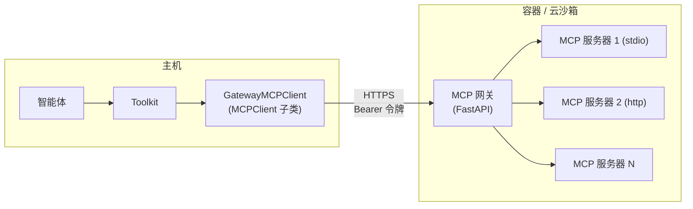

# 07-工作区与沙箱


<!-- 来源：概述.md -->


## 概述

> 为智能体提供可执行、可持久化的运行环境

工作区（Workspace）是智能体的运行环境。它提供智能体行动所需的资源，并统一管理其中所有资源的生命周期（MCP 服务器进程、动态添加的技能、卸载的文件）：

| 资源    | 工作区提供的能力                                            |
| ----- | --------------------------------------------------- |
| 工具    | 通过工作区后端执行的内置工具（Bash、Read、Write 等），以及已注册 MCP 服务提供的工具 |
| 技能    | 存放在 `skills/` 目录下的 Markdown 指令集，供智能体的 `Skill` 查看器读取 |
| 上下文卸载 | 通过 `Offloader` 协议持久化被压缩的消息与被截断的工具结果                 |

BocomAgentScope 提供七种工作区实现，各对应一种运行环境。所有实现共享同一接口，同一份智能体代码可以运行在任意后端上：

| 类                      | 运行环境                                                            | 持久化方式                                                 |
| ---------------------- | --------------------------------------------------------------- | ----------------------------------------------------- |
| `LocalWorkspace`       | 本机文件系统                                                          | 主机上的 `workdir` 目录                                     |
| `BubblewrapWorkspace`  | Linux [bubblewrap](https://github.com/containers/bubblewrap) 沙箱 | 主机 `host_workdir` 挂载到沙箱内 `/workspace`；不传则使用关闭时删除的临时目录 |
| `DockerWorkspace`      | Docker 容器                                                       | 主机 `workdir` 挂载到容器内 `/workspace`；不传则为临时容器             |
| `E2BWorkspace`         | [E2B](https://e2b.dev) 云沙箱                                      | 沙箱文件系统；通过沙箱元数据重新挂接                                    |
| `DaytonaWorkspace`     | [Daytona](https://www.daytona.io) 沙箱                            | 沙箱文件系统；通过沙箱标签重新挂接                                     |
| `K8sWorkspace`         | Kubernetes Pod                                                  | 挂载到 Pod 的 PVC；按工作区标识派生的名称重新挂接                         |
| `OpenSandboxWorkspace` | [OpenSandbox](https://github.com/bocomagentscope-ai/opensandbox) 沙箱  | 沙箱文件系统；通过沙箱元数据重新挂接                                    |

### 接口

所有实现都派生自 `WorkspaceBase`，其方法可分为四类角色：

| 角色    | 方法                                                                      | 调用方                 |
| ----- | ----------------------------------------------------------------------- | ------------------- |
| 生命周期  | `initialize()` / `close()` / `reset()`，以及 `async with` 协议               | 开发者，或工作区管理器         |
| 资源发现  | `list_tools()` / `list_mcps()` / `list_skills()` / `get_instructions()` | 装配智能体时，用于构建工具包与系统提示 |
| 上下文卸载 | `offload_context()` / `offload_tool_result()`                           | 智能体，在压缩或截断触发时       |
| 动态管理  | `add_mcp()` / `remove_mcp()` / `add_skill()` / `remove_skill()`         | 开发者或服务，在运行时         |

对于沙箱类后端（Bubblewrap、Docker、E2B、Daytona、K8s、OpenSandbox），MCP 服务器运行在隔离环境*内部*，主机通过工作区内的网关访问它们，详见 [MCP 网关](MCP网关.md)。

### 延伸阅读

<CardGroup cols={2}>
  <Card title="运行工作区" icon="play" href="/versions/2.0.8dev/zh/building-blocks/workspace/run-workspace">
    在任意后端上创建工作区，并接入智能体。
  </Card>

  <Card title="管理资源" icon="boxes-stacked" href="/versions/2.0.8dev/zh/building-blocks/workspace/manage-resources">
    在运行时添加、移除 MCP 服务与技能。
  </Card>

  <Card title="MCP 网关" icon="tower-broadcast" href="/versions/2.0.8dev/zh/building-blocks/workspace/mcp-gateway">
    沙箱类工作区如何把内部的 MCP 服务暴露给主机。
  </Card>

  <Card title="工作区管理器" icon="server" href="/versions/2.0.8dev/zh/deploy/workspace-manager">
    在服务中按用户、智能体或会话分配与隔离工作区。
  </Card>
</CardGroup>


<!-- 来源：MCP网关.md -->


## MCP 网关

> 沙箱类工作区如何把内部的 MCP 服务暴露给主机

沙箱类工作区（Bubblewrap、Docker、E2B、Daytona、K8s、OpenSandbox）无法直接注册主机侧的 MCP 客户端：MCP 服务器运行在容器或沙箱内部，stdio 会话无法跨越这条边界。BocomAgentScope 通过 **MCP 网关**解决这个问题：一个运行在工作区*内部*的轻量 FastAPI 进程，持有上游 MCP 会话，并通过一个带鉴权的 HTTP 端点统一暴露给主机。



网关暴露一组精简的 REST 接口（`GET /health`、`GET/POST/DELETE /mcps`、`GET /mcps/{name}/tools`、`POST /mcps/{name}/tools/{tool}`），由每次 `initialize()` 时生成的工作区专属 Bearer 令牌保护。主机侧由两个适配器保持标准接口不变：

| 适配器                | 基类          | 职责                                                                            |
| ------------------ | ----------- | ----------------------------------------------------------------------------- |
| `GatewayMCPClient` | `MCPClient` | `connect` / `close` / `list_tools` 转换为对网关的 HTTP 请求，工具包的其余部分无法将其与本地 MCP 客户端区分开 |
| `GatewayMCPTool`   | `ToolBase`  | `__call__` 向 `/mcps/{name}/tools/{tool}` 发起 POST，并重建返回的 `ToolChunk`           |

这层抽象让智能体侧代码在所有工作区后端上保持一致：无论上游会话位于主机（`LocalWorkspace`）还是隔离环境（所有沙箱类工作区），工作区的 `list_mcps()` 返回的都是 `MCPClient` 实例。

<Note>
  网关**不会**发布在主机可达的网络端口上。每次主机到网关的调用都在沙箱*内部*执行：`GatewayMCPClient` 通过后端的 `exec_shell` 以 `curl` 命令发起请求，网关始终只监听沙箱自身的回环地址。由于沙箱没有对外监听的服务，这一设计避免了对外开放网关端口带来的攻击面。
</Note>

`BubblewrapWorkspace` 是例外：它与主机共享网络命名空间，沙箱的回环地址即主机回环地址，主机上的其他进程有可能访问到该端口。因此它额外启用了两道防护：

| 防护措施      | 作用                                                       |
| --------- | -------------------------------------------------------- |
| Bearer 令牌 | 网关要求携带该工作区专属的令牌，即使其他进程发现了端口，也无法驱动其中的 MCP 服务              |
| 实例随机数     | `/health` 探测不携带令牌，且响应中必须包含本次启动网关时生成的随机数，避免端口竞争把令牌泄露给无关进程 |


<!-- 来源：管理资源.md -->


## 管理资源

> 在运行时添加、移除 MCP 服务与技能

工作区的资源并非在创建时就固定不变。MCP 服务与技能都可以在工作区运行期间添加或移除，且每次变更都会持久化，重启后依然生效。生命周期方法则负责把工作区从开通带到释放。

### 管理 MCP 服务

MCP 声明按 `agent_id + session_id` 隔离。即使多个会话共用同一个工作区，状态型 MCP 的连接、Cookie 和登录状态也不会串到其他会话。客户端在该会话首次调用 `list_mcps` 时才会建立连接：

```python theme={null}
from bocomagentscope.mcp import MCPClient, HttpMCPConfig

# 注册新的 MCP 服务；名称已存在时抛出 ValueError
await workspace.add_mcp(
    MCPClient(
        name="amap",
        is_stateful=False,
        mcp_config=HttpMCPConfig(url="https://mcp.amap.com/mcp?key=..."),
    ),
    agent_id="coder",
    session_id="session-1",
)

# 按名称注销；名称不存在时记录警告并静默返回
await workspace.remove_mcp(
    "amap",
    agent_id="coder",
    session_id="session-1",
)

# 枚举当前已注册的客户端
mcps = await workspace.list_mcps(
    agent_id="coder",
    session_id="session-1",
)
```

<Note>
  持久化遵循工作区自身的模型：未挂载主机 `workdir` 的临时 `DockerWorkspace` 只在内存中保存 MCP 列表，容器销毁后即丢失。
</Note>

### 管理技能

技能按 `agent_id` 隔离。`skill_paths` 先写入 `skills/.seed` 模板；智能体首次访问时，工作区为它创建独立分区。`add_skill`、`remove_skill` 与 `list_skills` 只操作指定智能体的分区：

```python theme={null}
# 把本地技能目录复制进工作区；
# 缺少 SKILL.md 或目录已存在时抛出 ValueError
await workspace.add_skill("./skills/web-search", agent_id="coder")

# 按 frontmatter 中的名称删除；找不到时抛出 KeyError
await workspace.remove_skill("web-search", agent_id="coder")

# 枚举可用技能（从各 SKILL.md 解析）
skills = await workspace.list_skills(agent_id="coder")
```

### 管理生命周期

三个方法贯穿工作区的一生，`async with` 协议则把 `initialize` / `close` 包装为作用域用法：

| 方法             | 效果                                     |
| -------------- | -------------------------------------- |
| `initialize()` | 开通后端（启动容器 / 沙箱 / Pod）、恢复 MCP 声明、准备技能种子 |
| `reset()`      | 把工作区恢复为空状态：关闭并移除全部 MCP、删除全部技能、清空各会话状态  |
| `close()`      | 释放全部资源与连接                              |

```python theme={null}
async with LocalWorkspace(workdir="./ws") as workspace:
    ...  # 进入时 initialize()，退出时 close()
```

<Warning>
  `reset()` 会删除所有会话的 MCP 声明、技能分区和会话状态。此后会话再次访问 MCP 时会重新继承 `default_mcps`；`skill_paths` 则不会重新播种。
</Warning>

### 在服务中分配工作区

在多租户服务中，决定哪个请求使用哪个工作区（按用户、智能体或会话）、缓存活跃实例、淘汰空闲实例，是**工作区管理器**的职责，它是独立的服务侧组件，有专门的章节介绍：

<Card title="工作区管理器" icon="server" href="/versions/2.0.8dev/zh/deploy/workspace-manager" cta="查看部署文档" arrow>
  分配与隔离策略、TTL 淘汰，以及与智能体服务的集成。
</Card>


<!-- 来源：运行工作区.md -->


## 运行工作区

> 在任意后端上创建工作区，并接入智能体

运行一个工作区分两步：在与目标环境匹配的后端上创建工作区，再把它的资源交给智能体。

### 创建工作区

每种后端有各自的持久化模型与目录布局，选择与目标环境匹配的标签页：

<Tabs>
  <Tab title="本地">
    `LocalWorkspace` 把状态直接持久化在主机文件系统的 `workdir` 之下，重启后重新打开同一目录即可。目录布局如下：

    ```
    {workdir}/
    ├── .mcp           # 按智能体/会话保存的 MCP 声明
    ├── data/          # 卸载的多模态内容（按 SHA-256 去重）
    ├── skills/        # .seed 模板及按智能体隔离的技能目录
    └── sessions/      # 各会话的 context.jsonl 与工具结果文件
    ```

    ```python theme={null}
    from bocomagentscope.workspace import LocalWorkspace

    workspace = LocalWorkspace(
        workdir="/data/my-workspace",
        default_mcps=[],
        skill_paths=["./skills/web-search"],
    )
    await workspace.initialize()
    ```
  </Tab>

  <Tab title="Bubblewrap">
    `BubblewrapWorkspace` 通过 [bubblewrap](https://github.com/containers/bubblewrap)（`bwrap`）执行每一条命令，无需守护进程或云端账号，只要 Linux 主机上装有 `bwrap` 即可。`host_workdir` 以读写方式挂载到沙箱内的 `/workspace`，用于保存状态；不传该参数则使用临时目录，关闭时一并删除。

    ```
    {host_workdir}/    # 主机目录，挂载到沙箱内的 /workspace
    ├── .bocomagentscope    # 网关虚拟环境与运行时文件
    ├── .mcp           # 按智能体/会话保存的 MCP 声明
    ├── data/          # 卸载的多模态数据
    ├── skills/        # .seed 模板及按智能体隔离的技能目录
    └── sessions/      # 每个会话的 context.jsonl 与工具结果文件
    ```

    ```python theme={null}
    from bocomagentscope.workspace import BubblewrapWorkspace

    workspace = BubblewrapWorkspace(
        host_workdir="/data/bwrap-workspaces/agent-1",  # 挂载到 /workspace
        host_cache_dir=None,        # None 表示使用工作区私有的包缓存目录
        gateway_port=None,          # None 表示自动选择可用的回环端口
        extra_pip=["numpy", "pandas"],
        default_mcps=[],
        skill_paths=["./skills/web-search"],
    )
    await workspace.initialize()
    ```

    <Warning>
      该工作区**不隔离网络**。MCP 网关需要在多次 `bwrap` 执行之间通过主机回环地址访问，因此 `share_net` 必须保持为 `True`，沙箱内的代码与主机共享网络命名空间：主机能访问的服务它都能访问，包括其他回环服务与云环境的元数据地址。除网络命名空间外，bubblewrap 仍然隔离其余命名空间与挂载的文件系统。如果业务同时需要网络隔离，请改用 Docker、K8s 或云沙箱。
    </Warning>

    显式传入的 `host_cache_dir` 不能与 `host_workdir` 重叠；多个工作区共用同一缓存目录会以隔离性换取更快的初始化速度，仅建议在互相信任的工作区之间使用。
  </Tab>

  <Tab title="Docker">
    `DockerWorkspace` 把主机 `workdir` 挂载到容器内的 `/workspace`，因此下面的目录位于主机上，容器重启后依然存在。不传 `workdir` 则得到一个纯临时容器，可写层随容器一起消失。

    ```
    {workdir}/         # 主机目录，挂载到容器内 /workspace
    ├── .mcp           # 按智能体/会话保存的 MCP 声明
    ├── data/          # 卸载的多模态内容
    ├── skills/        # .seed 模板及按智能体隔离的技能目录
    └── sessions/      # 各会话的 context.jsonl 与工具结果文件
    ```

    ```python theme={null}
    from bocomagentscope.workspace import DockerWorkspace

    workspace = DockerWorkspace(
        base_image="python:3.11-slim",
        workdir="/data/docker-workspaces/agent-1",  # 挂载到 /workspace
        node_version="20",
        extra_pip=["numpy", "pandas"],
        default_mcps=[],
        skill_paths=["./skills/web-search"],
    )
    await workspace.initialize()
    ```
  </Tab>

  <Tab title="E2B">
    `E2BWorkspace` 以沙箱文件系统本身作为持久化层，没有主机 `workdir`。每个沙箱的 E2B 元数据中记录了 `workspace_id`；重启后工作区通过 `AsyncSandbox.list(...)` 查找并用 `connect(sandbox_id=...)` 重连。暂停会保留磁盘状态，恢复后原样还原。

    ```
    $workdir/          # 沙箱内部
    ├── .mcp           # 按智能体/会话保存的 MCP 声明
    ├── data/          # 卸载的多模态内容
    ├── skills/        # .seed 模板及按智能体隔离的技能目录
    └── sessions/      # 各会话的 context.jsonl 与工具结果文件
    ```

    ```python theme={null}
    from bocomagentscope.workspace import E2BWorkspace

    workspace = E2BWorkspace(
        template="base",
        api_key="your-e2b-api-key",   # 或设置 E2B_API_KEY 环境变量
        timeout_seconds=300,
        default_mcps=[],
        skill_paths=["./skills/web-search"],
    )
    await workspace.initialize()
    ```
  </Tab>

  <Tab title="Daytona">
    `DaytonaWorkspace` 面向 [Daytona](https://www.daytona.io) 部署，以沙箱文件系统作为持久化层，没有主机 `workdir`。每个沙箱的 Daytona 标签中记录了 `workspace_id`；重启后工作区按该标签重新挂接，沿用沙箱的磁盘状态。

    ```
    $workdir/          # 沙箱内部
    ├── .mcp           # 按智能体/会话保存的 MCP 声明
    ├── data/          # 卸载的多模态内容
    ├── skills/        # .seed 模板及按智能体隔离的技能目录
    └── sessions/      # 各会话的 context.jsonl 与工具结果文件
    ```

    ```python theme={null}
    from bocomagentscope.workspace import DaytonaWorkspace

    workspace = DaytonaWorkspace(
        api_key="your-daytona-api-key",  # "" 时读取 SDK 的环境配置
        api_url="",                      # 可选，用于自建部署
        timeout_seconds=300,
        extra_pip=["numpy", "pandas"],
        default_mcps=[],
        skill_paths=["./skills/web-search"],
    )
    await workspace.initialize()
    ```
  </Tab>

  <Tab title="Kubernetes">
    `K8sWorkspace` 在 Kubernetes 集群上为每个工作区运行一个 Pod，并挂载一个 PVC 作为持久化层，下面的文件系统在 Pod 重启后依然存在。重启后工作区按工作区标识派生的名称重新挂接 Pod 与 PVC。设置 `delete_pvc_on_close=True` 可在关闭工作区时一并删除 PVC。

    ```
    /workspace/        # Pod 内部，由 PVC 支撑
    ├── .mcp           # 按智能体/会话保存的 MCP 声明
    ├── data/          # 卸载的多模态内容
    ├── skills/        # .seed 模板及按智能体隔离的技能目录
    └── sessions/      # 各会话的 context.jsonl 与工具结果文件
    ```

    ```python theme={null}
    from bocomagentscope.workspace import K8sWorkspace

    workspace = K8sWorkspace(
        namespace="bocomagentscope",       # Pod 与 PVC 所在的命名空间
        kubeconfig=None,              # None 时使用集群内配置
        image="python:3.11-slim",     # 容器镜像
        storage_size="1Gi",           # 支撑文件系统的 PVC 大小
        default_mcps=[],
        skill_paths=["./skills/web-search"],
    )
    await workspace.initialize()
    ```
  </Tab>

  <Tab title="OpenSandbox">
    `OpenSandboxWorkspace` 面向 [OpenSandbox](https://github.com/bocomagentscope-ai/opensandbox) 部署，以沙箱文件系统作为持久化层，没有主机 `workdir`。每个沙箱在 `bocomagentscope.workspace.id` 元数据键下记录了 `workspace_id`；重启后工作区按该键过滤 `list_sandbox_infos(...)`，恢复匹配的沙箱并原样还原磁盘状态。

    ```
    /workspace/        # 沙箱内部（SANDBOX_WORKDIR）
    ├── .mcp           # 按智能体/会话保存的 MCP 声明
    ├── data/          # 卸载的多模态内容
    ├── skills/        # .seed 模板及按智能体隔离的技能目录
    └── sessions/      # 各会话的 context.jsonl 与工具结果文件
    ```

    ```python theme={null}
    from bocomagentscope.workspace import OpenSandboxWorkspace

    workspace = OpenSandboxWorkspace(
        image="python:3.11-slim",
        api_key="your-opensandbox-api-key",  # 或使用 SDK 的环境变量回退
        domain="your-opensandbox-domain",    # 可选，用于自建部署
        protocol="http",
        timeout_seconds=300,
        extra_pip=["numpy", "pandas"],
        default_mcps=[],
        skill_paths=["./skills/web-search"],
    )
    await workspace.initialize()
    ```

    网关虚拟环境在首次 `initialize()` 时在沙箱内自举，`extra_pip` 的包会与网关基础依赖一并装入。由于精简基础镜像冷启动时要执行数分钟的 `apt-get` + `uv` + `pip`，自举命令使用更长的单命令超时；除非确认镜像已预装环境，否则请保持 `request_timeout_seconds` 的默认值（与自举预算一致）。
  </Tab>
</Tabs>

<Note>
  `default_mcps` 与 `skill_paths` 是种子输入，但不会让资源在共享工作区内混用。每个智能体/会话在首次访问 MCP 时获得独立客户端实例；每个智能体在首次访问技能时，从 `skills/.seed` 复制出自己的技能分区。后续添加或删除只影响对应的智能体/会话。
</Note>

### 集成智能体

工作区从两条路径接入 `Agent`：作为工具、MCP 与技能的来源，以及作为上下文压缩的卸载器：

```python theme={null}
from bocomagentscope.agent import Agent
from bocomagentscope.tool import Toolkit
from bocomagentscope.workspace import LocalWorkspace

workspace = LocalWorkspace(workdir="./my-workspace")
await workspace.initialize()

agent_id = "coder"
session_id = "session-1"

agent = Agent(
    name="coder",
    system_prompt="你是一个编程助手。",
    model=model,
    toolkit=Toolkit(
        tools=await workspace.list_tools(),
        mcps=await workspace.list_mcps(
            agent_id=agent_id,
            session_id=session_id,
        ),
        skills_or_loaders=await workspace.list_skills(agent_id=agent_id),
    ),
    offloader=workspace,
)
```

| 路径 | 接入方式                                                  | 智能体获得的能力                                                                                      |
| -- | ----------------------------------------------------- | --------------------------------------------------------------------------------------------- |
| 资源 | `Toolkit(tools=..., mcps=..., skills_or_loaders=...)` | 工作区中可用的内置工具、MCP 工具与技能                                                                         |
| 卸载 | `Agent(offloader=workspace)`                          | 上下文压缩触发或工具结果超限时，智能体调用 `workspace.offload_context()` / `offload_tool_result()`，并以返回的引用路径替代原始内容 |

`list_tools()` 返回的工具已绑定到工作区的执行后端，在沙箱类工作区上会在容器或沙箱内部运行。若要把自己构造的工具绑定到同一环境，通过 `workspace.get_backend()` 获取后端并传给工具构造函数，参见[切换工具后端](../06-工具/Python函数工具.md#切换工具后端)。

<Tip>
  工作区以扁平列表的形式暴露资源，当工具过多、无法全部保持激活时，可以把它们划分为若干 `ToolGroup`。将分组传入 `Toolkit(tool_groups=[...])` 后，智能体通过内置的[元工具](../06-工具/元工具.md)按需激活；只有保留的 `basic` 组始终在线。

  ```python theme={null}
  from bocomagentscope.tool import Toolkit, ToolGroup

  mcps = await workspace.list_mcps(
      agent_id=agent_id,
      session_id=session_id,
  )
  skills = await workspace.list_skills(agent_id=agent_id)

  toolkit = Toolkit(
      tools=await workspace.list_tools(),         # 始终激活（basic 组）
      tool_groups=[
          ToolGroup(name="search", description="Web 搜索与检索。",
                    mcps=[m for m in mcps if m.name.startswith("search")]),
          ToolGroup(name="coding", description="代码编辑技能。",
                    skills_or_loaders=skills),
      ],
  )
  ```
</Tip>
