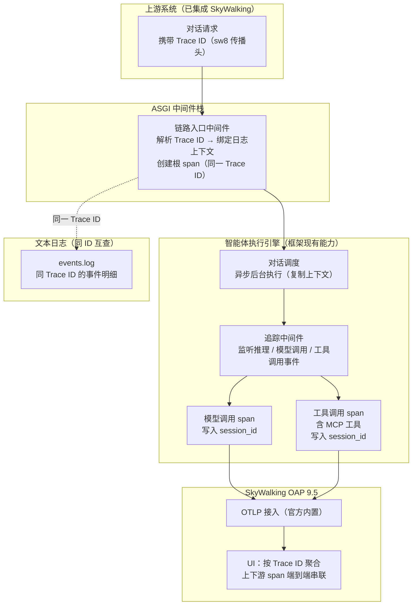
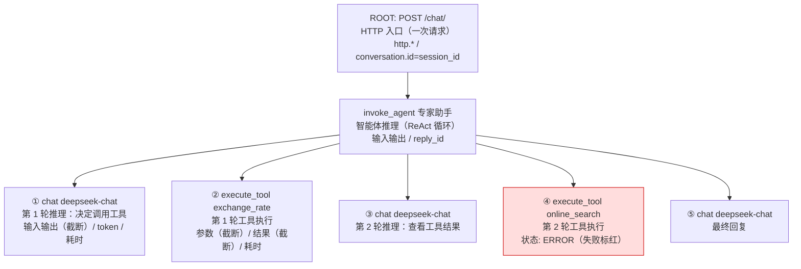
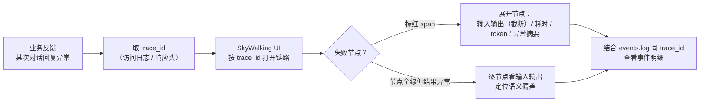

# 智能体运行时链路追踪方案（SkyWalking OAP 9.5）

> 面向评审专家：顶层设计方案——**智能体运行时**（对话推理循环、大模型调用、工具与 MCP 调用）的全链路可观测。方案已集成 **SkyWalking OAP 9.5**，智能体整个循环的每个关键阶段（HTTP 入口、智能体推理、大模型调用、工具/MCP 调用）自动成为可追踪 span，业务失败时可按 trace_id 快速定位排错。
>
> **背景事实**：上下游系统均已集成 SkyWalking；本项目内部以 **session_id** 为业务关联维度。
>
> **方案结论**：以 OTLP 协议直连 SkyWalking OAP 9.5（官方内置 OTLP receiver），**零框架源码改动**；入口解析上游 sw8 传播头继承 Trace ID，本项目 span 与上游同一条 trace 端到端串联；每个 span 同时写入 session_id，支持按会话维度检索。

---

## 1. 背景与目标

### 1.1 背景：智能体运行时是多阶段循环

智能体的一次对话不是简单的请求-响应，而是由智能体推理循环（ReAct）驱动的多阶段链路：一次对话从 HTTP 触发开始，进入智能体推理循环，循环中的每一轮都会调用大模型，部分轮次还会调用工具（含 MCP 工具），最终由模型产出回复。

```
一次对话 = HTTP 触发 → 智能体推理循环（多轮）
                        ├─ 每轮：大模型调用（chat）
                        └─ 每轮可含：工具调用 / MCP 工具调用（execute_tool）
                       → 产出回复
```

这条链路长、节点多、呈黑盒：当业务失败（回复异常、工具报错、超时）时，传统日志只能逐条翻找，难以回答"哪一步失败、为什么失败、耗时花在哪"。

### 1.2 目标

本方案要实现四个目标。其一，**智能体整个循环可追踪**——对话、推理、大模型调用、工具/MCP 调用各阶段均为独立 span，在 SkyWalking UI 中呈现完整 span 树；其二，**业务失败可排错**——按 trace_id 查看整条链路，失败节点标红，输入输出与耗时一目了然；其三，**会话级检索**——每个 span 写入 session_id，按会话一键拉出该会话全部链路；其四，**可灰度回退**——配置一键切换 none / langfuse / skywalking 三种后端。

### 1.3 范围边界

设计范围限定于 `bocomadp/` 侧与 `config.yaml` 配置，不修改 AgentScope 框架源码。现有事件日志体系保持不变，日志中的 trace_id 与 SkyWalking traceId 同 ID，双通道互查。

---

## 2. SkyWalking 集成（已集成）

### 2.1 接入方式

**SkyWalking 已完成集成**：本项目通过标准 OTLP 协议直连 SkyWalking OAP 9.5 上报 span——span 由框架内置 TracingMiddleware 自动生成（**零埋点、零框架改动**）；入口解析上游 sw8 头继承 Trace ID，实现跨系统端到端串联，上游未携带时本地生成，链路自洽。

### 2.2 基本配置

追踪行为通过 config.yaml 中的 tracing 配置段控制，共五项配置。`backend` 指定追踪后端，取值为 none / langfuse / skywalking，默认 skywalking；`endpoint` 为 OTLP 上报地址，支持通过 `SW_OTLP_ENDPOINT` 环境变量注入；`sample_ratio` 为采样率，默认全量，且上游已采样的请求全量跟随，保证跨系统链路完整；`max_attr_len` 控制 span 属性截断长度（默认 2000），用于控制上报体积；`redact_keywords` 配置敏感词脱敏——命中关键词的 span 属性值统一替换为 `***`，凭证字段（api_key、token 等）一律不采集，与脱敏词表形成双重保障。

### 2.3 总体架构

下图展示端到端的数据流：上游系统携带 Trace ID 发起对话请求，链路入口中间件解析 Trace ID 并绑定到日志上下文，同时创建根 span；智能体执行引擎中的对话调度以异步后台方式执行（复制上下文），追踪中间件监听推理、模型调用、工具调用事件，分别为模型调用和工具调用生成 span 并写入 session_id；所有 span 经 OTLP 接入上报至 SkyWalking OAP，在 UI 中按 Trace ID 聚合为端到端链路；与此同时，文本日志以同一 Trace ID 记录事件明细，与链路互为印证。



**图 1：总体架构**

---

## 3. span 设计：智能体运行时的追踪粒度

### 3.1 追踪粒度

框架 TracingMiddleware 已为智能体运行时的关键阶段生成 span，与推理循环的节点一一对应。下图展示一次典型对话的 span 树：根 span 对应 HTTP 入口（一次请求粒度），其下是智能体推理 span（一次完整推理循环），推理循环内部 chat 与 execute_tool 交替出现——每轮推理一次模型调用，工具调用可有可无、轮数不固定，最终一轮模型调用产出回复；图中第 2 轮工具调用失败，该节点标记为 ERROR 标红。



**图 2：智能体运行时 span 树**

四个阶段的追踪粒度如下。**HTTP 入口**（ROOT span）粒度是一次请求，记录 trace_id、session_id、user_id 与请求耗时；**智能体推理**（invoke_agent）粒度是一次完整推理循环，记录循环总耗时、输入输出与 reply_id；**大模型调用**（chat）粒度是单次模型调用，记录模型输入输出（截断前 N 字）、token 用量与耗时；**工具调用**（execute_tool）粒度是单次工具执行，记录工具参数与结果（截断前 N 字）、耗时与状态，MCP 工具同样纳入该体系。

### 3.2 追踪能力

span 体系具备四项追踪能力。**多轮 ReAct 完整展开**：循环每一轮生成独立的 chat / execute_tool span，UI 中可展开整个推理过程，看到"模型想了几轮、每轮做了什么"；**失败节点标红**：模型或工具异常时对应 span 标记 ERROR 并记录异常摘要，排错直达病灶；**工具全覆盖**：execute_tool 覆盖全部工具调用，含 MCP 工具——MCP 服务器以工具形式参与智能体循环，同一 span 体系追踪，不区分来源；**会话关联**：每个 span 自动写入 session_id（gen_ai.conversation.id），支持按会话检索。

---

## 4. 如何追踪与排错

### 4.1 追踪入口

追踪有三种入口。**按 trace_id 追踪一次对话**（精确到某次请求）：从访问日志中检索 "POST /chat" 取该请求的 trace_id，在 SkyWalking UI 的 Trace 查询页输入 trace_id 打开链路，span 树完整展开（ROOT → invoke_agent → 逐轮 chat / execute_tool），点击任意 span 可查看耗时、状态与 Tags（输入输出截断、token、session_id）。**按 session_id 追踪整个会话**（业务维度，跨多次请求）：在 Trace 查询页添加 Tag 过滤 `gen_ai.conversation.id = {session_id}`，即可得到该会话全部链路按时间排列。**按时间浏览**（无 ID 兜底）：Trace 查询页按时间范围、服务名与端点（POST /chat）查询，最近请求的链路一目了然，适合"只知道大概时间、没有 ID"的场景。

### 4.2 span 详情与日志联动

每个 span 上可查看五类信息：输入/输出（截断前 N 字）回答"模型收到什么、工具返回什么"；token 用量回答"模型调用花费"；耗时与状态回答"每阶段耗时多少、哪个节点失败"；异常摘要在 ERROR span 上直达失败原因；session_id（conversation.id）完成会话关联。日志联动方面，同 trace_id 在 events.log 中检索即可拿到事件明细——链路图看结构，日志看明细。

### 4.3 排错场景：业务失败如何定位

下图给出业务失败的通用定位路径：从业务反馈出发，取 trace_id 后在 SkyWalking UI 打开链路，若存在标红节点则展开查看输入输出、耗时、token 与异常摘要，若节点全绿但结果异常则逐节点核对输入输出定位语义偏差，最后结合 events.log 同 trace_id 的事件明细确认根因。



**图 3：业务失败定位流程**

四个典型场景的定位路径如下。**某次对话回复异常**：访问日志取 trace_id → UI 打开链路 → 失败节点标红，展开看输入输出/耗时/异常摘要 → 结合 events.log 同 ID 明细。**某用户某会话出问题**：UI 按 gen_ai.conversation.id（= session_id）过滤，该会话全部链路按时间排列，定位异常那次。**性能排查（回复慢）**：各节点耗时一目了然，模型调用慢、工具执行慢还是推理轮次过多，一眼定位瓶颈。**跨系统问题**：上游携带 sw8 头时链路含上游 span，可判断问题是上游传入还是本项目产生。

---

## 5. 方案产出物

方案划分为 5 个模块，全部位于 `bocomadp/` 侧与 config.yaml，框架源码保持不变。**统一装配模块**（tracing/bootstrap.py）持有 TracingMiddleware 单例，按 backend 装配 TracerProvider、OTLP exporter 与采样器，承载截断与脱敏；**SkyWalking 接入入口**（custom/skywalking_tracing.py）在 backend=skywalking 时启用并导出单例供中间件注册；**Langfuse 兼容层**（langfuse_tracing.py）在 backend=langfuse 时启用，保证可回退；**sw8 解析 + root span**（trace_middleware.py）解析 sw8 提取 Trace ID（无头则生成），绑定日志 trace_id 并创建 OTel ROOT span；**配置项**位于 app_config.py 与 config.yaml 的 tracing 配置段。交付特性：可灰度（backend 一键切换）、可回退（事件日志体系始终保留，双通道互为印证）。

---

## 6. 可行性论证

方案可行性由四点支撑。**协议可行**：SkyWalking OAP 9.5 官方内置 OTLP receiver（4317/4318），可直接接收 OpenTelemetry 数据；**零新增埋点**：框架 TracingMiddleware 已生成 invoke_agent / chat / execute_tool 三层 span，与智能体循环节点天然对应；**Trace ID 继承有标准依据**：sw8 为 SkyWalking 官方公开传播标准，相同 Trace ID 即端到端串联，现有 trace_middleware 已有"读头 → 绑定 → 注入日志"骨架；**风险可控、可回退**：sw8 缺失时本地生成不影响服务，backend 一键切换 none / langfuse / skywalking。

---

## 7. 验证方案

验证分五项进行。**端到端串联**：上游带 sw8 调用，UI 中本项目 span 与上游 span 同一条 trace；**日志同 ID**：events.log 的 trace_id 与 SkyWalking traceId 一致；**span 树完整性**：ROOT → invoke_agent → chat / execute_tool 层级正确，多轮 ReAct 显示多个 chat span；**节点信息**：chat span 含输入输出（截断）、耗时、token，tool span（含 MCP 工具）含参数与结果（截断）、耗时、状态；**失败定位**：制造模型/工具异常，对应 span 标 ERROR 且含异常摘要。本地验证路径：docker-compose 起 OAP 9.5 + UI，以 `SW_OTLP_ENDPOINT=http://localhost:4318/v1/traces` 启动服务，调用一次含工具调用的对话，在 UI 按 trace_id 核对上述标准。

---

## 附：相关代码索引

关键实现文件：事件日志中间件（`bocomadp/middleware/custom/event_log.py`）、框架 OTel 追踪中间件（`agentscope/middleware/_tracing/_trace.py` 与 `_extractor.py`）、trace_id 贯穿机制（`bocomadp/logging/trace_context.py`）、sw8 解析 + root span（`bocomadp/logging/trace_middleware.py`）、OTLP 上报装配（`bocomadp/middleware/custom/langfuse_tracing.py`）、MCP 工具注册（`bocomadp/mcp/` 与 `agentscope/mcp/`）、配置体系（`bocomadp/config/app_config.py` 与 `config.yaml`）。

---

*本文为评审用技术方案，描述顶层设计与技术路径，不涉及代码实现。配套机制说明见《运行时调用链路与 TraceId》。*
