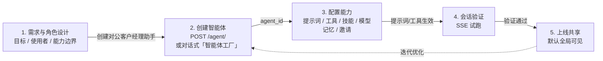

# 智能体发布流程

> 面向银行内部开发者：本文讲清楚一个智能体从「需求」到「可被行内用户使用」的完整发布链路，以及提示词、工具、技能、模型、记忆、并发等每一项配置在哪里、怎么配、何时生效。
>
> 适用代码版本：`examples/agent_service`（BocomADP）。

## 1. 核心概念：智能体是什么

在本平台中，一个智能体等于一条持久化配置记录加上运行时装配出来的能力。配置记录为 AgentRecord（含 AgentData），存储在框架持久化层（PostgreSQL agents 表），字段包括 name、system_prompt、context_config、react_config、invite_config；而运行时能力——工具（Toolkit）、技能（Skill）、中间件（Middleware）、模型（ChatModel）、记忆（Memory）——这些不落库，而是在每次会话（run）时由工厂函数动态装配。

需要特别说明的是，**发布 ≠ 部署**：平台没有"构建镜像、滚动发布"的过程，配置写入 PostgreSQL 即生效；代码级能力（新增工具/技能/中间件）通过「放文件 + 重启」发布。两者下文分述。

## 2. 发布总览

下图给出发布总览：一条完整的发布链路包含五个阶段，创建后可经"迭代优化"回到配置环节循环调整。



**图 1：发布总览**

各阶段要点如下。第一阶段是**需求与角色设计**，明确目标、使用者与能力边界；第二阶段**创建智能体**，通过 POST /agent/ 原生接口或对话式「智能体工厂」完成，产出 agent_id 并存入 PG agents 表；第三阶段**配置能力**，包括提示词、工具、技能、模型与凭证、记忆与邀请，各项配置分别落入 PG 各表与 workspace 目录；第四阶段**会话验证**，通过 SSE 试跑确认提示词、工具、权限符合预期；第五阶段**上线共享**，平台默认全局可见，配置写入即发布。

> 接口约定：本文涉及的 HTTP 接口均为 **AgentScope 原生接口**（`create_app()` 内置注册的 12 个路由模块：/agent、/sessions、/chat、/credential、/model、/skill、/workspace、/hub、/mcp、/knowledge_bases、/schedule、/tts-model）。BocomADP 将整个应用挂载在 `/api` 前缀下（见 main.py 第 8 节 `root_app.mount`），故下文接口一律按实际访问路径书写（如原生 `POST /agent/` 即 `POST /api/agent/`）。

> **curl 通用约定**：下文各阶段的 curl 命令按"一个阶段集中一段"组织，均可在 bash 中直接复制执行，每段开头统一定义以下变量：
>
> - `BASE=http://192.168.0.106/api`——服务根地址（应用整体挂载于 `/api` 前缀，uvicorn 默认 8000 端口，按实际部署修改）；
> - `AUTH="X-User-ID: default"`——身份头：平台从 `X-User-ID` 识别调用者，`default` 为内置用户（自带默认凭证），真实环境替换为对应工号；
> - `JSON="Content-Type: application/json"`——JSON 请求体内容类型（multipart 上传的接口不使用）。
>
> 命令中的 `<占位符>`（如 `<agent_id>`、`<session_id>`）替换为上一步返回的实际值；`$AGENT_ID`、`$SESSION_ID` 等变量用于路径拼接，已在各段开头定义。

## 3. 第一步：创建智能体

创建智能体有两种方式。

**方式 A：调用原生创建接口（推荐，可脚本化）**。通过 POST /api/agent/ 提交字段，返回 agent_id，之后所有按智能体的配置都使用这个 agent_id。字段 schema 由 GET /api/agent/schema/v2 返回，前端表单据此渲染。涉及接口如下：

| 方法/路径 | 用途 |
|---|---|
| `POST /api/agent/` | 创建智能体，返回 agent_id |
| `GET /api/agent/schema/v2` | 返回字段 schema，前端表单据此渲染 |

提交字段包括：

| 字段 | 必填 | 说明 |
|---|---|---|
| `name` | 是 | 智能体名称，同时作为 Agent 实例的 name |
| `system_prompt` | 是 | 角色定义、行为约束与工作流程 |
| `context_config` | 是 | 上下文压缩控制——trigger_ratio 触发压缩的 token 占比、reserve_ratio 保留占比、compression_prompt 压缩指令、summary_template 摘要模板，默认 0.8 / 0.1 / 内置 |
| `react_config` | 是 | 推理循环控制——max_iters 单轮最大思考-行动迭代数、stop_on_reject 工具被拒后是否停止，默认 20 / false |
| `invite_config` | 否 | 是否可被其他智能体借调进团队，invitable=true 时 invite_description 必填 |

**方式 B：对话式创建（智能体工厂）**。平台内置 _agent-creator（"智能体工厂"）——一个注册在框架持久层的内置智能体（agent_id 为 _agent-creator，归属默认用户、全员可见）。通过原生会话链路与它对话（创建会话 → 发消息，见第 9 章），如"帮我创建一个'利率查询助手'，提示词里说明只负责查询利率"，即可创建/修改/删除智能体，无需写 JSON。工厂工具（bocomadp/tools/agent_factory_tools.py）代为执行 create_agent、update_agent、set_agent_tools、enable_skill_for_agent 等操作，自身只暴露 9 个工厂工具（白名单约束，最小权限）。

#### 第 3 步 curl 命令：创建智能体

```bash
BASE=http://192.168.0.106/api
AUTH="X-User-ID: default"
JSON="Content-Type: application/json"

# ① 查看创建表单字段 schema（前端表单据此渲染，可用它确认各字段默认值）
curl -s -H "X-User-ID: default" "http://192.168.0.106/api/agent/schema/v2"

# ② 创建智能体 → 响应 {"agent_id": "..."}，记下 agent_id 供后续所有配置使用
curl -s -H "X-User-ID: default" -H "Content-Type: application/json" -X POST "http://192.168.0.106/api/agent/" -d '{
  "name": "对公客户经理助手",
  "system_prompt": "你是对公客户经理助手，回答存款、贷款、结算业务问题",
  "context_config": {"trigger_ratio": 0.8, "reserve_ratio": 0.1},
  "react_config": {"max_iters": 20, "stop_on_reject": false},
  "invite_config": {"invitable": false, "invite_description": ""}
}'
```

## 4. 第二步：配置提示词（System Prompt）

提示词是智能体记录的一部分（`AgentData.system_prompt`，存 PG agents 表），随智能体创建写入、随时可改。配置入口如下：

| 方法/路径 | 用途 |
|---|---|
| `POST /api/agent/` | 创建智能体时写入 system_prompt |
| `PATCH /api/agent/{agent_id}` | 更新提示词（部分更新，只覆盖携带字段） |

拼接与占位符规则由 bocomadp/middleware/custom_prompt.py 的 on_system_prompt 钩子实现：以智能体 system_prompt 为主体，支持三个占位符——`<技能注入>` 替换为框架拼好的 `<agent-skills>` 段（技能指令）、`<工作区>` 替换为 `<workspace>` 段（沙箱说明）、`<用户提示词>` 替换为 AgentData 中保存的基础提示词；没有占位符的段自动追加到末尾，不会丢内容。

**图 2：提示词装配链路**

行内公共规范（如"涉及客户信息必须脱敏"）没有单独的"全局提示词"接口：既可以在每个智能体创建时写入相同的 system_prompt（可脚本化批量下发），也可以封装为 on_system_prompt 中间件（Python API）统一注入，两种方式均随配置写入即生效。

#### 第 4 步 curl 命令：配置提示词

```bash
BASE=http://192.168.0.106/api
AUTH="X-User-ID: default"
JSON="Content-Type: application/json"
AGENT_ID="<上一步返回的 agent_id>"   # 替换为实际值

# 更新提示词（PATCH 为部分更新：只覆盖携带字段，其余保持不变）
# 三个占位符 <技能注入> / <工作区> / <用户提示词> 由 CustomPromptMiddleware 替换为实际段落
curl -s -H "X-User-ID: default" -H "Content-Type: application/json" -X PATCH "http://192.168.0.106/api/agent/$AGENT_ID" -d '{
  "system_prompt": "<技能注入>\n你是对公客户经理助手，回答存款、贷款、结算业务问题。\n<工作区>\n<用户提示词>\n涉及客户信息必须脱敏，回答需注明数据口径。"
}'
```

## 5. 第三步：配置工具（Tools）

工具来源有三类：**沙箱内置工具**（bash / read / write / edit / glob / grep）为运行基础能力，不可关闭；**项目工具**（ToolRegistry）来自 tools/builtin_tools.py 与 tools/custom/*.py 自动扫描，加上企业工具（build_enterprise_tools），在会话运行时由 Toolkit 装配；**MCP 工具**来自 mcp/builtin_mcps.py 与 mcp/custom/*.py，通过 workspace 级 MCP 管理接口挂载。

MCP 工具的挂载与管理接口如下：

| 方法/路径 | 用途 |
|---|---|
| `GET /api/workspace/mcp` | workspace 级 MCP 连接列表 |
| `POST /api/workspace/mcp` | 添加 MCP 连接 |
| `POST /api/workspace/mcp/from-library` | 从库添加 MCP 连接 |
| `DELETE /api/workspace/mcp/{mcp_name}` | 移除 MCP 连接 |
| `GET /api/hub/mcp` | MCP 中心（Hub）列表 |
| `GET /api/hub/mcp/{hub_id}/cards` | 浏览某中心的 MCP 卡片 |
| `POST /api/hub/mcp/{hub_id}/cards/{card_id}/install` | 安装 MCP 卡片到 workspace |
| `GET /api/mcp/` | 全局 MCP 连接列表 |
| `PATCH /api/mcp/{mcp_id}` | 更新 MCP 连接配置 |
| `DELETE /api/mcp/{mcp_id}` | 删除 MCP 连接 |

> 说明：原生接口层没有"按智能体开关工具"的白名单 HTTP 接口。工具对智能体是否可见，由会话运行时装配的 Toolkit 决定（Python API 层：`Toolkit(tools=..., mcps=...)` 传入即可用）；MCP 工具挂到 workspace 后即对会话可见，沙箱内置工具恒可用。

新增项目工具时，在 tools/custom/ 下新建 .py 文件、重启自动注册（ToolRegistry.load_custom_tools 自动扫描），无需改 main.py。工具函数必须满足框架工具协议之一：**函数式**——实现带 docstring 与完整类型注解签名的函数，FunctionTool 会从签名与 docstring 自动提取 name / description / input_schema（或用 bocomadp 的 @tool 装饰器）；**类式**——继承框架 ToolBase 类，实现 call 方法及 name / description / input_schema 协议属性。企业工具（如 HR / Doc / ITSM）在 main.py 的 build_enterprise_tools(user_id, agent_id, session_id) 中主动构建（可拿到请求级上下文），来源在 tools/enterprise.py。

#### 第 5 步 curl 命令：配置工具（MCP）

```bash
BASE=http://192.168.0.106/api
AUTH="X-User-ID: default"
JSON="Content-Type: application/json"
AGENT_ID="<智能体 id>"
SESSION_ID="<会话 id>"   # workspace 类接口需绑定会话工作区，会话创建见第 9 章

# ---- workspace 级 MCP（?agent_id= 与 ?session_id= 为必填 query 参数）----

# ① 查看当前工作区已挂载的 MCP 及健康状态
curl -s -H "X-User-ID: default" "http://192.168.0.106/api/workspace/mcp?agent_id=$AGENT_ID&session_id=$SESSION_ID"

# ② 直接添加 MCP 连接（HTTP 型；STDIO 型把 mcp_config 换成 command/args 且 is_stateful=true）
curl -s -H "X-User-ID: default" -H "Content-Type: application/json" -X POST "http://192.168.0.106/api/workspace/mcp?agent_id=$AGENT_ID&session_id=$SESSION_ID" -d '{
  "name": "exchange_rate",
  "is_stateful": false,
  "mcp_config": {
    "type": "http_mcp",
    "url": "https://mcp.example.com/exchange-rate",
    "headers": {"Authorization": "Bearer <token>"}
  }
}'

# ③ 从我的库批量挂载（mcp_ids 来自下方 ⑨ GET /api/mcp/ 返回的记录 id）
curl -s -H "X-User-ID: default" -H "Content-Type: application/json" -X POST "http://192.168.0.106/api/workspace/mcp/from-library?agent_id=$AGENT_ID&session_id=$SESSION_ID" -d '{
  "mcp_ids": ["<mcp_id_1>", "<mcp_id_2>"]
}'

# ④ 从工作区移除 MCP
curl -s -H "X-User-ID: default" -X DELETE "http://192.168.0.106/api/workspace/mcp/exchange_rate?agent_id=$AGENT_ID&session_id=$SESSION_ID"

# ---- MCP 中心（Hub）----

# ⑤ 列出已注册的 MCP 中心
curl -s -H "X-User-ID: default" "http://192.168.0.106/api/hub/mcp"

# ⑥ 浏览某中心的 MCP 卡片（q 为可选搜索关键字，limit 默认 20）
curl -s -H "X-User-ID: default" "http://192.168.0.106/api/hub/mcp/<hub_id>/cards?q=汇率&limit=20"

# ⑦ 查看单张卡片，确认需要填写的 inputs_schema（安装前先看它）
curl -s -H "X-User-ID: default" "http://192.168.0.106/api/hub/mcp/<hub_id>/cards/<card_id>"

# ⑧ 安装卡片到我的库（values 按卡片 inputs_schema 填写，如 API Key），返回 MCP 记录
curl -s -H "X-User-ID: default" -H "Content-Type: application/json" -X POST "http://192.168.0.106/api/hub/mcp/<hub_id>/cards/<card_id>/install" -d '{
  "name": "exchange_rate",
  "values": {"api_key": "sk-xxx"}
}'

# ---- 全局 MCP 库（用户级，安装卡片/手写添加后都进这里）----

# ⑨ 我的 MCP 库列表（含记录 id，供 from-library / PATCH / DELETE 使用）
curl -s -H "X-User-ID: default" "http://192.168.0.106/api/mcp/"

# ⑩ 更新 MCP：改名 / 启停（enabled）/ 重填密钥（values 仅对来自卡片的 MCP 有效）
curl -s -H "X-User-ID: default" -H "Content-Type: application/json" -X PATCH "http://192.168.0.106/api/mcp/<mcp_id>" -d '{
  "name": "exchange_rate_v2",
  "enabled": true
}'

# ⑪ 从库中删除（不影响已挂载到工作区的实例）
curl -s -H "X-User-ID: default" -X DELETE "http://192.168.0.106/api/mcp/<mcp_id>"
```

## 6. 第四步：配置技能（Skills）

技能是带 SKILL.md 的指令包，挂到智能体 workspace 下，由框架拼进 `<agent-skills>` 段。技能来源与安装接口如下：

| 方法/路径 | 用途 |
|---|---|
| `GET /api/workspace/skill` | workspace 技能列表 |
| `POST /api/workspace/skill/upload` | 上传安装技能 |
| `POST /api/workspace/skill/from-library` | 从库添加技能 |
| `DELETE /api/workspace/skill/{skill_name}` | 移除技能 |
| `GET /api/skill/` | 框架 Skill 列表 |
| `GET /api/skill/{skill_id}` | Skill 详情 |
| `DELETE /api/skill/{skill_id}` | 删除 Skill |
| `GET /api/hub/skill` | 外部技能 Hub（Claw / GitHub MCP Hub，main.py 的 skill_hubs）列表 |
| `GET /api/hub/skill/{hub_id}/cards` | 浏览某 Hub 的技能卡片 |
| `POST /api/hub/skill/{hub_id}/cards/{card_id}/install` | 安装技能卡片到 workspace |

技能安装到 workspace 后即对会话可见，无需单独的"启用"动作；用户在会话中输入 "/技能名 问题" 前缀时，ActiveSkillMiddleware 解析前缀并改写为"请使用 xxx 技能完成以下任务：问题"（bocomadp/middleware/active_skill.py），实现会话中指定使用某技能。

#### 第 6 步 curl 命令：配置技能

```bash
BASE=http://192.168.0.106/api
AUTH="X-User-ID: default"
JSON="Content-Type: application/json"
AGENT_ID="<智能体 id>"
SESSION_ID="<会话 id>"   # workspace 类接口需绑定会话工作区，会话创建见第 9 章

# ---- workspace 级技能（?agent_id= 与 ?session_id= 为必填 query 参数）----

# ① 查看工作区已安装技能
curl -s -H "X-User-ID: default" "http://192.168.0.106/api/workspace/skill?agent_id=$AGENT_ID&session_id=$SESSION_ID"

# ② 上传安装技能包（multipart 表单：manifest 声明文件清单，files 按清单顺序逐个上传）
curl -s -H "X-User-ID: default" \
  -F 'manifest={"entries":[{"path":"SKILL.md","size":1200},{"path":"rate_query.py","size":800}]}' \
  -F 'files=@./SKILL.md' \
  -F 'files=@./rate_query.py' \
  "http://192.168.0.106/api/workspace/skill/upload?agent_id=$AGENT_ID&session_id=$SESSION_ID"

# ③ 从我的库挂载技能（skill_ids 来自下方 ⑤ GET /api/skill/ 返回的记录 id）
curl -s -H "X-User-ID: default" -H "Content-Type: application/json" -X POST "http://192.168.0.106/api/workspace/skill/from-library?agent_id=$AGENT_ID&session_id=$SESSION_ID" -d '{
  "skill_ids": ["<skill_id>"]
}'

# ④ 从工作区移除技能
curl -s -H "X-User-ID: default" -X DELETE "http://192.168.0.106/api/workspace/skill/利率查询?agent_id=$AGENT_ID&session_id=$SESSION_ID"

# ---- 框架 Skill 库（用户级）----

# ⑤ 技能库列表
curl -s -H "X-User-ID: default" "http://192.168.0.106/api/skill/"

# ⑥ 技能详情
curl -s -H "X-User-ID: default" "http://192.168.0.106/api/skill/<skill_id>"

# ⑦ 删除技能（从库中删除，不影响已挂载到工作区的实例）
curl -s -H "X-User-ID: default" -X DELETE "http://192.168.0.106/api/skill/<skill_id>"

# ---- 外部技能 Hub（Claw / GitHub MCP Hub，main.py 的 skill_hubs）----

# ⑧ 列出已注册技能 Hub
curl -s -H "X-User-ID: default" "http://192.168.0.106/api/hub/skill"

# ⑨ 浏览某 Hub 的技能卡片（q 为可选搜索关键字，limit 默认 20）
curl -s -H "X-User-ID: default" "http://192.168.0.106/api/hub/skill/<hub_id>/cards?q=利率&limit=20"

# ⑩ 安装技能卡片到我的库（可加 ?name= 覆盖卡片默认名），之后用 ③ 挂到工作区即对会话可见
curl -s -H "X-User-ID: default" -X POST "http://192.168.0.106/api/hub/skill/<hub_id>/cards/<card_id>/install?name=利率查询"
```

## 7. 第五步：配置模型与凭证

平台不在智能体上绑定模型，**模型与会话绑定**：创建会话时通过 chat_model_config 指定——凭证类型、凭证 id、模型名与参数（见第 9 章）；会话创建后可随时通过 PATCH /api/sessions/{session_id} 修改模型配置。凭证是模型配置的依赖项，创建会话前需先确保凭证可用。

凭证管理接口由框架 create_app() 内置注册（agentscope/app/_router/_credential.py），添加后即进入对应用户的解析链，无需重启：

| 方法/路径 | 用途 |
|---|---|
| `GET /api/credential/schemas` | 查看所有凭证类型的 JSON schema（前端表单据此渲染） |
| `POST /api/credential/` | 添加凭证（data 为凭证 payload，type 取 schema 中的判别字段） |
| `GET /api/credential/` | 凭证列表 |
| `PATCH /api/credential/{credential_id}` | 更新凭证（支持部分字段更新，只覆盖传入字段，其余保持原值） |
| `DELETE /api/credential/{credential_id}` | 删除凭证 |

模型查询与会话模型配置接口：

| 方法/路径 | 用途 |
|---|---|
| `GET /api/model/` | 可用对话模型列表（按凭证类型过滤） |
| `PATCH /api/sessions/{session_id}` | 修改会话模型配置（chat_model_config） |

平台启动时 ensure_default_credentials 会将内置默认凭证（app_config.py 的 _builtin_model_entries()，api_key 从环境变量读取）幂等刷入凭证存储，default 用户的默认凭证可直接在会话模型配置中引用；修改其参数（api_key / base_url）即修改 default 用户的凭证记录，无需重启。

#### 第 7 步 curl 命令：配置模型与凭证

```bash
BASE=http://192.168.0.106/api
AUTH="X-User-ID: default"
JSON="Content-Type: application/json"

# ---- 凭证管理（添加后即进入对应用户的解析链，无需重启）----

# ① 查看所有凭证类型的 JSON schema（type 判别字段与必填项，前端表单据此渲染）
curl -s -H "X-User-ID: default" "http://192.168.0.106/api/credential/schemas"

# ② 添加 DeepSeek 凭证 → 响应 {"credential_id": "..."}
curl -s -H "X-User-ID: default" -H "Content-Type: application/json" -X POST "http://192.168.0.106/api/credential/" -d '{
  "data": {
    "type": "deepseek_credential",
    "api_key": "sk-xxx",
    "base_url": "https://api.deepseek.com"
  }
}'

# ③ 凭证列表
curl -s -H "X-User-ID: default" "http://192.168.0.106/api/credential/"

# ④ 更新凭证（只覆盖传入字段，其余保持原值）
curl -s -H "X-User-ID: default" -H "Content-Type: application/json" -X PATCH "http://192.168.0.106/api/credential/<credential_id>" -d '{
  "data": {"type": "deepseek_credential", "api_key": "sk-new", "base_url": "https://api.deepseek.com"}
}'

# ⑤ 删除凭证
curl -s -H "X-User-ID: default" -X DELETE "http://192.168.0.106/api/credential/<credential_id>"

# ---- 模型查询与会话模型配置 ----

# ⑥ 查询某凭证类型下的可用模型（provider 为 query 参数，不是 body）
curl -s -H "X-User-ID: default" "http://192.168.0.106/api/model/?provider=deepseek"

# ⑦ 修改已有会话的模型配置（PATCH /sessions/{id} 需带 ?agent_id= query 参数）
curl -s -H "X-User-ID: default" -H "Content-Type: application/json" -X PATCH "http://192.168.0.106/api/sessions/<session_id>?agent_id=<agent_id>" -d '{
  "chat_model_config": {
    "type": "deepseek_credential",
    "credential_id": "<credential_id>",
    "model": "deepseek-chat",
    "parameters": {"temperature": 0.7, "max_tokens": 4096}
  }
}'
```

## 8. 第六步：配置记忆 / 并发 / 邀请

**记忆配置**通过 PATCH /api/agent/{agent_id} 携带记忆字段完成，持久化到 PG agent_memory_configs 表，与 AgentData 合并生效。

**并发语义**：原生运行时自带并发约束——**一个会话至多一个活跃 run**（ChatRunRegistry 单 run 规则，重复触发返回 409 防重），不存在"智能体级最大会话数（池大小）"的 HTTP 配置接口；如需释放运行名额，走会话中断接口。

**邀请配置**：AgentData.invite_config.invitable=true 时该智能体可被其他智能体通过 AgentInvite 工具借调进团队；invite_description 是展示给"领导 LLM"的简介（invitable=true 时必填）。

涉及接口：

| 方法/路径 | 用途 |
|---|---|
| `PATCH /api/agent/{agent_id}` | 更新智能体配置（含记忆字段、invite_config） |
| `POST /api/sessions/{session_id}/interrupt` | 中断运行中或停驻的 run（释放并发名额） |

#### 第 8 步 curl 命令：配置记忆 / 邀请 / 中断

```bash
BASE=http://192.168.0.106/api
AUTH="X-User-ID: default"
JSON="Content-Type: application/json"
AGENT_ID="<智能体 id>"
SESSION_ID="<会话 id>"

# ① 配置记忆与邀请（记忆字段为 BocomADP 在 PATCH /agent/{id} 上的扩展：
#    memory_enabled 开关、memory_type 0=程序性/1=事务性、memory_update_rounds 每 N 轮触发更新）
curl -s -H "X-User-ID: default" -H "Content-Type: application/json" -X PATCH "http://192.168.0.106/api/agent/$AGENT_ID" -d '{
  "memory_enabled": true,
  "memory_type": 0,
  "memory_update_rounds": 10,
  "memory_update_prompt": "请从对话中提取需要长期记住的客户偏好并更新记忆",
  "invite_config": {"invitable": true, "invite_description": "对公客户经理助手：可回答存贷结算业务问题"}
}'

# ② 中断运行中/停驻的 run（幂等：空闲会话为 no-op），释放"一个会话至多一个活跃 run"的并发名额
curl -s -H "X-User-ID: default" -X POST "http://192.168.0.106/api/sessions/$SESSION_ID/interrupt?agent_id=$AGENT_ID"
```

## 9. 第七步：验证（会话试跑）

验证走原生会话链路，三步完成：

| 步骤 | 方法/路径 | 请求体要点 | 返回 |
|---|---|---|---|
| 第一步：创建会话 | `POST /api/sessions/` | agent_id 与 chat_model_config（type 凭证类型、credential_id、model 模型名、parameters 参数） | session_id |
| 第二步：发起对话 | `POST /api/chat/` | agent_id、session_id 与 input（用户消息） | `{status: "started"}`，对话在后台异步执行 |
| 第三步：订阅结果 | `GET /api/sessions/{session_id}/stream?agent_id=<智能体id>` | — | SSE 实时事件流（推理、模型调用、工具调用各阶段事件） |

验证要点：提示词是否按预期注入（日志中看 CustomPromptMiddleware 占位符替换）、工具是否可用（TOOL_INPUT/TOOL_OUTPUT 事件）、权限是否收敛（只给了必要工具）。

#### 第 9 步 curl 命令：验证（会话试跑）

```bash
BASE=http://192.168.0.106/api
AUTH="X-User-ID: default"
JSON="Content-Type: application/json"

# ① 创建会话（chat_model_config 指定凭证类型 / 凭证 id / 模型名 / 参数）→ 响应 {"session_id": "..."}
curl -s -H "X-User-ID: default" -H "Content-Type: application/json" -X POST "http://192.168.0.106/api/sessions/" -d '{
  "agent_id": "<agent_id>",
  "chat_model_config": {
    "type": "deepseek_credential",
    "credential_id": "<credential_id>",
    "model": "deepseek-chat",
    "parameters": {"temperature": 0.7, "max_tokens": 4096}
  }
}'

# ② 发起对话（fire-and-forget：立即返回 {"status": "started"}，事件经 SSE 推送）
curl -s -H "X-User-ID: default" -H "Content-Type: application/json" -X POST "http://192.168.0.106/api/chat/" -d '{
  "agent_id": "<agent_id>",
  "session_id": "<session_id>",
  "input": {
    "name": "user",
    "role": "user",
    "content": [{"type": "text", "text": "帮我查一年期贷款利率"}],
    "metadata": {}
  }
}'

# ③ 订阅 SSE 实时事件流（-N 关闭缓冲；先重放当前 run 的缓冲事件，再实时推送，30s 心跳）
#    观察 TOOL_INPUT / TOOL_OUTPUT 事件确认工具可用、提示词注入符合预期
curl -s -N -H "X-User-ID: default" "http://192.168.0.106/api/sessions/<session_id>/stream?agent_id=<agent_id>"
```

## 10. 第八步：上线共享（发布）

平台默认开放访问（bocomadp/open_agent_access.py 补丁）：任意用户可与任意智能体对话（创建/更新会话不做 agent 归属校验）；会话模型配置引用凭证 API 中按用户管理的凭证（见第 7 章），密钥跨用户可用；资源列表对全员可见（团队 worker 除外）。因此**配置写入即发布**，无独立"上架"动作。如需"灰度发布"或"仅部分人可见"，当前版本靠资源列表排序 / editable 标记 + 会话级控制实现；如需严格权限隔离，请在 ResourceAccessPolicyBase 之上扩展（见《配置变更同步机制》中 Apollo/Nacos 章节的思路）。

## 11. 运维：更新与下线

上线后的运维操作如下：

| 操作 | 方法/路径 | 说明 |
|---|---|---|
| 更新配置 | `PATCH /api/agent/{agent_id}` | 部分更新，只改携带字段，校验失败返回 422 |
| 更新提示词 | `PATCH /api/agent/{agent_id}` | 携带 system_prompt 覆盖智能体提示词 |
| 更新 MCP 工具 | `POST /api/workspace/mcp`、`DELETE /api/workspace/mcp/{mcp_name}` | workspace 级 MCP 增删 |
| 删除智能体 | `DELETE /api/agent/{agent_id}` | 级联删除：会话、团队成员、运行中任务取消 |

#### 第 11 章 curl 命令：运维（更新与下线）

```bash
BASE=http://192.168.0.106/api
AUTH="X-User-ID: default"
JSON="Content-Type: application/json"
AGENT_ID="<智能体 id>"

# ① 更新配置（部分更新：只改携带字段，校验失败返回 422）——改提示词 / 记忆 / 邀请同理
curl -s -H "X-User-ID: default" -H "Content-Type: application/json" -X PATCH "http://192.168.0.106/api/agent/$AGENT_ID" -d '{
  "name": "对公客户经理助手-v2",
  "system_prompt": "你是对公客户经理助手，回答存款、贷款、结算业务问题（v2）",
  "react_config": {"max_iters": 30, "stop_on_reject": true}
}'

# ② 更新 MCP 工具：先删后加（workspace 级增删，需 agent_id + session_id）
curl -s -H "X-User-ID: default" -X DELETE "http://192.168.0.106/api/workspace/mcp/exchange_rate?agent_id=$AGENT_ID&session_id=<session_id>"
curl -s -H "X-User-ID: default" -H "Content-Type: application/json" -X POST "http://192.168.0.106/api/workspace/mcp?agent_id=$AGENT_ID&session_id=<session_id>" -d '{
  "name": "exchange_rate_v2",
  "is_stateful": false,
  "mcp_config": {"type": "http_mcp", "url": "https://mcp.example.com/exchange-rate-v2"}
}'

# ③ 下线：删除智能体（级联删除：会话、团队成员、运行中任务取消）
curl -s -H "X-User-ID: default" -X DELETE "http://192.168.0.106/api/agent/$AGENT_ID"
```

部署规范：多副本环境请保证代码一致（同一镜像 Tag），配置见《配置变更同步机制》。

## 12. 完整示例：发布"对公客户经理助手"

以一个完整的发布过程收尾。**第一步，创建智能体**：调用 POST /api/agent/ 提交名称与 system_prompt（如"你是对公客户经理助手，回答存款、贷款、结算业务问题"），得到 agent_id。**第二步，配置带占位符的提示词**：调用 PATCH /api/agent/{agent_id}，内容含 `<技能注入>`、`<工作区>`、`<用户提示词>` 三个占位符。**第三步，挂载工具**：调用 POST /api/workspace/mcp 添加 exchange_rate 查询 MCP 服务（或从 Hub 安装：POST /api/hub/mcp/{hub_id}/cards/{card_id}/install）。**第四步，安装技能**：调用 POST /api/workspace/skill/upload 上传"利率查询"技能包，安装后即对会话可见。**第五步，配置模型凭证**：调用 POST /api/credential/ 添加模型凭证（type 取 deepseek_credential，携带 api_key 与 base_url），返回 credential_id。**第六步，创建会话并绑定模型**：调用 POST /api/sessions/，body 携带 agent_id 与 chat_model_config——type 取凭证类型、credential_id 为上一步返回值、model 为模型名（如 deepseek-chat）、parameters 为模型参数，返回 session_id。**第七步，试跑验证**：调用 POST /api/chat/ 携带 agent_id、session_id 与用户消息"帮我查一年期贷款利率"，再通过 GET /api/sessions/{session_id}/stream?agent_id=<智能体id> 建立 SSE 连接查看事件流，验证提示词与工具均按预期工作，验证通过即完成发布。

上述七步对应的 curl 命令已分散在各阶段代码块中；下面将完整流程串成一段可执行的 bash 脚本（顺序略作调整：先建凭证与会话，再挂工具/技能——workspace 类接口依赖会话存在）。

```bash
# 端到端发布脚本（需 python3 解析 JSON 提取 id；<占位符> 替换为实际值）
BASE=http://192.168.0.106/api
AUTH="X-User-ID: default"
JSON="Content-Type: application/json"

# 1) 创建智能体，提取 agent_id
AGENT_ID=$(curl -s -H "X-User-ID: default" -H "Content-Type: application/json" -X POST "http://192.168.0.106/api/agent/" -d '{
  "name": "对公客户经理助手",
  "system_prompt": "你是对公客户经理助手，回答存款、贷款、结算业务问题"
}' | python3 -c 'import sys, json; print(json.load(sys.stdin)["agent_id"])')

# 2) 配置带占位符的提示词
curl -s -H "X-User-ID: default" -H "Content-Type: application/json" -X PATCH "http://192.168.0.106/api/agent/$AGENT_ID" -d '{
  "system_prompt": "<技能注入>\n你是对公客户经理助手，回答存款、贷款、结算业务问题。\n<工作区>\n<用户提示词>\n涉及客户信息必须脱敏。"
}' > /dev/null

# 3) 添加模型凭证，提取 credential_id
CREDENTIAL_ID=$(curl -s -H "X-User-ID: default" -H "Content-Type: application/json" -X POST "http://192.168.0.106/api/credential/" -d '{
  "data": {"type": "deepseek_credential", "api_key": "<DEEPSEEK_API_KEY>", "base_url": "https://api.deepseek.com"}
}' | python3 -c 'import sys, json; print(json.load(sys.stdin)["credential_id"])')

# 4) 创建会话并绑定模型，提取 session_id
SESSION_ID=$(curl -s -H "X-User-ID: default" -H "Content-Type: application/json" -X POST "http://192.168.0.106/api/sessions/" \
  -d "{\"agent_id\": \"$AGENT_ID\", \"chat_model_config\": {\"type\": \"deepseek_credential\", \"credential_id\": \"$CREDENTIAL_ID\", \"model\": \"deepseek-chat\", \"parameters\": {\"temperature\": 0.7}}}" \
  | python3 -c 'import sys, json; print(json.load(sys.stdin)["session_id"])')

# 5) 挂载工具：添加 exchange_rate HTTP MCP 到会话工作区
curl -s -H "X-User-ID: default" -H "Content-Type: application/json" -X POST "http://192.168.0.106/api/workspace/mcp?agent_id=$AGENT_ID&session_id=$SESSION_ID" -d '{
  "name": "exchange_rate",
  "is_stateful": false,
  "mcp_config": {"type": "http_mcp", "url": "https://mcp.example.com/exchange-rate", "headers": {"Authorization": "Bearer <token>"}}
}' > /dev/null

# 6) 安装"利率查询"技能包到工作区（上传后即对会话可见）
curl -s -H "X-User-ID: default" \
  -F 'manifest={"entries":[{"path":"SKILL.md","size":1200}]}' \
  -F 'files=@./SKILL.md' \
  "http://192.168.0.106/api/workspace/skill/upload?agent_id=$AGENT_ID&session_id=$SESSION_ID" > /dev/null

# 7) 试跑验证：发起对话
curl -s -H "X-User-ID: default" -H "Content-Type: application/json" -X POST "http://192.168.0.106/api/chat/" -d '{
  "agent_id": "'"$AGENT_ID"'",
  "session_id": "'"$SESSION_ID"'",
  "input": {"name": "user", "role": "user", "content": [{"type": "text", "text": "帮我查一年期贷款利率"}], "metadata": {}}
}'

# 8) 订阅 SSE 查看事件流（Ctrl+C 断开）
curl -s -N -H "X-User-ID: default" "http://192.168.0.106/api/sessions/$SESSION_ID/stream?agent_id=$AGENT_ID"
```
